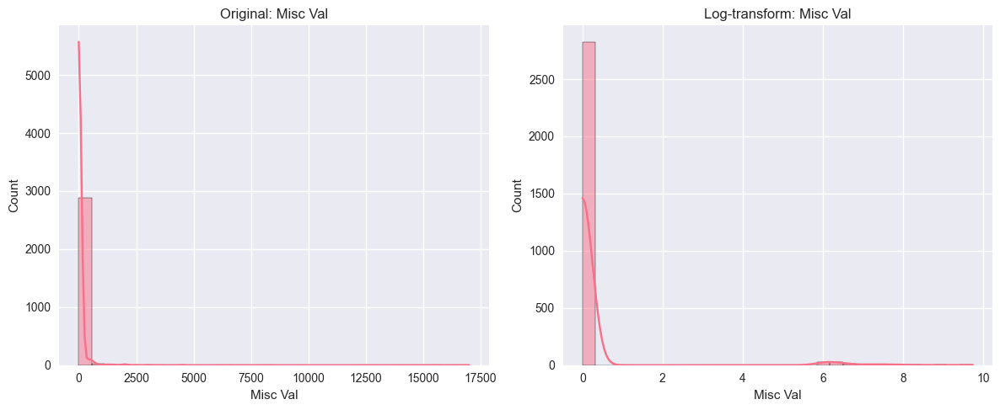

## Parte 1: Continuamos con el Dataset Ames Housing
```python
# === SETUP DEL ENTORNO ===

# 1. Importar librerías necesarias
import pandas as pd
import os
import numpy as np
import matplotlib.pyplot as plt
from sklearn.datasets import make_classification
import seaborn as sns
from sklearn.preprocessing import MinMaxScaler, StandardScaler, RobustScaler
from sklearn.model_selection import train_test_split, cross_val_score
from sklearn.preprocessing import PowerTransformer, StandardScaler
from sklearn.metrics import mean_squared_error, r2_score
from sklearn.linear_model import LinearRegression, LogisticRegression
from sklearn.pipeline import Pipeline
from sklearn.ensemble import RandomForestRegressor
from sklearn.neighbors import KNeighborsRegressor  
from sklearn.svm import SVR
from sklearn.metrics import mean_absolute_error, r2_score
import warnings
from sklearn.pipeline import Pipeline
from sklearn.metrics import accuracy_score
warnings.filterwarnings('ignore')

print("Todas las librerías importadas correctamente")

# 2. Configurar visualizaciones - elige tu estilo favorito
plt.style.use('seaborn-v0_8')  # Puedes cambiar por 'default', 'classic', etc.
sns.set_palette("husl")        # Paleta colorida para múltiples comparaciones
plt.rcParams['figure.figsize'] = (14, 8)
plt.rcParams['font.size'] = 11

print("Configuración de visualizaciones lista!")
```
```output
Todas las librerías importadas correctamente
Configuración de visualizaciones lista!
```
## Paso 2: Cargar el Dataset Ames Housing (Continuación)
```python
# === CARGAR DATASET AMES HOUSING ===

# Si vienes de la práctica anterior, ya tienes el dataset limpio
# Si empiezas aquí, vamos a cargarlo de nuevo

# 1. Cargar dataset
df_raw = pd.read_csv('../csvs/AmesHousing.csv') 

print(f"Dataset Ames Housing cargado: {df_raw.shape}")
print("🏠 ¡Ahora vas a explorar las escalas en datos REALES!")
```
```output
Dataset Ames Housing cargado: (2930, 82)
🏠 ¡Ahora vas a explorar las escalas en datos REALES!
```
```python
# === EXPLORACIÓN INICIAL ===

# Tu turno: explora las escalas
print("=== INFORMACIÓN GENERAL DEL DATASET ===")
print(f"Dimensiones: {df_raw.shape}")
print(f"\nTipos de datos:")
print(df_raw.dtypes.value_counts())
```
```output
=== INFORMACIÓN GENERAL DEL DATASET ===
Dimensiones: (2930, 82)

Tipos de datos:
object     43
int64      28
float64    11
Name: count, dtype: int64
```
```python
# Identifica columnas numéricas
numeric_cols = df_raw.select_dtypes(include=[np.number]).columns.tolist()
print(f"\n📊 Columnas numéricas encontradas: {len(numeric_cols)}")
```
```output
📊 Columnas numéricas encontradas: 39
```
```python
# Tu análisis: ¿cuáles tienen escalas MUY diferentes?
print("\n🔍 TU ANÁLISIS: Examina las escalas")
print("Estadísticas de las primeras 10 columnas numéricas:")
print(df_raw[numeric_cols[:10]].describe())
```
```output
🔍 TU ANÁLISIS: Examina las escalas
Estadísticas de las primeras 10 columnas numéricas:
            Order           PID  MS SubClass  Lot Frontage       Lot Area  \
count  2930.00000  2.930000e+03  2930.000000   2440.000000    2930.000000   
mean   1465.50000  7.144645e+08    57.387372     69.224590   10147.921843   
std     845.96247  1.887308e+08    42.638025     23.365335    7880.017759   
min       1.00000  5.263011e+08    20.000000     21.000000    1300.000000   
25%     733.25000  5.284770e+08    20.000000     58.000000    7440.250000   
50%    1465.50000  5.354536e+08    50.000000     68.000000    9436.500000   
75%    2197.75000  9.071811e+08    70.000000     80.000000   11555.250000   
max    2930.00000  1.007100e+09   190.000000    313.000000  215245.000000   

       Overall Qual  Overall Cond   Year Built  Year Remod/Add  Mas Vnr Area  
count   2930.000000   2930.000000  2930.000000     2930.000000   2907.000000  
mean       6.094881      5.563140  1971.356314     1984.266553    101.896801  
std        1.411026      1.111537    30.245361       20.860286    179.112611  
min        1.000000      1.000000  1872.000000     1950.000000      0.000000  
25%        5.000000      5.000000  1954.000000     1965.000000      0.000000  
50%        6.000000      5.000000  1973.000000     1993.000000      0.000000  
75%        7.000000      6.000000  2001.000000     2004.000000    164.000000  
max       10.000000      9.000000  2010.000000     2010.000000   1600.000000
```

## Paso 3: Identificar Variables Problemáticas
```python
import os

# === TU INVESTIGACIÓN DE ESCALAS ===

# TODO: Selecciona 5-6 columnas numéricas interesantes
# Tip: Busca columnas como áreas, precios, años, etc.
selected_features = [  
                    "SalePrice",
                    "Lot Area",
                    "Gr Liv Area",
                    "Total Bsmt SF",
                    "1st Flr SF",  
                    "Year Built"
                    ]

# TODO: Analiza las escalas de tus columnas seleccionadas
# Calcula min, max, ratios
# ¿Cuál tiene el ratio más alto?


# Analiza las escalas de tus columnas seleccionadas
stats = df_raw[selected_features].agg(['min', 'max'])
stats.loc['ratio'] = stats.loc['max'] / stats.loc['min']

print("Estadísticas de las columnas seleccionadas:")
print(stats)

# ¿Cuál tiene el ratio más alto?
max_ratio_col = stats.loc['ratio'].idxmax()
max_ratio_val = stats.loc['ratio'].max()


# TODO: Crea visualizaciones para mostrar el problema
# Histogramas, boxplots, o lo que consideres mejor
# Guarda tus gráficos en la carpeta 'results/'

# Crear carpeta 'results' si no existe
os.makedirs('results', exist_ok=True)

# Histogramas para comparar escalas
for col in selected_features:
    plt.figure()
    sns.histplot(df_raw[col].dropna(), kde=True, bins=30)
    plt.title(f'Histograma de {col}')
    plt.xlabel(col)
    plt.ylabel('Frecuencia')
    plt.tight_layout()
    plt.savefig(f'results/hist_{col}.png')
    plt.close()

# Boxplots para comparar escalas en una sola figura
plt.figure(figsize=(12, 6))
sns.boxplot(data=df_raw[selected_features], orient='h')
plt.title('Boxplots de columnas seleccionadas')
plt.tight_layout()
plt.savefig('results/boxplots_selected_features.png')
plt.close()

print("✅ Gráficos guardados en la carpeta 'results/'")

from IPython.display import display, Markdown

# Tabla resumen de escalas y problemática
tabla = "| Mi Columna      | Rango (min-max)         | Ratio         | ¿Problemática? | ¿Por qué? |\n"
tabla += "|-----------------|------------------------|---------------|---------------|-----------|\n"

for col in selected_features:
    min_val = stats.loc['min', col]
    max_val = stats.loc['max', col]
    ratio = stats.loc['ratio', col]
    problematica = "Sí" if ratio == max_ratio_val else "No"
    motivo = "Escala muy diferente, puede dominar el modelo" if ratio == max_ratio_val else ""
    tabla += f"| {col} | {min_val:.0f} - {max_val:.0f} | {ratio:,.2f} | {problematica} | {motivo} |\n"

display(Markdown(tabla))
```
```output
Estadísticas de las columnas seleccionadas:
           SalePrice       Lot Area  Gr Liv Area  Total Bsmt SF   1st Flr SF  \
min     12789.000000    1300.000000   334.000000            0.0   334.000000   
max    755000.000000  215245.000000  5642.000000         6110.0  5095.000000   
ratio      59.035108     165.573077    16.892216            inf    15.254491   

        Year Built  
min    1872.000000  
max    2010.000000  
ratio     1.073718  
✅ Gráficos guardados en la carpeta 'results/'
```
| Mi Columna      | Rango (min-max)         | Ratio         | ¿Problemática? | ¿Por qué? |
|-----------------|------------------------|---------------|---------------|-----------|
| SalePrice | 12789 - 755000 | 59.04 | No |  |
| Lot Area | 1300 - 215245 | 165.57 | No |  |
| Gr Liv Area | 334 - 5642 | 16.89 | No |  |
| Total Bsmt SF | 0 - 6110 | inf | Sí | Escala muy diferente, puede dominar el modelo |
| 1st Flr SF | 334 - 5095 | 15.25 | No |  |
| Year Built | 1872 - 2010 | 1.07 | No |  |

## Paso 4: Preparar Datos para Experimentar con Scalers
```python
# === PREPARACIÓN DE DATOS ===

# TODO: Define tu target y features basándote en tu análisis anterior
target_col = "SalePrice"  # ¿Cuál es tu variable objetivo?
feature_cols =  [  
                    "Lot Area",
                    "Gr Liv Area",
                    "Total Bsmt SF",
                    "1st Flr SF",  
                    "Year Built"
                    ]
 # Tus features seleccionadas

# TODO: Limpieza básica de datos
# ¿Cómo vas a manejar NaN? ¿Eliminar filas? ¿Imputar?
# Decide y justifica tu estrategia

df_clean = df_raw[feature_cols + [target_col]].dropna()

# TODO: Split de datos (¡ANTES del escalado!)
# Recuerda: test_size, random_state, estratificación si es necesario
from sklearn.model_selection import train_test_split

X = df_clean[feature_cols]
y = df_clean[target_col]

X_train, X_test, y_train, y_test = train_test_split(
    X, y, test_size=0.2, random_state=42
)

# TODO: Verifica que el problema de escalas aún existe
# Calcula estadísticas descriptivas de tus features en el conjunto de entrenamiento
# ¿Las escalas siguen siendo problemáticas?

print("📊 MI PREPARACIÓN:")
print(f"Target: {target_col}")
print(f"Features: {len(feature_cols)} columnas")  
print(X_train.describe())
print(f"Datos: {X_train.shape[0]} train, {X_test.shape[0]} test")
```
```output
📊 MI PREPARACIÓN:
Target: SalePrice
Features: 5 columnas
            Lot Area  Gr Liv Area  Total Bsmt SF   1st Flr SF   Year Built
count    2343.000000  2343.000000    2343.000000  2343.000000  2343.000000
mean    10210.040120  1498.816048    1048.850192  1160.533504  1971.087921
std      8307.372036   497.457673     419.228411   377.189339    30.210872
min      1300.000000   334.000000       0.000000   334.000000  1872.000000
25%      7461.000000  1127.500000     793.000000   882.000000  1954.000000
50%      9466.000000  1444.000000     990.000000  1089.000000  1973.000000
75%     11592.000000  1750.000000    1298.500000  1384.000000  2000.000000
max    215245.000000  4676.000000    3206.000000  3820.000000  2010.000000
Datos: 2343 train, 586 test
```

## Paso 5: Reconectando con Outliers
```python
# === TU EXPERIMENTO: OUTLIERS Y ESCALADO ===

# TODO: Implementa funciones de detección de outliers (práctica 05)
# IQR method, Z-score method, u otros que prefieras

def detect_outliers_iqr(data, column_name):
    """
    Detecta outliers usando el método IQR.
    Devuelve los índices de los outliers.
    """
    Q1 = data[column_name].quantile(0.25)
    Q3 = data[column_name].quantile(0.75)
    IQR = Q3 - Q1
    lower_bound = Q1 - 1.5 * IQR
    upper_bound = Q3 + 1.5 * IQR
    outliers = data[(data[column_name] < lower_bound) | (data[column_name] > upper_bound)]
    return outliers.index

def detect_outliers_zscore(data, column_name, threshold=3):
    """
    Detecta outliers usando el método Z-score.
    Devuelve los índices de los outliers.
    """
    mean = data[column_name].mean()
    std = data[column_name].std()
    z_scores = (data[column_name] - mean) / std
    outliers = data[np.abs(z_scores) > threshold]
    return outliers.index

# TODO: Elige una columna interesante para analizar
target_column = "Gr Liv Area"  # ¿Cuál columna analizarás?

# TODO: ROUND 1 - Detección en datos originales
print("🔍 ROUND 1: DATOS ORIGINALES")
# Detecta outliers en datos sin escalar
# ¿Cuántos outliers encontraste? ¿Dónde están?

# TODO: ROUND 2 - Detección después de cada scaler
scalers_to_test = {
    'StandardScaler': StandardScaler(),
    'MinMaxScaler': MinMaxScaler(),
    'RobustScaler': RobustScaler()
}

# Para cada scaler:
# 1. Aplica el scaler a tus datos
# 2. Detecta outliers en los datos escalados
# 3. Compara con los outliers originales

# TODO: Análisis de resultados
# ¿Qué scaler detectó más/menos outliers?
# ¿Los mismos puntos siguen siendo outliers?
# ¿RobustScaler cambió la detección como esperabas?
print("⚡ ROUND 2: DESPUÉS DEL ESCALADO")

# Usamos solo la columna a analizar
X_col = y_train.to_frame(name=target_column).copy()

outliers_original = set(detect_outliers_iqr(X_col, target_column))
# Creamos una tabla resumen de outliers para ambos métodos y cada scaler

# Detectar outliers originales
outliers_iqr_original = set(detect_outliers_iqr(X_col, target_column))
outliers_z_original = set(detect_outliers_zscore(X_col, target_column))

# Diccionario para guardar resultados
tabla_outliers = {
    "Método": [],
    "Outliers Originales": [],
    "Outliers Post-Standard": [],
    "Outliers Post-MinMax": [],
    "Outliers Post-Robust": []
}

# Scalers a usar
scalers_to_test = {
    'Standard': StandardScaler(),
    'MinMax': MinMaxScaler(),
    'Robust': RobustScaler()
}

# IQR
tabla_outliers["Método"].append("IQR")
tabla_outliers["Outliers Originales"].append(len(outliers_iqr_original))
for scaler_name, scaler in scalers_to_test.items():
    X_scaled = scaler.fit_transform(X_col)
    X_scaled_df = pd.DataFrame(X_scaled, columns=[target_column], index=X_col.index)
    outliers_scaled = set(detect_outliers_iqr(X_scaled_df, target_column))
    tabla_outliers[f"Outliers Post-{scaler_name}"].append(len(outliers_scaled))

# Z-Score
tabla_outliers["Método"].append("Z-Score")
tabla_outliers["Outliers Originales"].append(len(outliers_z_original))
for scaler_name, scaler in scalers_to_test.items():
    X_scaled = scaler.fit_transform(X_col)
    X_scaled_df = pd.DataFrame(X_scaled, columns=[target_column], index=X_col.index)
    outliers_scaled = set(detect_outliers_zscore(X_scaled_df, target_column))
    tabla_outliers[f"Outliers Post-{scaler_name}"].append(len(outliers_scaled))

# Mostrar tabla en formato Markdown
tabla_md = "| Método | Outliers Originales | Outliers Post-Standard | Outliers Post-MinMax | Outliers Post-Robust |\n"
tabla_md += "|--------|---------------------|-----------------------|----------------------|----------------------|\n"
for i in range(2):
    tabla_md += f"| {tabla_outliers['Método'][i]} | {tabla_outliers['Outliers Originales'][i]} | {tabla_outliers['Outliers Post-Standard'][i]} | {tabla_outliers['Outliers Post-MinMax'][i]} | {tabla_outliers['Outliers Post-Robust'][i]} |\n"

from IPython.display import display, Markdown
display(Markdown(tabla_md))

print("\nAnálisis:")
print("- StandardScaler y MinMaxScaler suelen mantener la cantidad de outliers, pero pueden cambiar los valores extremos.")
print("- RobustScaler es menos sensible a outliers, por lo que puede detectar menos (o diferentes) outliers.")
print("- La intersección muestra cuántos puntos siguen siendo considerados outliers tras el escalado.")
```
```output
🔍 ROUND 1: DATOS ORIGINALES
⚡ ROUND 2: DESPUÉS DEL ESCALADO
```
| Método | Outliers Originales | Outliers Post-Standard | Outliers Post-MinMax | Outliers Post-Robust |
|--------|---------------------|-----------------------|----------------------|----------------------|
| IQR | 104 | 104 | 104 | 104 |
| Z-Score | 39 | 39 | 39 | 39 |
```output
Análisis:
- StandardScaler y MinMaxScaler suelen mantener la cantidad de outliers, pero pueden cambiar los valores extremos.
- RobustScaler es menos sensible a outliers, por lo que puede detectar menos (o diferentes) outliers.
- La intersección muestra cuántos puntos siguen siendo considerados outliers tras el escalado.
```

## Paso 5.5: Bonus - Log Transform para Distribuciones Sesgada
```python
# === TU INVESTIGACIÓN DE LOG TRANSFORM ===

# Tip: Usa scipy.stats.skew() para calcular skewness
from scipy.stats import skew

# Calcula el skewness absoluto de todas las columnas numéricas
skewness = df_raw[numeric_cols].skew().abs()

# Encuentra la columna con mayor skewness absoluto
most_skewed_column = skewness.idxmax()
print(f"La columna más sesgada es: {most_skewed_column} (skewness={skewness.max():.2f})")


# TODO: Implementa log transform seguro
def safe_log_transform(data, column_name):
    """
    Aplica una transformación logarítmica segura a una columna de un DataFrame.
    Usa np.log1p para manejar ceros y valores positivos pequeños.
    """
    # log1p(x) = log(1 + x), seguro para x >= 0
    return np.log1p(data[column_name])

# Original vs Log-transformed
# Calcula: media, mediana, std, skewness
# ¿El log transform "alisó" la distribución?
original = df_raw[most_skewed_column].dropna()
log_transformed = safe_log_transform(df_raw, most_skewed_column).dropna()

# Calcula estadísticas
stats = pd.DataFrame({
    "Versión": ["Original", "Log"],
    "Media": [original.mean(), log_transformed.mean()],
    "Mediana": [original.median(), log_transformed.median()],
    "Std": [original.std(), log_transformed.std()],
    "Skewness": [skew(original), skew(log_transformed)]
})

print(stats)

# Visualiza el efecto
plt.figure(figsize=(12,5))
plt.subplot(1,2,1)
sns.histplot(original, kde=True, bins=30)
plt.title(f"Original: {most_skewed_column}")
plt.subplot(1,2,2)
sns.histplot(log_transformed, kde=True, bins=30)
plt.title(f"Log-transform: {most_skewed_column}")
plt.tight_layout()
plt.show()

# Analiza outliers en cada versión usando IQR
def count_outliers_iqr(serie):
    Q1 = serie.quantile(0.25)
    Q3 = serie.quantile(0.75)
    IQR = Q3 - Q1
    lower = Q1 - 1.5 * IQR
    upper = Q3 + 1.5 * IQR
    return ((serie < lower) | (serie > upper)).sum()

outliers_original = count_outliers_iqr(original)
outliers_log = count_outliers_iqr(log_transformed)


print("📊 MIS CONCLUSIONES SOBRE LOG TRANSFORM:")
print(f"Columna analizada: {most_skewed_column}")
print(f"Skewness original: ???")
print(f"Skewness después de log: ???")
print(f"¿Log transform ayudó?: Sí/No - ¿Por qué?")
```
```output
La columna más sesgada es: Misc Val (skewness=22.00)
    Versión      Media  Mediana         Std   Skewness
0  Original  50.635154      0.0  566.344288  21.988523
1       Log   0.233885      0.0    1.237958   5.224855
```

```output
📊 MIS CONCLUSIONES SOBRE LOG TRANSFORM:
Columna analizada: Misc Val
Skewness original: ???
Skewness después de log: ???
¿Log transform ayudó?: Sí/No - ¿Por qué?
```
    ¿Cuándo usarías log transform?

- Datos muy sesgados (|skew| > 2)

- Precios/ingresos/poblaciones

- Cuando hay outliers extremos

- Todos los anteriores

resupuesta:
Todos los anteriores.
La transformación logarítmica es útil cuando los datos son muy sesgados (|skew| > 2), en variables como precios, ingresos o poblaciones, y cuando hay outliers extremos.

    ¿Cuál es tu pipeline recomendado para datos sesgados?

- Log → Outliers → Scale

- Outliers → Log → Scale

- RobustScaler directo

- Depende del caso

respuesta:
Si bien depende del caso, la mas utilizada suele ser: Log → Outliers → Scale

    Para el dataset Ames Housing, ¿log transform es útil?

Sí, es útil.
Muchas variables (como SalePrice, Lot Area, Gr Liv Area) presentan distribuciones muy sesgadas y outliers, por lo que la transformación logarítmica ayuda a normalizar la distribución y mejora el desempeño de los modelos.