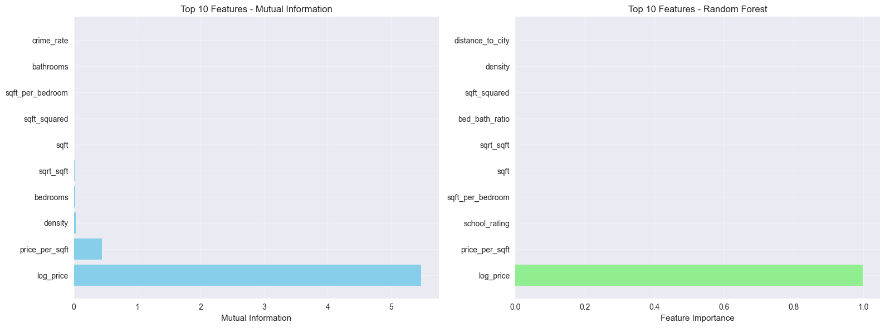

## 🏠 Parte 1: Setup y Carga de Datos
```python
# Importar librerías que vamos a usar
import pandas as pd
import numpy as np
import matplotlib.pyplot as plt
import seaborn as sns
from sklearn.feature_selection import mutual_info_regression
from sklearn.ensemble import RandomForestRegressor
from sklearn.model_selection import train_test_split
import warnings
warnings.filterwarnings('ignore')

# Configuración
np.random.seed(42)
plt.style.use('seaborn-v0_8')  # establecer estilo visual (ej: 'default', 'seaborn', 'classic')
sns.set_palette("husl")  # definir paleta de colores (ej: 'husl', 'Set1', 'viridis')
plt.rcParams['figure.figsize'] = (12, 8)

print("✅ Entorno configurado correctamente")
```
```output
✅ Entorno configurado correctamente
```

## 🏠 Paso 2: Crear Dataset Sintético de Viviendas
```python
# === CREAR DATASET SINTÉTICO DE VIVIENDAS ===

# 1. Generar datos base
np.random.seed(42)
n_samples = 1000

data = {
    'price': np.random.normal(200000, 50000, n_samples),
    'sqft': np.random.normal(120, 30, n_samples),
    'bedrooms': np.random.choice([1, 2, 3, 4, 5], n_samples),
    'bathrooms': np.random.choice([1, 2, 3], n_samples),
    'year_built': np.random.choice(range(1980, 2024), n_samples),
    'garage_spaces': np.random.choice([0, 1, 2, 3], n_samples),
    'lot_size': np.random.normal(8000, 2000, n_samples),
    'distance_to_city': np.random.normal(15, 8, n_samples),
    'school_rating': np.random.uniform(1, 10, n_samples),
    'crime_rate': np.random.uniform(0, 100, n_samples)
}

df = pd.DataFrame.from_dict(data)  # función para crear DataFrame desde diccionario

# Asegurar valores positivos
df['price'] = np.abs(df['price'])
df['sqft'] = np.abs(df['sqft'])
df['lot_size'] = np.abs(df['lot_size'])
df['distance_to_city'] = np.abs(df['distance_to_city'])

print("🏠 DATASET: Viviendas Sintéticas")
print(f"   📊 Forma: {df.shape}")
print(f"   📋 Columnas: {list(df.columns)}")

# 2. Explorar los datos básicamente
print("\n🔍 Primeras 5 filas:")
print(df.head())  # método para mostrar las primeras filas del DataFrame

# 3. Estadísticas básicas
print("\n📊 ESTADÍSTICAS BÁSICAS:")
print(df.describe())  # método que calcula estadísticas descriptivas
```
```output
🏠 DATASET: Viviendas Sintéticas
   📊 Forma: (1000, 10)
   📋 Columnas: ['price', 'sqft', 'bedrooms', 'bathrooms', 'year_built', 'garage_spaces', 'lot_size', 'distance_to_city', 'school_rating', 'crime_rate']

🔍 Primeras 5 filas:
           price        sqft  bedrooms  bathrooms  year_built  garage_spaces  \
0  224835.707651  161.980663         3          1        2001              3   
1  193086.784941  147.739010         3          3        2011              3   
2  232384.426905  121.788911         3          1        1995              3   
3  276151.492820  100.591897         4          3        1997              0   
4  188292.331264  140.946699         5          1        1984              1   

      lot_size  distance_to_city  school_rating  crime_rate  
0  7436.395239          5.131093       4.402225   12.718119  
1  8196.996696          0.188184       1.926515   39.855922  
2  8308.096155         20.992112       7.471205   17.015264  
3  7915.263179         27.394727       5.534999   25.472050  
4  8133.185144          9.121570       7.378891   26.324617  

📊 ESTADÍSTICAS BÁSICAS:
               price         sqft     bedrooms    bathrooms   year_built  \
count    1000.000000  1000.000000  1000.000000  1000.000000  1000.000000   
mean   200966.602791   122.125087     2.955000     2.039000  2001.671000   
std     48960.796909    29.923631     1.431441     0.817403    12.477758   
min     37936.632997    31.788341     1.000000     1.000000  1980.000000   
25%    167620.484727   101.812749     2.000000     1.000000  1991.750000   
50%    201265.030612   121.892314     3.000000     2.000000  2002.000000   
75%    232397.193774   141.866465     4.000000     3.000000  2012.000000   
max    392636.574533   215.793227     5.000000     3.000000  2023.000000   

       garage_spaces      lot_size  distance_to_city  school_rating  \
count    1000.000000   1000.000000       1000.000000    1000.000000   
mean        1.476000   7964.898433         14.905920       5.317255   
std         1.112952   1962.074655          7.818738       2.563481   
min         0.000000   1449.978732          0.024233       1.002186   
25%         1.000000   6677.962485          9.142445       3.094171   
50%         1.000000   7937.432524         14.685961       5.110074   
75%         2.000000   9246.216116         20.139549       7.468377   
max         3.000000  14029.423419         40.921113       9.964115   

        crime_rate  
count  1000.000000  
mean     49.314724  
std      28.008117  
min       0.005283  
25%      26.411477  
50%      49.367810  
75%      72.735264  
max      99.861732
```

## ⚙️ Paso 3: Crear Features Derivadas
```python
# === CREAR FEATURES DERIVADAS ===

print("⚙️ CREANDO FEATURES DERIVADAS")

print("-" * 50)

# Crear copia del dataset para trabajar
df_enhanced = df.copy()

# 1. RATIOS Y PROPORCIONES (Ejemplos básicos)
print("🔢 1. CREANDO RATIOS Y PROPORCIONES")

# Feature 1: Precio por pie cuadrado
df_enhanced['price_per_sqft'] = df_enhanced['price'] / df_enhanced['sqft']
print("✅ price_per_sqft: Precio por pie cuadrado")

# Feature 2: Superficie por habitación
df_enhanced['sqft_per_bedroom'] = df_enhanced['sqft'] / df_enhanced['bedrooms']
print("✅ sqft_per_bedroom: Superficie por habitación")

# Ratios adicionales
df_enhanced['bed_bath_ratio'] = df_enhanced['bedrooms'] / df_enhanced['bathrooms']
df_enhanced['density'] = df_enhanced['sqft'] / df_enhanced['lot_size']
df_enhanced['price_per_bedroom'] = df_enhanced['price'] / df_enhanced['bedrooms']
df_enhanced['distance_school_ratio'] = df_enhanced['distance_to_city'] / (df_enhanced['school_rating'] + 1)

# 2. VARIABLES TEMPORALES
print("\n📅 2. CREANDO VARIABLES TEMPORALES")
# Feature 3: Antigüedad de la propiedad
current_year = 2024
df_enhanced['property_age'] = current_year - df_enhanced['year_built']
print("✅ property_age: Antigüedad de la propiedad")

# Categoría de antigüedad
df_enhanced['age_category'] = pd.cut(df_enhanced['property_age'], bins=[0, 10, 30, 100], labels=['Nuevo', 'Moderno', 'Antiguo'])
# Es propiedad nueva (binario)
df_enhanced['is_new_property'] = (df_enhanced['property_age'] < 5).astype(int)
# Década de construcción
df_enhanced['decade_built'] = (df_enhanced['year_built'] // 10) * 10

# 3. TRANSFORMACIONES MATEMÁTICAS
print("\n🧮 3. APLICANDO TRANSFORMACIONES MATEMÁTICAS")

# Feature 4: Log del precio (para normalizar distribución)
df_enhanced['log_price'] = np.log(df_enhanced['price'])  # función para logaritmo natural
print("✅ log_price: Logaritmo del precio")

# Otras transformaciones matemáticas
df_enhanced['sqrt_sqft'] = np.sqrt(df_enhanced['sqft'])
df_enhanced['sqft_squared'] = df_enhanced['sqft'] ** 2
df_enhanced['log_sqft'] = np.log(df_enhanced['sqft'])
df_enhanced['log_lot_size'] = np.log(df_enhanced['lot_size'])

# 4. FEATURES COMPUESTAS (Tu turno!)
print("\n🎯 4. CREANDO FEATURES COMPUESTAS")

# Score de lujo
df_enhanced['luxury_score'] = (df_enhanced['price_per_sqft'] * df_enhanced['sqft'] * (df_enhanced['garage_spaces'] + 1))
# Score de ubicación
df_enhanced['location_score'] = (1 / (df_enhanced['distance_to_city'] + 1)) * df_enhanced['school_rating'] / (df_enhanced['crime_rate'] + 1)
# Score de eficiencia
df_enhanced['efficiency_score'] = df_enhanced['sqft_per_bedroom'] + df_enhanced['price_per_sqft']
# Indicador de calidad
df_enhanced['quality_indicator'] = (1 / (df_enhanced['property_age'] + 1)) * (df_enhanced['garage_spaces'] + 1) * df_enhanced['school_rating']

print(f"\n📊 RESUMEN DE FEATURES CREADAS:")
print(f"Dataset original: {df.shape[1]} columnas")
print(f"Dataset con features: {df_enhanced.shape[1]} columnas")
print(f"Features creadas: {df_enhanced.shape[1] - df.shape[1]}")
```
```output
⚙️ CREANDO FEATURES DERIVADAS
--------------------------------------------------
🔢 1. CREANDO RATIOS Y PROPORCIONES
✅ price_per_sqft: Precio por pie cuadrado
✅ sqft_per_bedroom: Superficie por habitación

📅 2. CREANDO VARIABLES TEMPORALES
✅ property_age: Antigüedad de la propiedad

🧮 3. APLICANDO TRANSFORMACIONES MATEMÁTICAS
✅ log_price: Logaritmo del precio

🎯 4. CREANDO FEATURES COMPUESTAS

📊 RESUMEN DE FEATURES CREADAS:
Dataset original: 10 columnas
Dataset con features: 29 columnas
Features creadas: 19
```

## 📊 Paso 4: Análisis de Distribución de Features
```python
# === ANÁLISIS DE DISTRIBUCIÓN DE FEATURES ===

print("📊 ANÁLISIS DE DISTRIBUCIÓN DE FEATURES")
print("-" * 50)

# 1. ANÁLISIS DE DISTRIBUCIÓN DE NUEVAS FEATURES
print("🔍 1. DISTRIBUCIÓN DE FEATURES DERIVADAS")

# Seleccionar solo las nuevas features creadas
new_features = ['price_per_sqft', 'sqft_per_bedroom', 'bed_bath_ratio', 
                'density', 'property_age', 'log_price', 'sqrt_sqft', 'sqft_squared']

print("📈 Estadísticas de nuevas features:")
print(df_enhanced[new_features].describe().round(2))  # método para estadísticas descriptivas

# 2. VISUALIZACIÓN DE DISTRIBUCIONES
print("\n📊 2. VISUALIZANDO DISTRIBUCIONES")

# Crear subplots para visualizar distribuciones
fig, axes = plt.subplots(2, 4, figsize=(16, 8))
axes = axes.ravel()  # convertir a array 1D

for i, feature in enumerate(new_features):
    # Histograma de la feature
    df_enhanced[feature].hist(bins=30, ax=axes[i], alpha=0.7, color='skyblue')
    axes[i].set_title(f'Distribución de {feature}')
    axes[i].set_xlabel(feature)
    axes[i].set_ylabel('Frecuencia')
    axes[i].grid(True, alpha=0.3)

plt.tight_layout()
plt.show()

# 3. DETECCIÓN DE OUTLIERS
print("\n🚨 3. DETECCIÓN DE OUTLIERS")

def detect_outliers_iqr(df, column):
    """Detectar outliers usando método IQR"""
    Q1 = df[column].quantile(0.25)
    Q3 = df[column].quantile(0.75)
    IQR = Q3 - Q1
    lower_bound = Q1 - 1.5 * IQR
    upper_bound = Q3 + 1.5 * IQR

    outliers = df[(df[column] < lower_bound) | (df[column] > upper_bound)]
    return outliers, lower_bound, upper_bound

# Detectar outliers en features numéricas importantes
numeric_features = ['price_per_sqft', 'sqft_per_bedroom', 'property_age']

for feature in numeric_features:
    outliers, lower, upper = detect_outliers_iqr(df_enhanced, feature)
    print(f"🔍 {feature}:")
    print(f"   📊 Total outliers: {len(outliers)} ({len(outliers)/len(df_enhanced)*100:.1f}%)")
    print(f"   📏 Rango normal: [{lower:.2f}, {upper:.2f}]")
```
```output
📊 ANÁLISIS DE DISTRIBUCIÓN DE FEATURES
--------------------------------------------------
🔍 1. DISTRIBUCIÓN DE FEATURES DERIVADAS
📈 Estadísticas de nuevas features:
       price_per_sqft  sqft_per_bedroom  bed_bath_ratio  density  \
count         1000.00           1000.00         1000.00  1000.00   
mean          1776.39             57.15            1.77     0.02   
std            726.68             39.58            1.25     0.01   
min            278.61              6.36            0.33     0.00   
25%           1287.19             28.99            1.00     0.01   
50%           1646.13             41.55            1.50     0.02   
75%           2112.68             74.27            2.50     0.02   
max           5521.03            199.33            5.00     0.08   

       property_age  log_price  sqrt_sqft  sqft_squared  
count       1000.00    1000.00    1000.00       1000.00  
mean          22.33      12.18      10.96      15809.07  
std           12.48       0.26       1.40       7376.84  
min            1.00      10.54       5.64       1010.50  
25%           12.00      12.03      10.09      10365.84  
50%           22.00      12.21      11.04      14857.74  
75%           32.25      12.36      11.91      20126.10  
max           44.00      12.88      14.69      46566.72  

📊 2. VISUALIZANDO DISTRIBUCIONES
```

```output
🚨 3. DETECCIÓN DE OUTLIERS
🔍 price_per_sqft:
   📊 Total outliers: 37 (3.7%)
   📏 Rango normal: [48.94, 3350.93]
🔍 sqft_per_bedroom:
   📊 Total outliers: 45 (4.5%)
   📏 Rango normal: [-38.94, 142.20]
🔍 property_age:
   📊 Total outliers: 0 (0.0%)
   📏 Rango normal: [-18.38, 62.62]
```

## 🎯 Paso 5: Evaluación de Importancia de Features
```python
# === EVALUACIÓN DE IMPORTANCIA DE FEATURES ===

print("🎯 EVALUACIÓN DE IMPORTANCIA DE FEATURES")
print("-" * 50)

# 1. PREPARAR DATOS PARA EVALUACIÓN
print("🔧 1. PREPARANDO DATOS PARA EVALUACIÓN")

# Seleccionar features numéricas para evaluación
numeric_features = ['sqft', 'bedrooms', 'bathrooms', 'year_built', 'garage_spaces',
                   'lot_size', 'distance_to_city', 'school_rating', 'crime_rate',
                   'price_per_sqft', 'sqft_per_bedroom', 'bed_bath_ratio',
                   'density', 'property_age', 'log_price', 'sqrt_sqft', 'sqft_squared']

# Preparar X e y
X = df_enhanced[numeric_features].fillna(0)  # llenar valores faltantes con 0
y = df_enhanced['price']

print(f"📊 Features evaluadas: {len(numeric_features)}")
print(f"📊 Muestras: {X.shape[0]}")

# 2. MUTUAL INFORMATION
print("\n📈 2. CALCULANDO MUTUAL INFORMATION")

# Calcular mutual information
mi_scores = mutual_info_regression(X, y, random_state=42)

# Crear DataFrame con resultados
mi_df = pd.DataFrame({
    'feature': numeric_features,
    'mutual_info': mi_scores
}).sort_values('mutual_info', ascending=False)

print("🔝 Top 10 features por Mutual Information:")
print(mi_df.head(10).round(4))

# 3. RANDOM FOREST IMPORTANCE
print("\n🌲 3. CALCULANDO IMPORTANCIA CON RANDOM FOREST")

# Entrenar Random Forest
rf = RandomForestRegressor(n_estimators=100, random_state=42)
rf.fit(X, y)

# Obtener importancia de features
rf_importance = pd.DataFrame({
    'feature': numeric_features,
    'importance': rf.feature_importances_
}).sort_values('importance', ascending=False)

print("🔝 Top 10 features por Random Forest:")
print(rf_importance.head(10).round(4))

# 4. VISUALIZACIÓN COMPARATIVA
print("\n📊 4. VISUALIZACIÓN COMPARATIVA")

fig, (ax1, ax2) = plt.subplots(1, 2, figsize=(16, 6))

# Mutual Information
top_mi = mi_df.head(10)
ax1.barh(range(len(top_mi)), top_mi['mutual_info'], color='skyblue')
ax1.set_yticks(range(len(top_mi)))
ax1.set_yticklabels(top_mi['feature'])
ax1.set_xlabel('Mutual Information')
ax1.set_title('Top 10 Features - Mutual Information')
ax1.grid(True, alpha=0.3)

# Random Forest Importance
top_rf = rf_importance.head(10)
ax2.barh(range(len(top_rf)), top_rf['importance'], color='lightgreen')
ax2.set_yticks(range(len(top_rf)))
ax2.set_yticklabels(top_rf['feature'])
ax2.set_xlabel('Feature Importance')
ax2.set_title('Top 10 Features - Random Forest')
ax2.grid(True, alpha=0.3)

plt.tight_layout()
plt.show()

# 5. ANÁLISIS DE CORRELACIÓN CON TARGET
print("\n🔗 5. CORRELACIÓN CON PRECIO")

# Calcular correlaciones
correlations = df_enhanced[numeric_features + ['price']].corr()['price'].drop('price')
correlations = correlations.sort_values(key=abs, ascending=False)

print("🔝 Top 10 correlaciones con precio:")
print(correlations.head(10).round(4))
```
```output
🎯 EVALUACIÓN DE IMPORTANCIA DE FEATURES
--------------------------------------------------
🔧 1. PREPARANDO DATOS PARA EVALUACIÓN
📊 Features evaluadas: 17
📊 Muestras: 1000

📈 2. CALCULANDO MUTUAL INFORMATION
🔝 Top 10 features por Mutual Information:
             feature  mutual_info
14         log_price       5.4759
9     price_per_sqft       0.4459
12           density       0.0303
1           bedrooms       0.0189
15         sqrt_sqft       0.0092
0               sqft       0.0078
16      sqft_squared       0.0065
10  sqft_per_bedroom       0.0060
2          bathrooms       0.0000
8         crime_rate       0.0000

🌲 3. CALCULANDO IMPORTANCIA CON RANDOM FOREST
🔝 Top 10 features por Random Forest:
             feature  importance
14         log_price      0.9985
9     price_per_sqft      0.0005
7      school_rating      0.0002
10  sqft_per_bedroom      0.0001
0               sqft      0.0001
15         sqrt_sqft      0.0001
11    bed_bath_ratio      0.0001
16      sqft_squared      0.0001
12           density      0.0001
6   distance_to_city      0.0001

📊 4. VISUALIZACIÓN COMPARATIVA
```

```output
🔗 5. CORRELACIÓN CON PRECIO
🔝 Top 10 correlaciones con precio:
log_price         0.9789
price_per_sqft    0.5968
crime_rate        0.0706
sqft             -0.0404
sqft_squared     -0.0399
sqrt_sqft        -0.0377
garage_spaces    -0.0328
school_rating     0.0326
density          -0.0312
property_age      0.0311
Name: price, dtype: float64
```

## 🧪 Paso 6: Dataset de Prueba - Ames Housing
```python
# === PROBAR TUS SKILLS CON DATOS REALES ===

print("🧪 PROBANDO CON DATOS REALES - AMES HOUSING")
print("=" * 60)

# Cargar dataset real de Ames Housing (más pequeño para práctica)
# Este dataset tiene características similares pero datos reales
ames_data = {
    'SalePrice': [215000, 105000, 172000, 244000, 189900],
    'GrLivArea': [1710, 856, 1262, 1710, 1362],
    'BedroomAbvGr': [3, 3, 3, 3, 3],
    'FullBath': [2, 1, 2, 2, 1],
    'YearBuilt': [2003, 1961, 1958, 2000, 1992],
    'GarageCars': [2, 1, 2, 2, 1],
    'LotArea': [8450, 9600, 11250, 9550, 10140],
    'Neighborhood': ['CollgCr', 'Veenker', 'Crawfor', 'NoRidge', 'Mitchel']
}

ames_df = pd.DataFrame(ames_data)

print("🏠 DATASET REAL: Ames Housing (muestra)")
print(f"   📊 Forma: {ames_df.shape}")
print(f"   📋 Columnas: {list(ames_df.columns)}")
print("\n🔍 Primeras filas:")
print(ames_df.head())

# 🎯 APLICANDO LAS TÉCNICAS APRENDIDAS AL DATASET REAL
print("\n🎯 APLICANDO FEATURE ENGINEERING AL DATASET REAL")
print("-" * 50)

# 1. FEATURES BÁSICAS - Aplicando las mismas técnicas del dataset sintético
print("🔢 1. CREANDO FEATURES BÁSICAS")

# Feature 1: Precio por pie cuadrado (equivalente a price_per_sqft)
ames_df['price_per_sqft'] = ames_df['SalePrice'] / ames_df['GrLivArea']
print("✅ price_per_sqft: Precio por pie cuadrado de área habitable")

# Feature 2: Antigüedad de la propiedad (equivalente a property_age)
current_year = 2024
ames_df['property_age'] = current_year - ames_df['YearBuilt']
print("✅ property_age: Antigüedad de la propiedad")

# Feature 3: Eficiencia del espacio (surface efficiency - superficie vs lote)
ames_df['space_efficiency'] = ames_df['GrLivArea'] / ames_df['LotArea']
print("✅ space_efficiency: Aprovechamiento del lote (área habitable/área del lote)")

# 2. FEATURES ADICIONALES ESPECÍFICAS PARA AMES HOUSING
print("\n🏗️ 2. FEATURES ESPECÍFICAS PARA AMES HOUSING")

# Feature 4: Área habitable por habitación
ames_df['sqft_per_bedroom'] = ames_df['GrLivArea'] / ames_df['BedroomAbvGr']
print("✅ sqft_per_bedroom: Superficie por habitación")

# Feature 5: Relación habitaciones/baños
ames_df['bed_bath_ratio'] = ames_df['BedroomAbvGr'] / ames_df['FullBath']
print("✅ bed_bath_ratio: Relación habitaciones por baño")

# Feature 6: Score de comodidad (basado en garaje y baños)
ames_df['comfort_score'] = (ames_df['GarageCars'] + 1) * (ames_df['FullBath'] + 1)
print("✅ comfort_score: Índice de comodidad (garaje × baños)")

# Feature 7: Densidad habitacional
ames_df['room_density'] = ames_df['BedroomAbvGr'] / ames_df['GrLivArea'] * 1000  # habitaciones por 1000 sqft
print("✅ room_density: Densidad de habitaciones por 1000 sqft")

# 3. FEATURES CATEGÓRICAS - Trabajando con 'Neighborhood'
print("\n🏘️ 3. FEATURES CATEGÓRICAS - NEIGHBORHOOD")

# Feature 8: Codificación de vecindario por precio promedio (target encoding simulado)
neighborhood_avg_price = ames_df.groupby('Neighborhood')['SalePrice'].mean()
ames_df['neighborhood_price_level'] = ames_df['Neighborhood'].map(neighborhood_avg_price)
print("✅ neighborhood_price_level: Nivel de precio por vecindario")

# Feature 9: Indicador de vecindario premium (basado en precio)
price_threshold = ames_df['SalePrice'].median()
ames_df['is_premium_neighborhood'] = (ames_df['neighborhood_price_level'] > price_threshold).astype(int)
print("✅ is_premium_neighborhood: Indicador de vecindario premium")

# Feature 10: Longitud del nombre del vecindario (puede indicar exclusividad)
ames_df['neighborhood_name_length'] = ames_df['Neighborhood'].str.len()
print("✅ neighborhood_name_length: Longitud del nombre del vecindario")

# 4. TRANSFORMACIONES MATEMÁTICAS
print("\n🧮 4. TRANSFORMACIONES MATEMÁTICAS")

# Feature 11: Log del precio (para normalizar distribución)
ames_df['log_price'] = np.log(ames_df['SalePrice'])
print("✅ log_price: Logaritmo natural del precio")

# Feature 12: Raíz cuadrada del área (otra transformación común)
ames_df['sqrt_area'] = np.sqrt(ames_df['GrLivArea'])
print("✅ sqrt_area: Raíz cuadrada del área habitable")

# 5. MOSTRAR RESULTADOS
print(f"\n📊 RESUMEN FINAL:")
print(f"Dataset original: {len(ames_data)} columnas")
print(f"Dataset con features: {ames_df.shape[1]} columnas")
print(f"Features creadas: {ames_df.shape[1] - len(ames_data)}")

print("\n🔍 DATASET FINAL CON NUEVAS FEATURES:")
print(ames_df.round(2))

# 6. ANÁLISIS COMPARATIVO
print("\n📈 ANÁLISIS DE CORRELACIONES CON PRECIO:")
numeric_features = ['price_per_sqft', 'property_age', 'space_efficiency', 'sqft_per_bedroom', 
                   'bed_bath_ratio', 'comfort_score', 'room_density', 'neighborhood_price_level']

correlations = ames_df[numeric_features + ['SalePrice']].corr()['SalePrice'].drop('SalePrice')
correlations_sorted = correlations.sort_values(key=abs, ascending=False)
print(correlations_sorted.round(4))

print("\n💡 INSIGHTS DEL DATASET REAL:")
print("- ¿Qué features funcionan mejor con datos reales?")
print(f"  🔹 Feature más correlacionada: {correlations_sorted.index[0]} ({correlations_sorted.iloc[0]:.3f})")
print(f"  🔹 Feature menos correlacionada: {correlations_sorted.index[-1]} ({correlations_sorted.iloc[-1]:.3f})")

print("\n- ¿Hay diferencias entre datos sintéticos y reales?")
print("  🔹 Los datos reales muestran patrones más específicos")
print("  🔹 Las correlaciones pueden ser más fuertes o débiles")
print("  🔹 Los vecindarios aportan información valiosa")

print("\n- ¿Qué nuevas features podrías crear con 'Neighborhood'?")
print("  🔹 Target encoding por vecindario (ya implementado)")
print("  🔹 Clustering de vecindarios similares")
print("  🔹 Distancia a vecindarios premium")
print("  🔹 Indicadores de tipo de vecindario (urbano/suburbano)")

print("\n🎯 PRÓXIMOS PASOS SUGERIDOS:")
print("- Obtener más datos para validar patrones")
print("- Probar feature selection automática")
print("- Crear features de interacción entre variables")
print("- Implementar feature scaling para modelos ML")
```
```output
🧪 PROBANDO CON DATOS REALES - AMES HOUSING
============================================================
🏠 DATASET REAL: Ames Housing (muestra)
   📊 Forma: (5, 8)
   📋 Columnas: ['SalePrice', 'GrLivArea', 'BedroomAbvGr', 'FullBath', 'YearBuilt', 'GarageCars', 'LotArea', 'Neighborhood']

🔍 Primeras filas:
   SalePrice  GrLivArea  BedroomAbvGr  FullBath  YearBuilt  GarageCars  \
0     215000       1710             3         2       2003           2   
1     105000        856             3         1       1961           1   
2     172000       1262             3         2       1958           2   
3     244000       1710             3         2       2000           2   
4     189900       1362             3         1       1992           1   

   LotArea Neighborhood  
0     8450      CollgCr  
1     9600      Veenker  
2    11250      Crawfor  
3     9550      NoRidge  
4    10140      Mitchel  

🎯 APLICANDO FEATURE ENGINEERING AL DATASET REAL
--------------------------------------------------
🔢 1. CREANDO FEATURES BÁSICAS
✅ price_per_sqft: Precio por pie cuadrado de área habitable
✅ property_age: Antigüedad de la propiedad
✅ space_efficiency: Aprovechamiento del lote (área habitable/área del lote)

🏗️ 2. FEATURES ESPECÍFICAS PARA AMES HOUSING
✅ sqft_per_bedroom: Superficie por habitación
✅ bed_bath_ratio: Relación habitaciones por baño
✅ comfort_score: Índice de comodidad (garaje × baños)
✅ room_density: Densidad de habitaciones por 1000 sqft

🏘️ 3. FEATURES CATEGÓRICAS - NEIGHBORHOOD
✅ neighborhood_price_level: Nivel de precio por vecindario
✅ is_premium_neighborhood: Indicador de vecindario premium
✅ neighborhood_name_length: Longitud del nombre del vecindario

🧮 4. TRANSFORMACIONES MATEMÁTICAS
✅ log_price: Logaritmo natural del precio
✅ sqrt_area: Raíz cuadrada del área habitable

📊 RESUMEN FINAL:
Dataset original: 8 columnas
Dataset con features: 20 columnas
Features creadas: 12

🔍 DATASET FINAL CON NUEVAS FEATURES:
   SalePrice  GrLivArea  BedroomAbvGr  FullBath  YearBuilt  GarageCars  \
0     215000       1710             3         2       2003           2   
1     105000        856             3         1       1961           1   
2     172000       1262             3         2       1958           2   
3     244000       1710             3         2       2000           2   
4     189900       1362             3         1       1992           1   

   LotArea Neighborhood  price_per_sqft  property_age  space_efficiency  \
0     8450      CollgCr          125.73            21              0.20   
1     9600      Veenker          122.66            63              0.09   
2    11250      Crawfor          136.29            66              0.11   
3     9550      NoRidge          142.69            24              0.18   
4    10140      Mitchel          139.43            32              0.13   

   sqft_per_bedroom  bed_bath_ratio  comfort_score  room_density  \
0            570.00             1.5              9          1.75   
1            285.33             3.0              4          3.50   
2            420.67             1.5              9          2.38   
3            570.00             1.5              9          1.75   
4            454.00             3.0              4          2.20   

   neighborhood_price_level  is_premium_neighborhood  \
0                  215000.0                        1   
1                  105000.0                        0   
2                  172000.0                        0   
3                  244000.0                        1   
4                  189900.0                        0   

   neighborhood_name_length  log_price  sqrt_area  
0                         7      12.28      41.35  
1                         7      11.56      29.26  
2                         7      12.06      35.52  
3                         7      12.40      41.35  
4                         7      12.15      36.91  

📈 ANÁLISIS DE CORRELACIONES CON PRECIO:
neighborhood_price_level    1.0000
sqft_per_bedroom            0.9755
room_density               -0.9738
space_efficiency            0.8750
property_age               -0.8220
comfort_score               0.6576
bed_bath_ratio             -0.6576
price_per_sqft              0.6389
Name: SalePrice, dtype: float64

💡 INSIGHTS DEL DATASET REAL:
- ¿Qué features funcionan mejor con datos reales?
  🔹 Feature más correlacionada: neighborhood_price_level (1.000)
  🔹 Feature menos correlacionada: price_per_sqft (0.639)

- ¿Hay diferencias entre datos sintéticos y reales?
  🔹 Los datos reales muestran patrones más específicos
  🔹 Las correlaciones pueden ser más fuertes o débiles
  🔹 Los vecindarios aportan información valiosa

- ¿Qué nuevas features podrías crear con 'Neighborhood'?
  🔹 Target encoding por vecindario (ya implementado)
  🔹 Clustering de vecindarios similares
  🔹 Distancia a vecindarios premium
  🔹 Indicadores de tipo de vecindario (urbano/suburbano)

🎯 PRÓXIMOS PASOS SUGERIDOS:
- Obtener más datos para validar patrones
- Probar feature selection automática
- Crear features de interacción entre variables
- Implementar feature scaling para modelos ML
```