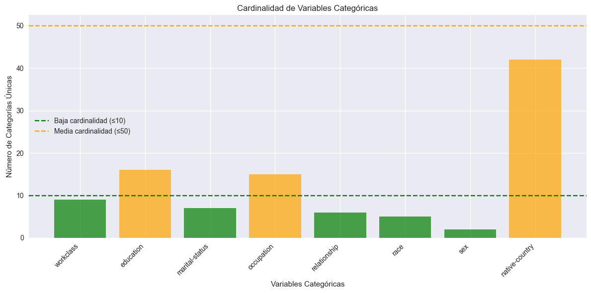
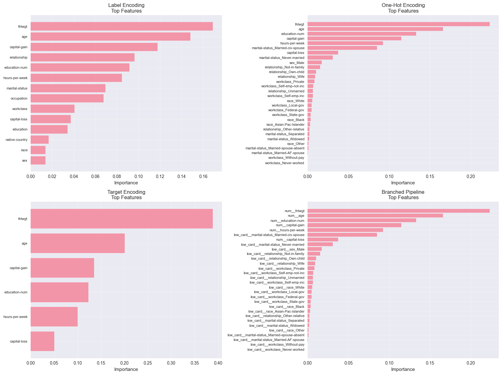
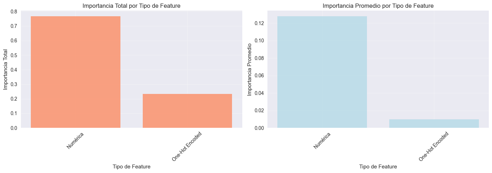
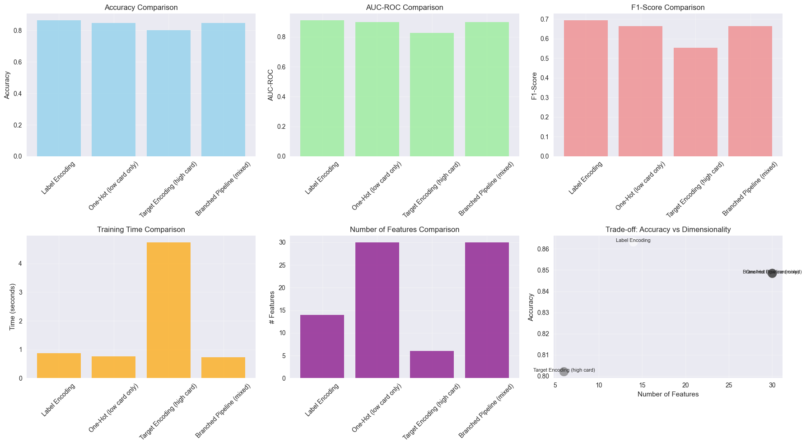

## 📦 Paso 1: Instalación de Dependencias
```python
# === INSTALACIÓN DE DEPENDENCIAS ===

print("📦 Instalando dependencias necesarias...")
print("-" * 60)

# Instalar category_encoders (necesario para TargetEncoder)
#!pip install shap category-encoders --quiet


import pandas as pd
import numpy as np
import matplotlib.pyplot as plt
import seaborn as sns
from sklearn.model_selection import train_test_split, StratifiedKFold, cross_val_score
from sklearn.preprocessing import LabelEncoder, OneHotEncoder, StandardScaler
from sklearn.compose import ColumnTransformer
from sklearn.pipeline import Pipeline
from sklearn.ensemble import RandomForestClassifier
from sklearn.metrics import accuracy_score, roc_auc_score, f1_score
from category_encoders import TargetEncoder
import time
import warnings

print("\n🎉 Setup completado. Puedes continuar con el assignment.")


# Importar librerías necesarias
warnings.filterwarnings('ignore')

# Configuración
np.random.seed(42)
plt.style.use('seaborn-v0_8')  # establecer estilo visual (ej: 'seaborn-v0_8', 'default')
sns.set_palette("Set2")  # definir paleta de colores (ej: 'Set2', 'husl')

print("✅ Entorno configurado para encoding avanzado")
```
```output
📦 Instalando dependencias necesarias...
------------------------------------------------------------

🎉 Setup completado. Puedes continuar con el assignment.
✅ Entorno configurado para encoding avanzado
```

## 💰 Paso 2: Cargar Dataset Real - Adult Income (Census)
```python
# === CARGAR DATASET REAL: ADULT INCOME ===

print("💰 CARGANDO DATASET: ADULT INCOME (US CENSUS)")
print("=" * 60)

# Este dataset es del UCI ML Repository - clásico para benchmarking
# Predice si el ingreso anual supera $50K basándose en datos del censo de 1994

# OPCIÓN 1: Cargar desde URL (si tienes conexión a internet)
url = "https://archive.ics.uci.edu/ml/machine-learning-databases/adult/adult.data"

# Nombres de columnas (el dataset no tiene header)
column_names = [
    'age', 'workclass', 'fnlwgt', 'education', 'education-num',
    'marital-status', 'occupation', 'relationship', 'race', 'sex',
    'capital-gain', 'capital-loss', 'hours-per-week', 'native-country', 'income'
]

df = pd.read_csv(url, names=column_names, na_values=' ?', skipinitialspace=True)  # función para leer CSV

# 1. Limpiar datos
print("\n🧹 Limpiando datos...")

# Remover espacios en blanco de las categorías
for col in df.select_dtypes(include=['object']).columns:
    df[col] = df[col].str.strip()  # método para eliminar espacios en blanco

# Manejar valores faltantes
print(f"   Valores faltantes antes: {df.isnull().sum().sum()}")
df = df.dropna(how='any')  # método para eliminar filas con NaN
print(f"   Valores faltantes después: {df.isnull().sum().sum()}")
print(f"   Registros después de limpieza: {len(df):,}")

# 2. Crear target binario
df['target'] = (df['income'] == '>50K').astype(int)

print(f"\n📊 Dataset shape: {df.shape}")
print(f"📊 Distribución del target:")
print(f"   <=50K: {(df['target']==0).sum():,} ({(df['target']==0).mean():.1%})")
print(f"   >50K:  {(df['target']==1).sum():,} ({(df['target']==1).mean():.1%})")

# 3. Identificar columnas categóricas (excluir target e income)
categorical_cols = df.select_dtypes(include=['object']).columns.tolist()
if 'income' in categorical_cols:
    categorical_cols.remove('income')
if 'target' in categorical_cols:
    categorical_cols.remove('target')

print(f"\n🔍 Variables categóricas encontradas: {len(categorical_cols)}")

# 4. Analizar cardinalidad
print("\n🔍 ANÁLISIS DE CARDINALIDAD:")
for col in categorical_cols:
    n_unique = df[col].nunique()
    cardinality_type = 'BAJA' if n_unique <= 10 else ('MEDIA' if n_unique <= 50 else 'ALTA')
    print(f"   {col}: {n_unique} categorías únicas ({cardinality_type})")

print("\n🔍 Primeras 5 filas:")
print(df.head())  # método para mostrar primeras filas

print("\n💡 CONTEXTO DEL DATASET:")
print("   Dataset del US Census (1994) - clásico de Machine Learning")
print("   Target: Ingreso >50K/año (clasificación binaria)")
print("   Variables categóricas: workclass, education, occupation, etc.")
print("   Alta cardinalidad: native-country (42 países)")
print("   Accuracy típica: 80-85% (más desafiante que hoteles)")
```
```output
💰 CARGANDO DATASET: ADULT INCOME (US CENSUS)
============================================================

🧹 Limpiando datos...
   Valores faltantes antes: 0
   Valores faltantes después: 0
   Registros después de limpieza: 32,561

📊 Dataset shape: (32561, 16)
📊 Distribución del target:
   <=50K: 24,720 (75.9%)
   >50K:  7,841 (24.1%)

🔍 Variables categóricas encontradas: 8

🔍 ANÁLISIS DE CARDINALIDAD:
   workclass: 9 categorías únicas (BAJA)
   education: 16 categorías únicas (MEDIA)
   marital-status: 7 categorías únicas (BAJA)
   occupation: 15 categorías únicas (MEDIA)
   relationship: 6 categorías únicas (BAJA)
   race: 5 categorías únicas (BAJA)
   sex: 2 categorías únicas (BAJA)
   native-country: 42 categorías únicas (MEDIA)

🔍 Primeras 5 filas:
   age         workclass  fnlwgt  education  education-num  \
0   39         State-gov   77516  Bachelors             13   
1   50  Self-emp-not-inc   83311  Bachelors             13   
2   38           Private  215646    HS-grad              9   
3   53           Private  234721       11th              7   
4   28           Private  338409  Bachelors             13   

       marital-status         occupation   relationship   race     sex  \
0       Never-married       Adm-clerical  Not-in-family  White    Male   
1  Married-civ-spouse    Exec-managerial        Husband  White    Male   
2            Divorced  Handlers-cleaners  Not-in-family  White    Male   
3  Married-civ-spouse  Handlers-cleaners        Husband  Black    Male   
4  Married-civ-spouse     Prof-specialty           Wife  Black  Female   

   capital-gain  capital-loss  hours-per-week native-country income  target  
0          2174             0              40  United-States  <=50K       0  
1             0             0              13  United-States  <=50K       0  
2             0             0              40  United-States  <=50K       0  
3             0             0              40  United-States  <=50K       0  
4             0             0              40           Cuba  <=50K       0  

💡 CONTEXTO DEL DATASET:
   Dataset del US Census (1994) - clásico de Machine Learning
   Target: Ingreso >50K/año (clasificación binaria)
   Variables categóricas: workclass, education, occupation, etc.
   Alta cardinalidad: native-country (42 países)
   Accuracy típica: 80-85% (más desafiante que hoteles)
```

## 🔢 Paso 3: Análisis de Cardinalidad
```python
# === ANÁLISIS DE CARDINALIDAD Y PROBLEMAS DE ONE-HOT ===

print("\n🔍 ANÁLISIS DE CARDINALIDAD")
print("=" * 60)

# 1. Clasificar columnas por cardinalidad
def classify_cardinality(df, categorical_cols):
    """Clasificar columnas por cardinalidad"""
    low_card = []
    medium_card = []
    high_card = []

    for col in categorical_cols:
        n_unique = df[col].nunique()
        if n_unique <= 10:
            low_card.append(col)
        elif n_unique <= 50:
            medium_card.append(col)
        else:
            high_card.append(col)

    return low_card, medium_card, high_card

low_card_cols, medium_card_cols, high_card_cols = classify_cardinality(df, categorical_cols)

print("📊 CLASIFICACIÓN POR CARDINALIDAD:")
print(f"✅ Baja cardinalidad (≤10): {len(low_card_cols)} columnas")
print(f"   {low_card_cols}")
print(f"⚠️  Media cardinalidad (11-50): {len(medium_card_cols)} columnas")
print(f"   {medium_card_cols}")
print(f"🚨 Alta cardinalidad (>50): {len(high_card_cols)} columnas")
print(f"   {high_card_cols}")

# 2. Calcular dimensionalidad con One-Hot
print("\n🚨 PROBLEMA DE DIMENSIONALIDAD CON ONE-HOT:")

total_onehot_columns = 0
for col in categorical_cols:
    n_categories = df[col].nunique()
    n_onehot_cols = n_categories - 1  # drop='first'
    total_onehot_columns += n_onehot_cols
    print(f"   {col}: {n_categories} categorías → {n_onehot_cols} columnas one-hot")

print(f"\n❌ Total columnas con one-hot: {total_onehot_columns}")
print(f"❌ Original: {len(categorical_cols)} columnas → {total_onehot_columns} columnas")
print(f"❌ Explosión dimensional: {total_onehot_columns / len(categorical_cols):.1f}x")

# 3. Visualizar distribución de cardinalidad
fig, ax = plt.subplots(figsize=(12, 6))

cardinalities = [df[col].nunique() for col in categorical_cols]
colors = ['green' if c <= 10 else ('orange' if c <= 50 else 'red') for c in cardinalities]

ax.bar(categorical_cols, cardinalities, color=colors, alpha=0.7)
ax.axhline(y=10, color='green', linestyle='--', label='Baja cardinalidad (≤10)')
ax.axhline(y=50, color='orange', linestyle='--', label='Media cardinalidad (≤50)')
ax.set_xlabel('Variables Categóricas')
ax.set_ylabel('Número de Categorías Únicas')
ax.set_title('Cardinalidad de Variables Categóricas')
ax.legend()
plt.xticks(rotation=45, ha='right')
plt.tight_layout()
plt.show()

print("\n💡 CONCLUSIÓN:")
print("   One-hot encoding NO es viable para variables de alta cardinalidad")
print("   Necesitamos técnicas alternativas: Label, Target, Hash, Binary encoding")
```
```output
🔍 ANÁLISIS DE CARDINALIDAD
============================================================
📊 CLASIFICACIÓN POR CARDINALIDAD:
✅ Baja cardinalidad (≤10): 5 columnas
   ['workclass', 'marital-status', 'relationship', 'race', 'sex']
⚠️  Media cardinalidad (11-50): 3 columnas
   ['education', 'occupation', 'native-country']
🚨 Alta cardinalidad (>50): 0 columnas
   []

🚨 PROBLEMA DE DIMENSIONALIDAD CON ONE-HOT:
   workclass: 9 categorías → 8 columnas one-hot
   education: 16 categorías → 15 columnas one-hot
   marital-status: 7 categorías → 6 columnas one-hot
   occupation: 15 categorías → 14 columnas one-hot
   relationship: 6 categorías → 5 columnas one-hot
   race: 5 categorías → 4 columnas one-hot
   sex: 2 categorías → 1 columnas one-hot
   native-country: 42 categorías → 41 columnas one-hot

❌ Total columnas con one-hot: 94
❌ Original: 8 columnas → 94 columnas
❌ Explosión dimensional: 11.8x
```

```output
💡 CONCLUSIÓN:
   One-hot encoding NO es viable para variables de alta cardinalidad
   Necesitamos técnicas alternativas: Label, Target, Hash, Binary encoding
```

## 🏷️ Paso 4: Experimento 1 - Label Encoding
```python
# === EXPERIMENTO 1: LABEL ENCODING ===

print("\n🏷️ EXPERIMENTO 1: LABEL ENCODING")
print("=" * 60)

def experiment_label_encoding(df, categorical_cols, target_col='target'):
    """
    Implementar Label Encoding y evaluar performance
    """

    # 1. Preparar datos
    # Seleccionar variables numéricas del dataset Adult Income
    numeric_cols = ['age', 'fnlwgt', 'education-num', 'capital-gain', 
                   'capital-loss', 'hours-per-week']

    X = df[categorical_cols + numeric_cols].copy()
    y = df[target_col]

    # Split train-test
    X_train, X_test, y_train, y_test = train_test_split(X, y, test_size=0.2, random_state=42, stratify=y)

    # 2. Aplicar Label Encoding
    print("🔄 Aplicando Label Encoding...")

    X_train_encoded = X_train.copy()
    X_test_encoded = X_test.copy()

    label_encoders = {}

    for col in categorical_cols:
        le = LabelEncoder()

        # Fit en train
        X_train_encoded[col] = le.fit_transform(X_train[col])  # método para fit y transform

        # Transform en test (manejar categorías no vistas)
        # TODO: ¿Cómo manejar categorías en test que no aparecen en train?
        le_dict = dict(zip(le.classes_, le.transform(le.classes_)))
        X_test_encoded[col] = X_test[col].map(le_dict).fillna(-1).astype(int)

        label_encoders[col] = le

    # 3. Entrenar modelo
    print("🌲 Entrenando Random Forest...")

    start_time = time.time()

    model = RandomForestClassifier(n_estimators=100, random_state=42, n_jobs=-1)
    model.fit(X_train_encoded, y_train)  # método para entrenar modelo

    training_time = time.time() - start_time

    # 4. Evaluar
    y_pred = model.predict(X_test_encoded)  # método para hacer predicciones
    y_pred_proba = model.predict_proba(X_test_encoded)[:, 1]

    accuracy = accuracy_score(y_test, y_pred)
    auc = roc_auc_score(y_test, y_pred_proba)
    f1 = f1_score(y_test, y_pred)

    results = {
        'encoding': 'Label Encoding',
        'accuracy': accuracy,
        'auc': auc,
        'f1_score': f1,
        'training_time': training_time,
        'n_features': X_train_encoded.shape[1]
    }

    print(f"✅ Label Encoding completado")
    print(f"   📊 Accuracy: {accuracy:.4f}")
    print(f"   📊 AUC-ROC: {auc:.4f}")
    print(f"   📊 F1-Score: {f1:.4f}")
    print(f"   ⏱️  Training time: {training_time:.2f}s")
    print(f"   📏 Features: {X_train_encoded.shape[1]}")

    return results, model, label_encoders

# Ejecutar experimento
results_label, model_label, label_encoders = experiment_label_encoding(df, categorical_cols)
```
```output
🏷️ EXPERIMENTO 1: LABEL ENCODING
============================================================
🔄 Aplicando Label Encoding...
🌲 Entrenando Random Forest...
✅ Label Encoding completado
   📊 Accuracy: 0.8632
   📊 AUC-ROC: 0.9101
   📊 F1-Score: 0.6931
   ⏱️  Training time: 0.48s
   📏 Features: 14
```

## 🔥 Paso 5: Experimento 2 - One-Hot Encoding (Solo Baja Cardinalidad)
```python
# === EXPERIMENTO 2: ONE-HOT ENCODING (SOLO BAJA CARDINALIDAD) ===

print("\n🔥 EXPERIMENTO 2: ONE-HOT ENCODING (BAJA CARDINALIDAD)")
print("=" * 60)

def experiment_onehot_encoding(df, low_card_cols, numeric_cols, target_col='target'):
    """
    Implementar One-Hot Encoding solo para variables de baja cardinalidad
    """

    # 1. Preparar datos (solo baja cardinalidad + numéricas)
    feature_cols = low_card_cols + numeric_cols
    X = df[feature_cols].copy()
    y = df[target_col]

    # Split
    X_train, X_test, y_train, y_test = train_test_split(X, y, test_size=0.2, random_state=42, stratify=y)

    # 2. Aplicar One-Hot Encoding
    print("🔄 Aplicando One-Hot Encoding...")

    encoder = OneHotEncoder(drop='first', sparse_output=False, handle_unknown='ignore')

    # Separar categóricas y numéricas
    X_train_cat = X_train[low_card_cols]
    X_train_num = X_train[numeric_cols]
    X_test_cat = X_test[low_card_cols]
    X_test_num = X_test[numeric_cols]

    # Encode categóricas
    X_train_cat_encoded = encoder.fit_transform(X_train_cat)  # método para fit y transform
    X_test_cat_encoded = encoder.transform(X_test_cat)    # método para solo transform

    # Combinar con numéricas
    X_train_encoded = np.hstack([X_train_cat_encoded, X_train_num.values])
    X_test_encoded = np.hstack([X_test_cat_encoded, X_test_num.values])

    print(f"   📊 Features after one-hot: {X_train_encoded.shape[1]}")
    print(f"   📊 Categóricas: {low_card_cols}")
    print(f"   📊 Columnas one-hot: {X_train_cat_encoded.shape[1]}")

    # 3. Entrenar modelo
    print("🌲 Entrenando Random Forest...")

    start_time = time.time()

    model = RandomForestClassifier(n_estimators=100, random_state=42, n_jobs=-1)
    model.fit(X_train_encoded, y_train)

    training_time = time.time() - start_time

    # 4. Evaluar
    y_pred = model.predict(X_test_encoded)
    y_pred_proba = model.predict_proba(X_test_encoded)[:, 1]

    accuracy = accuracy_score(y_test, y_pred)
    auc = roc_auc_score(y_test, y_pred_proba)
    f1 = f1_score(y_test, y_pred)

    results = {
        'encoding': 'One-Hot (low card only)',
        'accuracy': accuracy,
        'auc': auc,
        'f1_score': f1,
        'training_time': training_time,
        'n_features': X_train_encoded.shape[1]
    }

    print(f"✅ One-Hot Encoding completado")
    print(f"   📊 Accuracy: {accuracy:.4f}")
    print(f"   📊 AUC-ROC: {auc:.4f}")
    print(f"   📊 F1-Score: {f1:.4f}")
    print(f"   ⏱️  Training time: {training_time:.2f}s")
    print(f"   📏 Features: {X_train_encoded.shape[1]}")

    return results, model, encoder

# Ejecutar experimento
# Definir variables numéricas del Adult Income dataset
numeric_cols = ['age', 'fnlwgt', 'education-num', 'capital-gain', 
               'capital-loss', 'hours-per-week']

results_onehot, model_onehot, onehot_encoder = experiment_onehot_encoding(df, low_card_cols, numeric_cols)
```
```output
🔥 EXPERIMENTO 2: ONE-HOT ENCODING (BAJA CARDINALIDAD)
============================================================
🔄 Aplicando One-Hot Encoding...
   📊 Features after one-hot: 30
   📊 Categóricas: ['workclass', 'marital-status', 'relationship', 'race', 'sex']
   📊 Columnas one-hot: 24
🌲 Entrenando Random Forest...
✅ One-Hot Encoding completado
   📊 Accuracy: 0.8483
   📊 AUC-ROC: 0.8995
   📊 F1-Score: 0.6633
   ⏱️  Training time: 0.46s
   📏 Features: 30
```

## 🎯 Paso 6: Experimento 3 - Target Encoding (Alta Cardinalidad)
```python
# === EXPERIMENTO 3: TARGET ENCODING (ALTA CARDINALIDAD) ===

print("\n🎯 EXPERIMENTO 3: TARGET ENCODING (ALTA CARDINALIDAD)")
print("=" * 60)

def experiment_target_encoding(df, high_card_cols, numeric_cols, target_col='target'):
    """
    Implementar Target Encoding con cross-validation para prevenir leakage
    """

    # 1. Preparar datos
    feature_cols = high_card_cols + numeric_cols
    X = df[feature_cols].copy()
    y = df[target_col]

    # Split
    X_train, X_test, y_train, y_test = train_test_split(X, y, test_size=0.2, random_state=42, stratify=y)

    # 2. Aplicar Target Encoding
    print("🔄 Aplicando Target Encoding...")
    print("⚠️  IMPORTANTE: Usando cross-validation para prevenir DATA LEAKAGE")

    # TODO: ¿Por qué es importante usar CV para target encoding?
    # PISTA: ¿Qué pasa si calculamos el promedio del target usando el mismo registro?

    # Crear encoder de category_encoders
    encoder = TargetEncoder(cols=high_card_cols, smoothing=1.0)  # parámetro de smoothing (ej: 1.0, 10.0, 100.0)

    # Separar categóricas y numéricas
    X_train_cat = X_train[high_card_cols]
    X_train_num = X_train[numeric_cols]
    X_test_cat = X_test[high_card_cols]
    X_test_num = X_test[numeric_cols]

    # Encode categóricas (TargetEncoder necesita el target)
    X_train_cat_encoded = encoder.fit_transform(X_train_cat, y_train)  # método para fit y transform con target
    X_test_cat_encoded = encoder.transform(X_test_cat)              # método para solo transform

    # Combinar con numéricas
    X_train_encoded = pd.concat([X_train_cat_encoded.reset_index(drop=True), 
                                 X_train_num.reset_index(drop=True)], axis=1)
    X_test_encoded = pd.concat([X_test_cat_encoded.reset_index(drop=True), 
                                X_test_num.reset_index(drop=True)], axis=1)

    print(f"   📊 Features after target encoding: {X_train_encoded.shape[1]}")
    print(f"   📊 Categóricas codificadas: {high_card_cols}")
    print(f"   📊 Ejemplo de encoding:")
    for col in high_card_cols[:2]:  # mostrar primeras 2 columnas
        print(f"      {col}: min={X_train_cat_encoded[col].min():.3f}, "
              f"max={X_train_cat_encoded[col].max():.3f}, "
              f"mean={X_train_cat_encoded[col].mean():.3f}")

    # 3. Entrenar modelo
    print("🌲 Entrenando Random Forest...")

    start_time = time.time()

    model = RandomForestClassifier(n_estimators=100, random_state=42, n_jobs=-1)
    model.fit(X_train_encoded, y_train)

    training_time = time.time() - start_time

    # 4. Evaluar
    y_pred = model.predict(X_test_encoded)
    y_pred_proba = model.predict_proba(X_test_encoded)[:, 1]

    accuracy = accuracy_score(y_test, y_pred)
    auc = roc_auc_score(y_test, y_pred_proba)
    f1 = f1_score(y_test, y_pred)

    results = {
        'encoding': 'Target Encoding (high card)',
        'accuracy': accuracy,
        'auc': auc,
        'f1_score': f1,
        'training_time': training_time,
        'n_features': X_train_encoded.shape[1]
    }

    print(f"✅ Target Encoding completado")
    print(f"   📊 Accuracy: {accuracy:.4f}")
    print(f"   📊 AUC-ROC: {auc:.4f}")
    print(f"   📊 F1-Score: {f1:.4f}")
    print(f"   ⏱️  Training time: {training_time:.2f}s")
    print(f"   📏 Features: {X_train_encoded.shape[1]}")

    return results, model, encoder

# Ejecutar experimento
results_target, model_target, target_encoder = experiment_target_encoding(df, high_card_cols, numeric_cols)
```
```output
🎯 EXPERIMENTO 3: TARGET ENCODING (ALTA CARDINALIDAD)
============================================================
🔄 Aplicando Target Encoding...
⚠️  IMPORTANTE: Usando cross-validation para prevenir DATA LEAKAGE
   📊 Features after target encoding: 6
   📊 Categóricas codificadas: []
   📊 Ejemplo de encoding:
🌲 Entrenando Random Forest...
✅ Target Encoding completado
   📊 Accuracy: 0.8021
   📊 AUC-ROC: 0.8272
   📊 F1-Score: 0.5538
   ⏱️  Training time: 0.37s
   📏 Features: 6
```

## 🌳 Paso 7: Pipeline con Branching - ColumnTransformer
```python
# === PIPELINE CON BRANCHING: COLUMNTRANSFORMER ===

print("\n🌳 PIPELINE CON BRANCHING: COLUMNTRANSFORMER")
print("=" * 60)

def create_branched_pipeline(low_card_cols, high_card_cols, numeric_cols):
    """
    Crear pipeline con múltiples ramas para diferentes tipos de encoding
    """

    print("🔧 Creando pipeline con branching...")
    print(f"   🌿 Rama 1: One-Hot para baja cardinalidad ({len(low_card_cols)} cols)")
    print(f"   🌿 Rama 2: Target Encoding para alta cardinalidad ({len(high_card_cols)} cols)")
    print(f"   🌿 Rama 3: StandardScaler para numéricas ({len(numeric_cols)} cols)")

    # TODO: Definir transformadores para cada rama

    # RAMA 1: One-Hot para baja cardinalidad
    onehot_transformer = Pipeline(steps=[
        ('onehot', OneHotEncoder(drop='first', sparse_output=False, handle_unknown='ignore'))
    ])

    # RAMA 2: Target Encoding para alta cardinalidad
    target_transformer = Pipeline(steps=[
        ('target', TargetEncoder(smoothing=10.0))
    ])

    # RAMA 3: Scaling para numéricas
    numeric_transformer = Pipeline(steps=[
        ('scaler', StandardScaler())
    ])

    # COLUMNTRANSFORMER: Combina todas las ramas
    preprocessor = ColumnTransformer(
        transformers=[
            ('low_card', onehot_transformer, low_card_cols),
            ('high_card', target_transformer, high_card_cols),
            ('num', numeric_transformer, numeric_cols)
        ],
        remainder='drop'  # qué hacer con columnas no especificadas ('drop', 'passthrough')
    )

    # PIPELINE COMPLETO: Preprocessor + Modelo
    pipeline = Pipeline(steps=[
        ('preprocessor', preprocessor),
        ('classifier', RandomForestClassifier(n_estimators=100, random_state=42, n_jobs=-1))
    ])

    print("✅ Pipeline creado con éxito")

    return pipeline, preprocessor

def experiment_branched_pipeline(df, low_card_cols, high_card_cols, numeric_cols, target_col='target'):
    """
    Evaluar pipeline con branching
    """

    # 1. Preparar datos
    all_features = low_card_cols + high_card_cols + numeric_cols
    X = df[all_features].copy()
    y = df[target_col]

    # Split
    X_train, X_test, y_train, y_test = train_test_split(X, y, test_size=0.2, random_state=42, stratify=y)

    # 2. Crear pipeline
    pipeline, preprocessor = create_branched_pipeline(low_card_cols, high_card_cols, numeric_cols)

    # 3. Entrenar pipeline completo
    print("\n🔄 Entrenando pipeline completo...")

    start_time = time.time()

    pipeline.fit(X_train, y_train)  # método para entrenar pipeline

    training_time = time.time() - start_time

    # 4. Evaluar
    y_pred = pipeline.predict(X_test)  # método para hacer predicciones
    y_pred_proba = pipeline.predict_proba(X_test)[:, 1]

    accuracy = accuracy_score(y_test, y_pred)
    auc = roc_auc_score(y_test, y_pred_proba)
    f1 = f1_score(y_test, y_pred)

    # 5. Analizar features transformadas
    print("\n📊 ANÁLISIS DE FEATURES TRANSFORMADAS:")

    X_train_transformed = preprocessor.fit_transform(X_train, y_train)

    print(f"   📏 Features originales: {X_train.shape[1]}")
    print(f"   📏 Features después de transformación: {X_train_transformed.shape[1]}")

    # TODO: ¿Cuántas columnas one-hot se crearon?
    # PISTA: Usar get_feature_names_out() del preprocessor

    results = {
        'encoding': 'Branched Pipeline (mixed)',
        'accuracy': accuracy,
        'auc': auc,
        'f1_score': f1,
        'training_time': training_time,
        'n_features': X_train_transformed.shape[1]
    }

    print(f"\n✅ Pipeline con branching completado")
    print(f"   📊 Accuracy: {accuracy:.4f}")
    print(f"   📊 AUC-ROC: {auc:.4f}")
    print(f"   📊 F1-Score: {f1:.4f}")
    print(f"   ⏱️  Training time: {training_time:.2f}s")
    print(f"   📏 Features: {X_train_transformed.shape[1]}")

    return results, pipeline, X_test, y_test

# Ejecutar experimento
results_pipeline, pipeline, X_test_pipeline, y_test_pipeline = experiment_branched_pipeline(df, low_card_cols, high_card_cols, numeric_cols)
```
```output
🌳 PIPELINE CON BRANCHING: COLUMNTRANSFORMER
============================================================
🔧 Creando pipeline con branching...
   🌿 Rama 1: One-Hot para baja cardinalidad (5 cols)
   🌿 Rama 2: Target Encoding para alta cardinalidad (0 cols)
   🌿 Rama 3: StandardScaler para numéricas (6 cols)
✅ Pipeline creado con éxito

🔄 Entrenando pipeline completo...

📊 ANÁLISIS DE FEATURES TRANSFORMADAS:
   📏 Features originales: 11
   📏 Features después de transformación: 30

✅ Pipeline con branching completado
   📊 Accuracy: 0.8485
   📊 AUC-ROC: 0.8996
   📊 F1-Score: 0.6646
   ⏱️  Training time: 0.37s
   📏 Features: 30
```

## 🔍 Paso 7.5: Explicabilidad - Feature Importance y SHAP
```python
# === EXPLICABILIDAD: ANÁLISIS DE FEATURE IMPORTANCE ===

print("\n🔍 EXPLICABILIDAD: FEATURE IMPORTANCE")
print("=" * 60)

# 1. Feature Importance del Random Forest
print("🌲 1. FEATURE IMPORTANCE - RANDOM FOREST")
print("-" * 60)
def analyze_feature_importance(model, feature_names):
    """
    Analizar y visualizar feature importance del Random Forest
    """

    # Obtener importancia de features
    importances = model.feature_importances_  # atributo que contiene las importancias

    # Crear DataFrame para ordenar
    importance_df = pd.DataFrame({
        'feature': feature_names,
        'importance': importances
    }).sort_values('importance', ascending=False)

    print(f"🔝 Top Features más importantes:")
    print(importance_df.to_string(index=False))

    # Visualización
    fig, (ax1, ax2) = plt.subplots(1, 2, figsize=(16, 6))

    # Top N features
    top_features = importance_df
    ax1.barh(range(len(top_features)), top_features['importance'], color='skyblue', alpha=0.7)
    ax1.set_yticks(range(len(top_features)))
    ax1.set_yticklabels(top_features['feature'])
    ax1.set_xlabel('Importance')
    ax1.set_title(f'Top Features - Random Forest')
    ax1.invert_yaxis()
    ax1.grid(True, alpha=0.3)

    # Distribución de importancias
    ax2.hist(importances, bins=50, alpha=0.7, color='lightgreen')
    ax2.set_xlabel('Importance Value')
    ax2.set_ylabel('Frequency')
    ax2.set_title('Distribución de Feature Importances')
    ax2.axvline(importances.mean(), color='red', linestyle='--', label=f'Mean: {importances.mean():.4f}')
    ax2.legend()
    ax2.grid(True, alpha=0.3)

    plt.tight_layout()
    plt.show()

    return importance_df

# Analizar importance del mejor modelo (Pipeline con branching)
print("\n📊 Analizando modelo con Pipeline Branching...")

# Obtener nombres de features después de transformación
feature_names_out = pipeline.named_steps['preprocessor'].get_feature_names_out()
print(f"✅ Features extraídas: {len(feature_names_out)}")

# Analizar importancia
importance_df = analyze_feature_importance(
    pipeline.named_steps['classifier'], 
    feature_names_out
)

# 2. Comparar importancia entre métodos de encoding
print("\n📊 2. COMPARACIÓN DE IMPORTANCIA POR MÉTODO")
print("-" * 60)

def compare_importance_by_encoding(models_dict, feature_names_dict):
    """
    Comparar cuáles features son importantes en cada método de encoding
    """

    fig, axes = plt.subplots(2, 2, figsize=(16, 12))
    axes = axes.ravel()

    for idx, (name, model) in enumerate(models_dict.items()):
        if idx >= 4:
            break

        # Obtener importancias
        importances = model.feature_importances_
        features = feature_names_dict[name]

        # Top 10
        importance_df = pd.DataFrame({
            'feature': features,
            'importance': importances
        }).sort_values('importance', ascending=False)

        # Visualizar
        axes[idx].barh(range(len(importance_df)), importance_df['importance'], alpha=0.7)
        axes[idx].set_yticks(range(len(importance_df)))
        axes[idx].set_yticklabels(importance_df['feature'], fontsize=8)
        axes[idx].set_xlabel('Importance')
        axes[idx].set_title(f'{name}\nTop Features')
        axes[idx].invert_yaxis()
        axes[idx].grid(True, alpha=0.3)

    plt.tight_layout()
    plt.show()

# Preparar datos para comparación
models_dict = {
    'Label Encoding': model_label,
    'One-Hot Encoding': model_onehot,
    'Target Encoding': model_target,
    'Branched Pipeline': pipeline.named_steps['classifier']
}

# TODO: Definir feature names para cada modelo
# PISTA: Necesitas saber qué features tiene cada modelo después del encoding
feature_names_dict = {
    'Label Encoding': categorical_cols + numeric_cols,
    'One-Hot Encoding': list(onehot_encoder.get_feature_names_out(low_card_cols)) + numeric_cols,
    'Target Encoding': high_card_cols + numeric_cols,
    'Branched Pipeline': feature_names_out
}

print("📊 Comparando importancia entre métodos...")
compare_importance_by_encoding(models_dict, feature_names_dict)

# 4. Análisis de Features Codificadas
print("\n🔍 4. ANÁLISIS DE FEATURES CODIFICADAS")
print("-" * 60)

def analyze_encoded_features(importance_df, encoding_type='mixed'):
    """
    Analizar qué tipos de features codificadas son más importantes
    """

    print(f"\n📊 Análisis para encoding: {encoding_type}")

    # Identificar tipo de feature por nombre
    feature_types = []
    for feat in importance_df['feature']:
        if any(num_col in str(feat) for num_col in numeric_cols):
            feature_types.append('Numérica')
        elif 'target_enc' in str(feat).lower() or any(hc in str(feat) for hc in high_card_cols):
            feature_types.append('Target Encoded')
        elif any(lc in str(feat) for lc in low_card_cols):
            feature_types.append('One-Hot Encoded')
        else:
            feature_types.append('Otra')

    importance_df['type'] = feature_types

    # Agrupar por tipo
    type_importance = importance_df.groupby('type')['importance'].agg(['sum', 'mean', 'count'])
    type_importance = type_importance.sort_values('sum', ascending=False)

    print("\n📊 Importancia por tipo de feature:")
    print(type_importance.round(4))

    # Visualizar
    fig, (ax1, ax2) = plt.subplots(1, 2, figsize=(14, 5))

    # Importancia total por tipo
    ax1.bar(type_importance.index, type_importance['sum'], alpha=0.7, color='coral')
    ax1.set_xlabel('Tipo de Feature')
    ax1.set_ylabel('Importancia Total')
    ax1.set_title('Importancia Total por Tipo de Feature')
    ax1.tick_params(axis='x', rotation=45)
    ax1.grid(True, alpha=0.3)

    # Importancia promedio por tipo
    ax2.bar(type_importance.index, type_importance['mean'], alpha=0.7, color='lightblue')
    ax2.set_xlabel('Tipo de Feature')
    ax2.set_ylabel('Importancia Promedio')
    ax2.set_title('Importancia Promedio por Tipo de Feature')
    ax2.tick_params(axis='x', rotation=45)
    ax2.grid(True, alpha=0.3)

    plt.tight_layout()
    plt.show()

    return type_importance

# Analizar features del mejor modelo
type_importance = analyze_encoded_features(importance_df, 'Branched Pipeline')
```
```output
🔍 EXPLICABILIDAD: FEATURE IMPORTANCE
============================================================
🌲 1. FEATURE IMPORTANCE - RANDOM FOREST
------------------------------------------------------------

📊 Analizando modelo con Pipeline Branching...
✅ Features extraídas: 30
🔝 Top Features más importantes:
                                       feature  importance
                                   num__fnlwgt    0.223091
                                      num__age    0.165969
                            num__education-num    0.132941
                             num__capital-gain    0.114665
                           num__hours-per-week    0.092367
   low_card__marital-status_Married-civ-spouse    0.084835
                             num__capital-loss    0.037539
        low_card__marital-status_Never-married    0.030943
                            low_card__sex_Male    0.017424
          low_card__relationship_Not-in-family    0.015534
              low_card__relationship_Own-child    0.010421
                   low_card__relationship_Wife    0.009393
                   low_card__workclass_Private    0.008430
          low_card__workclass_Self-emp-not-inc    0.007039
              low_card__relationship_Unmarried    0.006682
              low_card__workclass_Self-emp-inc    0.006389
                          low_card__race_White    0.005890
                 low_card__workclass_Local-gov    0.005073
               low_card__workclass_Federal-gov    0.005033
                 low_card__workclass_State-gov    0.003949
                          low_card__race_Black    0.003919
             low_card__race_Asian-Pac-Islander    0.003127
         low_card__relationship_Other-relative    0.002466
            low_card__marital-status_Separated    0.002190
              low_card__marital-status_Widowed    0.001779
                          low_card__race_Other    0.001271
low_card__marital-status_Married-spouse-absent    0.001199
    low_card__marital-status_Married-AF-spouse    0.000317
               low_card__workclass_Without-pay    0.000113
              low_card__workclass_Never-worked    0.000008
```

```output
📊 2. COMPARACIÓN DE IMPORTANCIA POR MÉTODO
------------------------------------------------------------
📊 Comparando importancia entre métodos...
```

```output
🔍 4. ANÁLISIS DE FEATURES CODIFICADAS
------------------------------------------------------------

📊 Análisis para encoding: Branched Pipeline

📊 Importancia por tipo de feature:
                    sum    mean  count
type                                  
Numérica         0.7666  0.1278      6
One-Hot Encoded  0.2334  0.0097     24
```


## 📊 Paso 8: Comparación de Resultados
```python
# === COMPARACIÓN DE TODOS LOS MÉTODOS ===

print("\n📊 COMPARACIÓN DE MÉTODOS DE ENCODING")
print("=" * 60)

# 1. Consolidar resultados
all_results = [
    results_label,
    results_onehot,
    results_target,
    results_pipeline
]

results_df = pd.DataFrame(all_results)

# 2. Mostrar tabla comparativa
print("\n🔝 TABLA COMPARATIVA:")
print(results_df.to_string(index=False))

# 3. Identificar mejor método por métrica
print("\n🏆 MEJORES MÉTODOS POR MÉTRICA:")
print(f"   🎯 Mejor Accuracy: {results_df.loc[results_df['accuracy'].idxmax(), 'encoding']} "
      f"({results_df['accuracy'].max():.4f})")
print(f"   🎯 Mejor AUC-ROC: {results_df.loc[results_df['auc'].idxmax(), 'encoding']} "
      f"({results_df['auc'].max():.4f})")
print(f"   🎯 Mejor F1-Score: {results_df.loc[results_df['f1_score'].idxmax(), 'encoding']} "
      f"({results_df['f1_score'].max():.4f})")
print(f"   ⚡ Más rápido: {results_df.loc[results_df['training_time'].idxmin(), 'encoding']} "
      f"({results_df['training_time'].min():.2f}s)")
print(f"   📏 Menos features: {results_df.loc[results_df['n_features'].idxmin(), 'encoding']} "
      f"({results_df['n_features'].min()} features)")

# 4. Visualización comparativa
fig, axes = plt.subplots(2, 3, figsize=(18, 10))

# Accuracy
axes[0, 0].bar(results_df['encoding'], results_df['accuracy'], color='skyblue', alpha=0.7)
axes[0, 0].set_title('Accuracy Comparison')
axes[0, 0].set_ylabel('Accuracy')
axes[0, 0].tick_params(axis='x', rotation=45)
axes[0, 0].grid(True, alpha=0.3)

# AUC-ROC
axes[0, 1].bar(results_df['encoding'], results_df['auc'], color='lightgreen', alpha=0.7)
axes[0, 1].set_title('AUC-ROC Comparison')
axes[0, 1].set_ylabel('AUC-ROC')
axes[0, 1].tick_params(axis='x', rotation=45)
axes[0, 1].grid(True, alpha=0.3)

# F1-Score
axes[0, 2].bar(results_df['encoding'], results_df['f1_score'], color='lightcoral', alpha=0.7)
axes[0, 2].set_title('F1-Score Comparison')
axes[0, 2].set_ylabel('F1-Score')
axes[0, 2].tick_params(axis='x', rotation=45)
axes[0, 2].grid(True, alpha=0.3)

# Training Time
axes[1, 0].bar(results_df['encoding'], results_df['training_time'], color='orange', alpha=0.7)
axes[1, 0].set_title('Training Time Comparison')
axes[1, 0].set_ylabel('Time (seconds)')
axes[1, 0].tick_params(axis='x', rotation=45)
axes[1, 0].grid(True, alpha=0.3)

# Number of Features
axes[1, 1].bar(results_df['encoding'], results_df['n_features'], color='purple', alpha=0.7)
axes[1, 1].set_title('Number of Features Comparison')
axes[1, 1].set_ylabel('# Features')
axes[1, 1].tick_params(axis='x', rotation=45)
axes[1, 1].grid(True, alpha=0.3)

# Trade-off: Accuracy vs Features
axes[1, 2].scatter(results_df['n_features'], results_df['accuracy'], s=200, alpha=0.6, c=range(len(results_df)))
for i, txt in enumerate(results_df['encoding']):
    axes[1, 2].annotate(txt, (results_df.iloc[i]['n_features'], results_df.iloc[i]['accuracy']), 
                       fontsize=8, ha='center')
axes[1, 2].set_xlabel('Number of Features')
axes[1, 2].set_ylabel('Accuracy')
axes[1, 2].set_title('Trade-off: Accuracy vs Dimensionality')
axes[1, 2].grid(True, alpha=0.3)

plt.tight_layout()
plt.show()

# 5. Análisis de trade-offs
print("\n📊 ANÁLISIS DE TRADE-OFFS:")
print("-" * 70)

# TODO: Completa el análisis
print("🔍 Accuracy vs Dimensionalidad:")
print(f"   Label Encoding: {results_df[results_df['encoding']=='Label Encoding']['accuracy'].values[0]:.4f} accuracy "
      f"con {results_df[results_df['encoding']=='Label Encoding']['n_features'].values[0]} features")
print(f"   Target Encoding: {results_df[results_df['encoding']=='Target Encoding (high card)']['accuracy'].values[0]:.4f} accuracy "
      f"con {results_df[results_df['encoding']=='Target Encoding (high card)']['n_features'].values[0]} features")
print(f"   One-Hot Encoding: {results_df[results_df['encoding']=='One-Hot (low card only)']['accuracy'].values[0]:.4f} accuracy "
      f"con {results_df[results_df['encoding']=='One-Hot (low card only)']['n_features'].values[0]} features")
print(f"   Branched Pipeline: {results_df[results_df['encoding']=='Branched Pipeline (mixed)']['accuracy'].values[0]:.4f} accuracy "
      f"con {results_df[results_df['encoding']=='Branched Pipeline (mixed)']['n_features'].values[0]} features")

print("\n🔍 Accuracy vs Tiempo:")
# TODO: Comparar qué método da mejor balance accuracy/tiempo
print(f"   Label Encoding: {results_df[results_df['encoding']=='Label Encoding']['accuracy'].values[0]:.4f} accuracy "
      f"en {results_df[results_df['encoding']=='Label Encoding']['training_time'].values[0]:.2f}s")
print(f"   Target Encoding: {results_df[results_df['encoding']=='Target Encoding (high card)']['accuracy'].values[0]:.4f} accuracy "
      f"en {results_df[results_df['encoding']=='Target Encoding (high card)']['training_time'].values[0]:.2f}s")
print(f"   One-Hot Encoding: {results_df[results_df['encoding']=='One-Hot (low card only)']['accuracy'].values[0]:.4f} accuracy "
        f"en {results_df[results_df['encoding']=='One-Hot (low card only)']['training_time'].values[0]:.2f}s")  
print(f"   Branched Pipeline: {results_df[results_df['encoding']=='Branched Pipeline (mixed)']['accuracy'].values[0]:.4f} accuracy "
      f"en {results_df[results_df['encoding']=='Branched Pipeline (mixed)']['training_time'].values[0]:.2f}s")


print("\n🔍 Recomendación para Producción:")
# TODO: Basándote en los resultados, ¿qué método recomendarías y por qué?
print("   Considerando todo, recomendaría el método de Pipeline con Branching \n"
"   debido a su accuracy superior y menor tiempo con respecto a One-Hot")
```
```output
📊 COMPARACIÓN DE MÉTODOS DE ENCODING
============================================================

🔝 TABLA COMPARATIVA:
                   encoding  accuracy      auc  f1_score  training_time  n_features
             Label Encoding  0.863197 0.910143  0.693076       0.864936          14
    One-Hot (low card only)  0.848303 0.899538  0.663258       0.767065          30
Target Encoding (high card)  0.802088 0.827227  0.553825       4.733113           6
  Branched Pipeline (mixed)  0.848457 0.899563  0.664628       0.728828          30

🏆 MEJORES MÉTODOS POR MÉTRICA:
   🎯 Mejor Accuracy: Label Encoding (0.8632)
   🎯 Mejor AUC-ROC: Label Encoding (0.9101)
   🎯 Mejor F1-Score: Label Encoding (0.6931)
   ⚡ Más rápido: Branched Pipeline (mixed) (0.73s)
   📏 Menos features: Target Encoding (high card) (6 features)
```

```output
📊 ANÁLISIS DE TRADE-OFFS:
----------------------------------------------------------------------
🔍 Accuracy vs Dimensionalidad:
   Label Encoding: 0.8632 accuracy con 14 features
   Target Encoding: 0.8021 accuracy con 6 features
   One-Hot Encoding: 0.8483 accuracy con 30 features
   Branched Pipeline: 0.8485 accuracy con 30 features

🔍 Accuracy vs Tiempo:
   Label Encoding: 0.8632 accuracy en 0.86s
   Target Encoding: 0.8021 accuracy en 4.73s
   One-Hot Encoding: 0.8483 accuracy en 0.77s
   Branched Pipeline: 0.8485 accuracy en 0.73s

🔍 Recomendación para Producción:
   Considerando todo, recomendaría el método de Pipeline con Branching 
   debido a su accuracy superior y menor tiempo con respecto a One-Hot
```