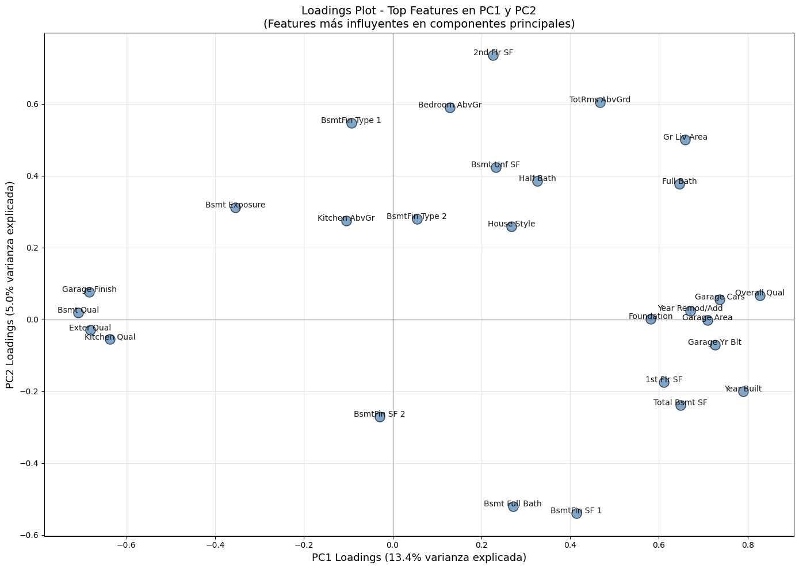
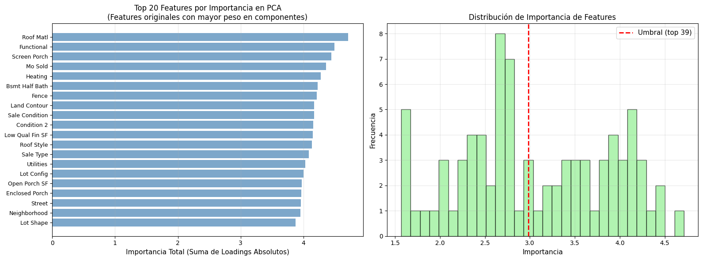
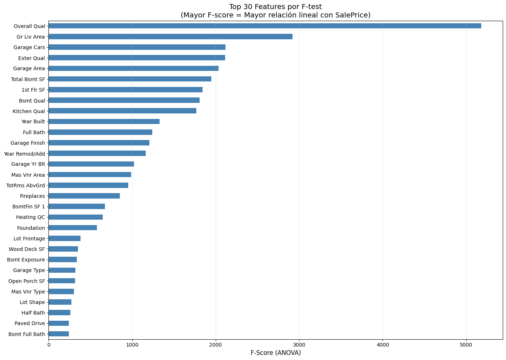
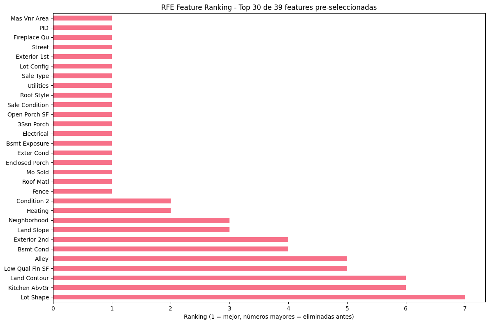
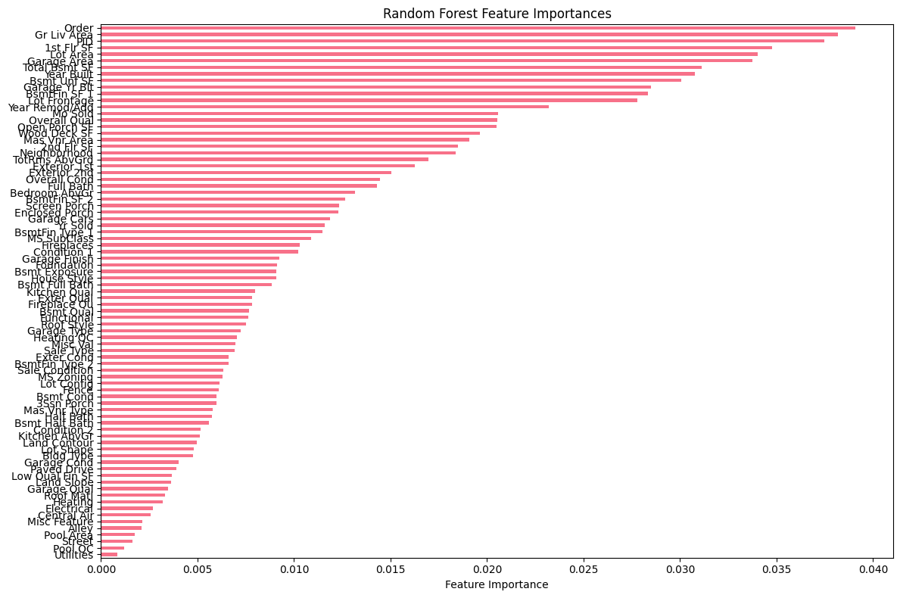
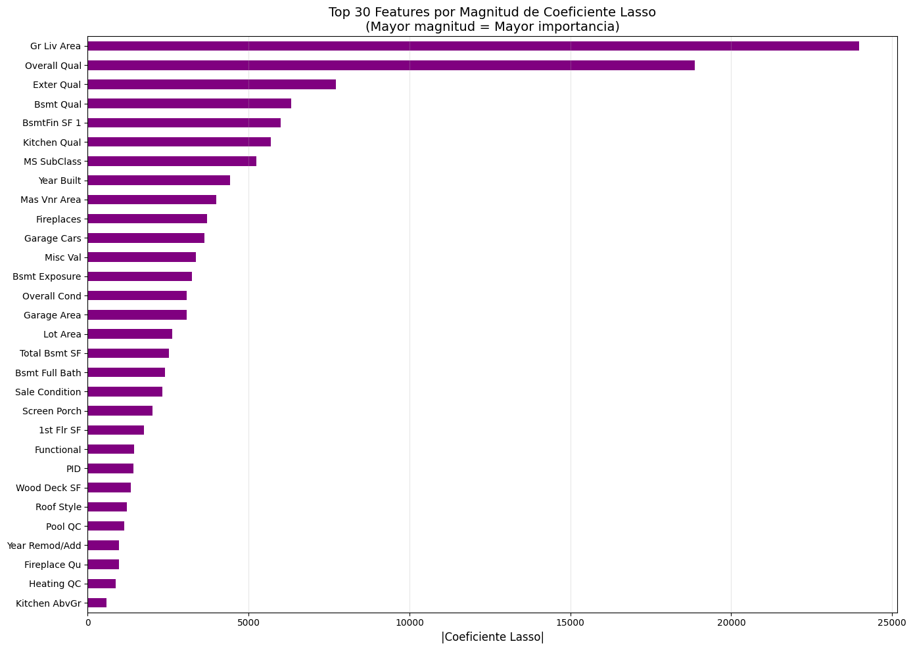

## Parte 1: Setup Rápido - Dataset Ames Housing
### Paso 1.1: Setup Rápido - Cargar y Preprocesar
```python
import pandas as pd
import numpy as np
import matplotlib.pyplot as plt
import seaborn as sns
from sklearn.model_selection import train_test_split
from sklearn.preprocessing import LabelEncoder
from sklearn.impute import SimpleImputer
import warnings
warnings.filterwarnings('ignore')

# Configuración
np.random.seed(42)
plt.style.use('default')
sns.set_palette("husl")

print("=" * 80)
print("ASSIGNMENT UT3-10: PCA y Feature Selection - Ames Housing Dataset")
print("=" * 80)

# ========== FUNCIÓN DE CARGA Y PREPROCESAMIENTO RÁPIDO ==========
def quick_load_and_preprocess_ames(filepath='train.csv'):
    """
    Carga y preprocesa Ames Housing en un solo paso
    (Ya hiciste esto en tareas anteriores, aquí es versión simplificada)
    """
    print("\n🏠 CARGANDO Y PREPROCESANDO AMES HOUSING...")

    # Cargar dataset
    df = pd.read_csv(filepath)
    print(f"✅ Dataset cargado: {df.shape[0]:,} casas, {df.shape[1]} columnas")

    # Eliminar 'Id' (no predictivo)
    df = df.drop('Id', axis=1, errors='ignore')

    # Identificar tipos de variables
    numerical_cols = df.select_dtypes(include=['int64', 'float64']).columns.tolist()
    categorical_cols = df.select_dtypes(include=['object']).columns.tolist()

    # Remover target de features
    if 'SalePrice' in numerical_cols:
        numerical_cols.remove('SalePrice')

    print(f"✅ Features numéricas: {len(numerical_cols)}")
    print(f"✅ Features categóricas: {len(categorical_cols)}")

    # Imputar valores faltantes
    num_imputer = SimpleImputer(strategy='median')
    df[numerical_cols] = num_imputer.fit_transform(df[numerical_cols])

    cat_imputer = SimpleImputer(strategy='most_frequent')
    df[categorical_cols] = cat_imputer.fit_transform(df[categorical_cols])

    print(f"✅ Missing values imputados")

    # Label encoding para categóricas
    le = LabelEncoder()
    for col in categorical_cols:
        df[col] = le.fit_transform(df[col].astype(str))

    print(f"✅ Categóricas encoded")

    # Separar X y y
    X = df.drop('SalePrice', axis=1)
    y = df['SalePrice']

    print(f"\n✅ DATASET LISTO:")
    print(f"   X shape: {X.shape} ({X.shape[1]} features)")
    print(f"   y shape: {y.shape}")
    print(f"   Precio promedio: ${y.mean():,.0f}")
    print(f"   Precio mediana: ${y.median():,.0f}")

    return X, y, X.columns.tolist()

# ========== EJECUTAR CARGA RÁPIDA ==========
# TODO: Completa con el path correcto
X, y, feature_names = quick_load_and_preprocess_ames('AmesHousing.csv')

print(f"\n📊 RESUMEN DEL DATASET:")
print(f"   Total features: {X.shape[1]}")
print(f"   Total casas: {X.shape[0]:,}")
print(f"   Ejemplos de features: {feature_names[:10]}")
```
```output
================================================================================
ASSIGNMENT UT3-10: PCA y Feature Selection - Ames Housing Dataset
================================================================================

🏠 CARGANDO Y PREPROCESANDO AMES HOUSING...
✅ Dataset cargado: 2,930 casas, 82 columnas
✅ Features numéricas: 38
✅ Features categóricas: 43
✅ Missing values imputados
✅ Categóricas encoded

✅ DATASET LISTO:
   X shape: (2930, 81) (81 features)
   y shape: (2930,)
   Precio promedio: $180,796
   Precio mediana: $160,000

📊 RESUMEN DEL DATASET:
   Total features: 81
   Total casas: 2,930
   Ejemplos de features: ['Order', 'PID', 'MS SubClass', 'MS Zoning', 'Lot Frontage', 'Lot Area', 'Street', 'Alley', 'Lot Shape', 'Land Contour']
```

## Parte 2: PCA - Análisis de Componentes Principales
### Paso 2.1: Estandarización (Crítico para PCA)
```python
from sklearn.preprocessing import StandardScaler

# ========== ESTANDARIZACIÓN ==========
print("=== ESTANDARIZACIÓN DE FEATURES ===")
print("⚠️ PCA es sensible a escala. SIEMPRE estandarizar antes de PCA.")

# TODO: Estandarizar datos
scaler = StandardScaler()
X_scaled = scaler.fit_transform(X)

# Verificar estandarización: mean ≈ 0, std ≈ 1
print(f"\n✅ Mean después de scaling: {X_scaled.mean():.6f} (esperado: ~0)")
print(f"✅ Std después de scaling: {X_scaled.std():.6f} (esperado: ~1)")

# Verificar shape
print(f"✅ X_scaled shape: {X_scaled.shape}")

# Comparar antes vs después
print(f"\n=== COMPARACIÓN ANTES vs DESPUÉS ===")
print(f"Antes - Mean GrLivArea: {X['Gr Liv Area'].mean():.0f}, Std: {X['Gr Liv Area'].std():.0f}")
print(f"Después - Mean GrLivArea: {X_scaled[:, X.columns.get_loc('Gr Liv Area')].mean():.6f}, Std: {X_scaled[:, X.columns.get_loc('Gr Liv Area')].std():.6f}")
```
```output
=== ESTANDARIZACIÓN DE FEATURES ===
⚠️ PCA es sensible a escala. SIEMPRE estandarizar antes de PCA.

✅ Mean después de scaling: -0.000000 (esperado: ~0)
✅ Std después de scaling: 1.000000 (esperado: ~1)
✅ X_scaled shape: (2930, 81)

=== COMPARACIÓN ANTES vs DESPUÉS ===
Antes - Mean GrLivArea: 1500, Std: 506
Después - Mean GrLivArea: 0.000000, Std: 1.000000
```

### Paso 2.2: Aplicar PCA Completo (80 Componentes)
from sklearn.decomposition import PCA
import time

# ========== APLICAR PCA SIN RESTRICCIONES ==========
print("\n=== APLICANDO PCA ===")
print("⏱️ Esto puede tomar 10-20 segundos con 80 features...")

start_time = time.time()

# TODO: Aplicar PCA sin restricción de componentes
pca = PCA()  # Sin n_components = todos los componentes posibles
X_pca = pca.fit_transform(X_scaled)

elapsed_time = time.time() - start_time
print(f"✅ PCA completado en {elapsed_time:.2f} segundos")

# ========== ANALIZAR VARIANZA EXPLICADA ==========
explained_variance = pca.explained_variance_ratio_
cumulative_variance = np.cumsum(explained_variance)

print(f"\n=== ANÁLISIS DE COMPONENTES PRINCIPALES ===")
print(f"Total de componentes generados: {X_pca.shape[1]}")
print(f"\nVarianza explicada por componentes principales:")
print(f"  PC1: {explained_variance[0]:.3%} (¡la más importante!)")
print(f"  PC2: {explained_variance[1]:.3%}")
print(f"  PC3: {explained_variance[2]:.3%}")
print(f"  PC4: {explained_variance[3]:.3%}")
print(f"  PC5: {explained_variance[4]:.3%}")

# TODO: Top 10 componentes
print("\n=== TOP 10 COMPONENTES ===")
for i in range(min(10, len(explained_variance))):
    print(f"PC{i+1:2d}: Individual {explained_variance[i]:6.3%} | Acumulada {cumulative_variance[i]:6.3%}")
```
```output
=== APLICANDO PCA ===
⏱️ Esto puede tomar 10-20 segundos con 80 features...
✅ PCA completado en 0.01 segundos

=== ANÁLISIS DE COMPONENTES PRINCIPALES ===
Total de componentes generados: 81

Varianza explicada por componentes principales:
  PC1: 13.409% (¡la más importante!)
  PC2: 4.956%
  PC3: 4.709%
  PC4: 3.690%
  PC5: 2.974%

=== TOP 10 COMPONENTES ===
PC 1: Individual 13.409% | Acumulada 13.409%
PC 2: Individual 4.956% | Acumulada 18.365%
PC 3: Individual 4.709% | Acumulada 23.074%
PC 4: Individual 3.690% | Acumulada 26.765%
PC 5: Individual 2.974% | Acumulada 29.739%
PC 6: Individual 2.727% | Acumulada 32.466%
PC 7: Individual 2.550% | Acumulada 35.017%
PC 8: Individual 2.404% | Acumulada 37.420%
PC 9: Individual 2.239% | Acumulada 39.659%
PC10: Individual 2.121% | Acumulada 41.780%
```

### Paso 2.3: Scree Plot y Decisión de Dimensionalidad
```python
# ========== CREAR SCREE PLOT ==========
print("\n=== SCREE PLOT: VISUALIZACIÓN DE VARIANZA ===")

# TODO: Crear scree plot con 80 componentes
plt.figure(figsize=(16, 6))

# Subplot 1: Varianza individual (primeros 30 componentes para claridad)
plt.subplot(1, 2, 1)
n_to_show = min(30, len(explained_variance))
plt.bar(range(1, n_to_show + 1), explained_variance[:n_to_show], alpha=0.7, color='steelblue')
plt.xlabel('Componente Principal', fontsize=12)
plt.ylabel('Varianza Explicada (Individual)', fontsize=12)
plt.title(f'Scree Plot - Primeros {n_to_show} Componentes', fontsize=14)
plt.grid(axis='y', alpha=0.3)

# Subplot 2: Varianza acumulada (TODOS los componentes)
plt.subplot(1, 2, 2)
plt.plot(range(1, len(cumulative_variance) + 1), cumulative_variance, 'o-', 
         color='steelblue', markersize=4, linewidth=2)

# Líneas de referencia
plt.axhline(y=0.80, color='r', linestyle='--', label='80% varianza', linewidth=2)
plt.axhline(y=0.90, color='g', linestyle='--', label='90% varianza', linewidth=2)
plt.axhline(y=0.95, color='orange', linestyle='--', label='95% varianza', linewidth=2)

plt.xlabel('Número de Componentes', fontsize=12)
plt.ylabel('Varianza Acumulada', fontsize=12)
plt.title('Varianza Acumulada por Número de Componentes', fontsize=14)
plt.legend(fontsize=11)
plt.grid(alpha=0.3)
plt.ylim([0, 1.05])

plt.tight_layout()
plt.show()

# ========== DECISIÓN DE DIMENSIONALIDAD ==========
print("\n=== DECISIÓN: ¿CUÁNTOS COMPONENTES NECESITAMOS? ===")

# TODO: Calcular componentes necesarios para diferentes umbrales
n_components_80 = next(i + 1 for i, v in enumerate(cumulative_variance) if v >= 0.80)
n_components_90 = next(i + 1 for i, v in enumerate(cumulative_variance) if v >= 0.90)
n_components_95 = next(i + 1 for i, v in enumerate(cumulative_variance) if v >= 0.95)

print(f"📊 Para 80% de varianza: {n_components_80} componentes")
print(f"📊 Para 90% de varianza: {n_components_90} componentes")
print(f"📊 Para 95% de varianza: {n_components_95} componentes")

# Análisis de reducción dimensional
original_features = X.shape[1]
reduction_80 = (1 - n_components_80 / original_features) * 100
reduction_90 = (1 - n_components_90 / original_features) * 100
reduction_95 = (1 - n_components_95 / original_features) * 100

print(f"\n🎯 IMPACTO DE REDUCCIÓN DIMENSIONAL:")
print(f"   Original: {original_features} features")
print(f"   80% varianza: {original_features} → {n_components_80} ({reduction_80:.1f}% reducción)")
print(f"   90% varianza: {original_features} → {n_components_90} ({reduction_90:.1f}% reducción)")
print(f"   95% varianza: {original_features} → {n_components_95} ({reduction_95:.1f}% reducción)")

print(f"\n💡 RECOMENDACIÓN PRÁCTICA:")
print(f"   Para este assignment, usaremos {n_components_80} componentes (80% varianza)")
print(f"   Esto balancea reducción dimensional con retención de información")
```
```output
=== SCREE PLOT: VISUALIZACIÓN DE VARIANZA ===
```

```output
=== DECISIÓN: ¿CUÁNTOS COMPONENTES NECESITAMOS? ===
📊 Para 80% de varianza: 39 componentes
📊 Para 90% de varianza: 52 componentes
📊 Para 95% de varianza: 60 componentes

🎯 IMPACTO DE REDUCCIÓN DIMENSIONAL:
   Original: 81 features
   80% varianza: 81 → 39 (51.9% reducción)
   90% varianza: 81 → 52 (35.8% reducción)
   95% varianza: 81 → 60 (25.9% reducción)

💡 RECOMENDACIÓN PRÁCTICA:
   Para este assignment, usaremos 39 componentes (80% varianza)
   Esto balancea reducción dimensional con retención de información
```

### Paso 2.4: Interpretación de Loadings (¿Qué representa cada PC?)
```python
# ========== OBTENER LOADINGS ==========
print("\n=== INTERPRETACIÓN DE COMPONENTES PRINCIPALES ===")
print("Los loadings te dicen qué features originales contribuyen a cada componente")

# TODO: Obtener loadings de PC1 y PC2
loadings = pca.components_.T * np.sqrt(pca.explained_variance_)

# Crear DataFrame de loadings para PC1 y PC2
loadings_df = pd.DataFrame(
    loadings[:, :2],
    columns=['PC1', 'PC2'],
    index=X.columns
)

# ========== FEATURES MÁS IMPORTANTES PARA PC1 ==========
print("\n=== PC1: COMPONENTE PRINCIPAL #1 ===")
print(f"Explica {explained_variance[0]:.1%} de la varianza total")
print(f"\nTop 10 features más importantes para PC1:")
pc1_top = loadings_df['PC1'].abs().nlargest(10)
for i, (feature, loading_abs) in enumerate(pc1_top.items(), 1):
    loading_val = loadings_df.loc[feature, 'PC1']
    direction = "↑ positivo" if loading_val > 0 else "↓ negativo"
    print(f"  {i:2d}. {feature:20s}: {loading_val:+7.3f} ({direction})")

# ========== FEATURES MÁS IMPORTANTES PARA PC2 ==========
print("\n=== PC2: COMPONENTE PRINCIPAL #2 ===")
print(f"Explica {explained_variance[1]:.1%} de la varianza total")
print(f"\nTop 10 features más importantes para PC2:")
pc2_top = loadings_df['PC2'].abs().nlargest(10)
for i, (feature, loading_abs) in enumerate(pc2_top.items(), 1):
    loading_val = loadings_df.loc[feature, 'PC2']
    direction = "↑ positivo" if loading_val > 0 else "↓ negativo"
    print(f"  {i:2d}. {feature:20s}: {loading_val:+7.3f} ({direction})")

# ========== VISUALIZAR LOADINGS (solo top features para claridad) ==========
print("\n=== VISUALIZACIÓN DE LOADINGS ===")

# Seleccionar top features para visualizar (top 15 de PC1 o PC2)
top_features_pc1 = set(loadings_df['PC1'].abs().nlargest(15).index)
top_features_pc2 = set(loadings_df['PC2'].abs().nlargest(15).index)
top_features = list(top_features_pc1.union(top_features_pc2))

loadings_df_viz = loadings_df.loc[top_features]

plt.figure(figsize=(14, 10))
plt.scatter(loadings_df_viz['PC1'], loadings_df_viz['PC2'], alpha=0.7, s=150, c='steelblue', edgecolors='black')

# Anotar features
for feature in loadings_df_viz.index:
    plt.annotate(feature, 
                (loadings_df_viz.loc[feature, 'PC1'], loadings_df_viz.loc[feature, 'PC2']), 
                fontsize=10, alpha=0.9, ha='center')

plt.xlabel(f'PC1 Loadings ({explained_variance[0]:.1%} varianza explicada)', fontsize=13)
plt.ylabel(f'PC2 Loadings ({explained_variance[1]:.1%} varianza explicada)', fontsize=13)
plt.title('Loadings Plot - Top Features en PC1 y PC2\n(Features más influyentes en componentes principales)', fontsize=14)
plt.axhline(y=0, color='k', linestyle='-', alpha=0.3, linewidth=1)
plt.axvline(x=0, color='k', linestyle='-', alpha=0.3, linewidth=1)
plt.grid(alpha=0.3)
plt.tight_layout()
plt.show()

# ========== INTERPRETACIÓN DE NEGOCIO ==========
print("\n=== 💼 INTERPRETACIÓN DE NEGOCIO ===")
print("\nPC1 representa principalmente (top 3):")
for i, (feature, loading_abs) in enumerate(loadings_df['PC1'].abs().nlargest(3).items(), 1):
    loading_val = loadings_df.loc[feature, 'PC1']
    direction = "positivamente" if loading_val > 0 else "negativamente"
    print(f"  {i}. {feature}: Contribuye {direction}")

print("\n💡 Interpretación: PC1 probablemente captura el 'tamaño/calidad general' de la casa")

print("\nPC2 representa principalmente (top 3):")
for i, (feature, loading_abs) in enumerate(loadings_df['PC2'].abs().nlargest(3).items(), 1):
    loading_val = loadings_df.loc[feature, 'PC2']
    direction = "positivamente" if loading_val > 0 else "negativamente"
    print(f"  {i}. {feature}: Contribuye {direction}")

print("\n💡 Interpretación: PC2 probablemente captura otra dimensión (edad, ubicación, etc.)")
```
```output
=== INTERPRETACIÓN DE COMPONENTES PRINCIPALES ===
Los loadings te dicen qué features originales contribuyen a cada componente

=== PC1: COMPONENTE PRINCIPAL #1 ===
Explica 13.4% de la varianza total

Top 10 features más importantes para PC1:
   1. Overall Qual        :  +0.827 (↑ positivo)
   2. Year Built          :  +0.790 (↑ positivo)
   3. Garage Cars         :  +0.737 (↑ positivo)
   4. Garage Yr Blt       :  +0.726 (↑ positivo)
   5. Garage Area         :  +0.709 (↑ positivo)
   6. Bsmt Qual           :  -0.708 (↓ negativo)
   7. Garage Finish       :  -0.683 (↓ negativo)
   8. Exter Qual          :  -0.682 (↓ negativo)
   9. Year Remod/Add      :  +0.671 (↑ positivo)
  10. Gr Liv Area         :  +0.659 (↑ positivo)

=== PC2: COMPONENTE PRINCIPAL #2 ===
Explica 5.0% de la varianza total

Top 10 features más importantes para PC2:
   1. 2nd Flr SF          :  +0.735 (↑ positivo)
   2. TotRms AbvGrd       :  +0.604 (↑ positivo)
   3. Bedroom AbvGr       :  +0.590 (↑ positivo)
   4. BsmtFin Type 1      :  +0.547 (↑ positivo)
   5. BsmtFin SF 1        :  -0.539 (↓ negativo)
   6. Bsmt Full Bath      :  -0.520 (↓ negativo)
   7. Gr Liv Area         :  +0.500 (↑ positivo)
   8. Bsmt Unf SF         :  +0.424 (↑ positivo)
   9. Half Bath           :  +0.386 (↑ positivo)
  10. Full Bath           :  +0.377 (↑ positivo)

=== VISUALIZACIÓN DE LOADINGS ===
```

```output
=== 💼 INTERPRETACIÓN DE NEGOCIO ===

PC1 representa principalmente (top 3):
  1. Overall Qual: Contribuye positivamente
  2. Year Built: Contribuye positivamente
  3. Garage Cars: Contribuye positivamente

💡 Interpretación: PC1 probablemente captura el 'tamaño/calidad general' de la casa

PC2 representa principalmente (top 3):
  1. 2nd Flr SF: Contribuye positivamente
  2. TotRms AbvGrd: Contribuye positivamente
  3. Bedroom AbvGr: Contribuye positivamente

💡 Interpretación: PC2 probablemente captura otra dimensión (edad, ubicación, etc.)
```

### Paso 2.5: Feature Selection Basada en PCA Loadings (CRÍTICO)
```python
# ========== FEATURE SELECTION BASADA EN PCA LOADINGS ==========
print("\n=== FEATURE SELECTION BASADA EN PCA LOADINGS ===")
print("💡 En lugar de usar PC1, PC2... usaremos las features ORIGINALES")
print("   que tienen mayor loading (peso) en los componentes principales")

# Decidir cuántos componentes considerar
n_top_components = 39

# Obtener loadings absolutos de todos los componentes importantes
print(f"\n🔍 Analizando loadings de los primeros {n_top_components} componentes...")

# Para cada componente, obtener las features con mayor loading absoluto
all_loadings = pca.components_[:n_top_components, :]  # Primeros n componentes

# Crear DataFrame con loadings de todos los componentes
loadings_all = pd.DataFrame(
    all_loadings.T,
    columns=[f'PC{i+1}' for i in range(n_top_components)],
    index=X.columns
)

# ========== ESTRATEGIA: SUMAR LOADINGS ABSOLUTOS ==========
# Para cada feature, sumar su importancia (loading absoluto) en todos los componentes
print("\n📊 ESTRATEGIA: Ranking de features por suma de loadings absolutos")

# TODO: Calcular importancia total de cada feature
feature_importance_from_pca = loadings_all.abs().sum(axis=1)

# Ordenar por importancia
feature_importance_from_pca = feature_importance_from_pca.sort_values(ascending=False)

print(f"\n🔝 TOP 20 FEATURES POR IMPORTANCIA EN PCA:")
for i, (feature, importance) in enumerate(feature_importance_from_pca.head(20).items(), 1):
    print(f"  {i:2d}. {feature:25s}: {importance:.4f}")

# ========== SELECCIONAR TOP-K FEATURES ==========
k = n_components_80  # Mismo número que usamos con PCA reducido

print(f"\n✅ Seleccionando top {k} features originales basadas en loadings de PCA")

# TODO: Seleccionar features
selected_features_pca = feature_importance_from_pca.head(k).index.tolist()

print(f"\n📋 Features seleccionadas ({k}):")
for i, feat in enumerate(selected_features_pca, 1):
    print(f"  {i:2d}. {feat}")

# ========== PREPARAR DATASET CON FEATURES SELECCIONADAS ==========
X_pca_selected = X_scaled[:, X.columns.isin(selected_features_pca)]

print(f"\n✅ Dataset con features seleccionadas por PCA:")
print(f"   Shape: {X_pca_selected.shape}")
print(f"   Reducción: {X.shape[1]} → {X_pca_selected.shape[1]} features")

# ========== VISUALIZAR COMPARACIÓN ==========
fig, (ax1, ax2) = plt.subplots(1, 2, figsize=(16, 6))

# Top 20 features por importancia PCA
ax1.barh(range(20), feature_importance_from_pca.head(20).values, color='steelblue', alpha=0.7)
ax1.set_yticks(range(20))
ax1.set_yticklabels(feature_importance_from_pca.head(20).index, fontsize=9)
ax1.set_xlabel('Importancia Total (Suma de Loadings Absolutos)', fontsize=11)
ax1.set_title('Top 20 Features por Importancia en PCA\n(Features originales con mayor peso en componentes)', fontsize=12)
ax1.invert_yaxis()
ax1.grid(axis='x', alpha=0.3)

# Distribución de importancias
ax2.hist(feature_importance_from_pca, bins=30, alpha=0.7, color='lightgreen', edgecolor='black')
ax2.set_xlabel('Importancia', fontsize=11)
ax2.set_ylabel('Frecuencia', fontsize=11)
ax2.set_title('Distribución de Importancia de Features', fontsize=12)
ax2.axvline(feature_importance_from_pca.iloc[k-1], color='red', linestyle='--', 
            label=f'Umbral (top {k})', linewidth=2)
ax2.legend(fontsize=11)
ax2.grid(alpha=0.3)

plt.tight_layout()
plt.show()

print("\n💡 INTERPRETACIÓN:")
print("   Estas features originales son las que 'explican' los componentes principales")
print("   Ventaja: Mantienen interpretabilidad (puedes decir 'GrLivArea importa')")
print("   Diferencia con PCA: Usas features originales, no combinaciones lineales")
```
```output
=== FEATURE SELECTION BASADA EN PCA LOADINGS ===
💡 En lugar de usar PC1, PC2... usaremos las features ORIGINALES
   que tienen mayor loading (peso) en los componentes principales

🔍 Analizando loadings de los primeros 39 componentes...

📊 ESTRATEGIA: Ranking de features por suma de loadings absolutos

🔝 TOP 20 FEATURES POR IMPORTANCIA EN PCA:
   1. Roof Matl                : 4.7138
   2. Functional               : 4.4919
   3. Screen Porch             : 4.4469
   4. Mo Sold                  : 4.3587
   5. Heating                  : 4.2757
   6. Bsmt Half Bath           : 4.2228
   7. Fence                    : 4.2113
   8. Land Contour             : 4.1697
   9. Sale Condition           : 4.1697
  10. Condition 2              : 4.1586
  11. Low Qual Fin SF          : 4.1478
  12. Roof Style               : 4.1321
  13. Sale Type                : 4.0840
  14. Utilities                : 4.0320
  15. Lot Config               : 4.0027
  16. Open Porch SF            : 3.9693
  17. Enclosed Porch           : 3.9666
  18. Street                   : 3.9571
  19. Neighborhood             : 3.9518
  20. Lot Shape                : 3.8744

✅ Seleccionando top 39 features originales basadas en loadings de PCA

📋 Features seleccionadas (39):
   1. Roof Matl
   2. Functional
   3. Screen Porch
   4. Mo Sold
   5. Heating
   6. Bsmt Half Bath
   7. Fence
   8. Land Contour
   9. Sale Condition
  10. Condition 2
  11. Low Qual Fin SF
  12. Roof Style
  13. Sale Type
  14. Utilities
  15. Lot Config
  16. Open Porch SF
  17. Enclosed Porch
  18. Street
  19. Neighborhood
  20. Lot Shape
  21. 3Ssn Porch
  22. Condition 1
  23. Alley
  24. Wood Deck SF
  25. Bsmt Cond
  26. Garage Cond
  27. Mas Vnr Type
  28. Exter Cond
  29. Land Slope
  30. Garage Qual
  31. Electrical
  32. Bsmt Exposure
  33. Fireplace Qu
  34. Overall Cond
  35. Exterior 1st
  36. Kitchen AbvGr
  37. PID
  38. Exterior 2nd
  39. Mas Vnr Area

✅ Dataset con features seleccionadas por PCA:
   Shape: (2930, 39)
   Reducción: 81 → 39 features
```

```output
💡 INTERPRETACIÓN:
   Estas features originales son las que 'explican' los componentes principales
   Ventaja: Mantienen interpretabilidad (puedes decir 'GrLivArea importa')
   Diferencia con PCA: Usas features originales, no combinaciones lineales
```

### Paso 2.6: Evaluación de Performance con REGRESIÓN (RMSE y R²)
```python
from sklearn.ensemble import RandomForestRegressor  # ⚠️ REGRESSOR, no Classifier
from sklearn.model_selection import cross_val_score
from sklearn.metrics import mean_squared_error, r2_score, mean_absolute_error
import warnings
warnings.filterwarnings('ignore')  # Suprimir warnings de convergencia

# ========== MODELO BASELINE: TODAS LAS FEATURES ORIGINALES ==========
print("\n=== EVALUACIÓN DE PERFORMANCE: PCA vs ORIGINAL ===")
print("⏱️ Esto puede tomar 1-2 minutos (cross-validation con 80 features)...\n")

# TODO: Evaluar modelo con datos originales
print("🔄 Evaluando modelo con features originales...")
rf_original = RandomForestRegressor(
    random_state=42, 
    n_estimators=100,
    max_depth=15,
    n_jobs=-1             # Usar todos los cores
)

# Usar neg_mean_squared_error y neg_mean_absolute_error para CV
scores_mse_original = -cross_val_score(rf_original, X_scaled, y, cv=5, 
                                        scoring='neg_mean_squared_error', n_jobs=-1)
scores_r2_original = cross_val_score(rf_original, X_scaled, y, cv=5, 
                                     scoring='r2', n_jobs=-1)

rmse_original = np.sqrt(scores_mse_original)

print(f"\n✅ BASELINE - Features Originales ({X.shape[1]} features):")
print(f"   RMSE: ${rmse_original.mean():,.0f} ± ${rmse_original.std():,.0f}")
print(f"   R²:   {scores_r2_original.mean():.4f} ± {scores_r2_original.std():.4f}")
print(f"   Scores RMSE: {[f'${x:,.0f}' for x in rmse_original]}")

# ========== MODELO CON PCA (80% VARIANZA) ==========
print(f"\n🔄 Evaluando modelo con PCA ({n_components_80} componentes)...")

# TODO: Aplicar PCA reducido
pca_reduced = PCA(n_components=n_components_80)
X_pca_reduced = pca_reduced.fit_transform(X_scaled)

print(f"✅ PCA transformado: {X.shape[1]} → {X_pca_reduced.shape[1]} features")

# Evaluar con PCA
rf_pca = RandomForestRegressor(
    random_state=42, 
    n_estimators=100, 
    max_depth=15,
    n_jobs=-1
)

scores_mse_pca = -cross_val_score(rf_pca, X_pca_reduced, y, cv=5, 
                                   scoring='neg_mean_squared_error', n_jobs=-1)
scores_r2_pca = cross_val_score(rf_pca, X_pca_reduced, y, cv=5, 
                                scoring='r2', n_jobs=-1)

rmse_pca = np.sqrt(scores_mse_pca)

print(f"\n✅ PCA - Componentes Reducidos ({n_components_80} componentes):")
print(f"   RMSE: ${rmse_pca.mean():,.0f} ± ${rmse_pca.std():,.0f}")
print(f"   R²:   {scores_r2_pca.mean():.4f} ± {scores_r2_pca.std():.4f}")
print(f"   Scores RMSE: {[f'${x:,.0f}' for x in rmse_pca]}")

# ========== MODELO CON FEATURES SELECCIONADAS POR PCA LOADINGS ==========
print(f"\n🔄 Evaluando modelo con features originales seleccionadas por PCA loadings...")

rf_pca_selected = RandomForestRegressor(
    random_state=42, 
    n_estimators=100, 
    max_depth=15,
    n_jobs=-1
)

scores_mse_pca_selected = -cross_val_score(rf_pca_selected, X_pca_selected, y, cv=5, 
                                             scoring='neg_mean_squared_error', n_jobs=-1)
scores_r2_pca_selected = cross_val_score(rf_pca_selected, X_pca_selected, y, cv=5, 
                                          scoring='r2', n_jobs=-1)

rmse_pca_selected = np.sqrt(scores_mse_pca_selected)

print(f"\n✅ PCA Loadings - Features Originales Seleccionadas ({len(selected_features_pca)} features):")
print(f"   RMSE: ${rmse_pca_selected.mean():,.0f} ± ${rmse_pca_selected.std():,.0f}")
print(f"   R²:   {scores_r2_pca_selected.mean():.4f} ± {scores_r2_pca_selected.std():.4f}")
print(f"   Scores RMSE: {[f'${x:,.0f}' for x in rmse_pca_selected]}")

# ========== ANÁLISIS COMPARATIVO ==========
print(f"\n" + "="*80)
print(f"{'COMPARACIÓN: ORIGINAL vs PCA vs PCA LOADINGS':^80}")
print(f"="*80)

reduction_pct = (1 - n_components_80 / X.shape[1]) * 100
rmse_diff_pca = rmse_pca.mean() - rmse_original.mean()
rmse_diff_pca_selected = rmse_pca_selected.mean() - rmse_original.mean()
r2_diff_pca = scores_r2_pca.mean() - scores_r2_original.mean()
r2_diff_pca_selected = scores_r2_pca_selected.mean() - scores_r2_original.mean()

print(f"\n📊 REDUCCIÓN DIMENSIONAL:")
print(f"   Original: {X.shape[1]} features")
print(f"   PCA: {X.shape[1]} → {n_components_80} componentes ({reduction_pct:.1f}% reducción)")
print(f"   PCA Loadings: {X.shape[1]} → {len(selected_features_pca)} features originales ({reduction_pct:.1f}% reducción)")
print(f"   Varianza retenida (PCA): {pca_reduced.explained_variance_ratio_.sum():.1%}")

print(f"\n📊 PERFORMANCE COMPARATIVO:")
print(f"\n   {'Método':<25s} {'RMSE':>15s} {'R²':>10s} {'Features':>10s}")
print(f"   {'-'*25} {'-'*15} {'-'*10} {'-'*10}")
print(f"   {'Original':<25s} ${rmse_original.mean():>14,.0f} {scores_r2_original.mean():>10.4f} {X.shape[1]:>10d}")
print(f"   {'PCA Componentes':<25s} ${rmse_pca.mean():>14,.0f} {scores_r2_pca.mean():>10.4f} {n_components_80:>10d}")
print(f"   {'PCA Loadings (Originales)':<25s} ${rmse_pca_selected.mean():>14,.0f} {scores_r2_pca_selected.mean():>10.4f} {len(selected_features_pca):>10d}")

print(f"\n📊 DIFERENCIAS VS ORIGINAL:")
print(f"   PCA Componentes:  RMSE {rmse_diff_pca:+,.0f} ({(rmse_diff_pca/rmse_original.mean())*100:+.1f}%) | R² {r2_diff_pca:+.4f}")
print(f"   PCA Loadings:     RMSE {rmse_diff_pca_selected:+,.0f} ({(rmse_diff_pca_selected/rmse_original.mean())*100:+.1f}%) | R² {r2_diff_pca_selected:+.4f}")

# Interpretación
print(f"\n💡 INTERPRETACIÓN:")
print(f"\n   🔵 PCA Componentes (PC1, PC2...):")
if rmse_pca.mean() < rmse_original.mean() * 1.05:
    print(f"      ✅ Mantiene performance similar con {reduction_pct:.0f}% reducción")
    print(f"      ⚠️ Pero: Componentes son combinaciones lineales (menos interpretables)")
else:
    print(f"      ⚠️ Pierde precisión significativa ({(rmse_diff_pca/rmse_original.mean())*100:.1f}%)")

print(f"\n   🟢 PCA Loadings (Features originales):")
if rmse_pca_selected.mean() < rmse_original.mean() * 1.05:
    print(f"      ✅ Mantiene performance similar con {reduction_pct:.0f}% reducción")
    print(f"      ✅ Plus: Usa features originales (interpretables)")
else:
    print(f"      ⚠️ Pierde precisión ({(rmse_diff_pca_selected/rmse_original.mean())*100:.1f}%)")

print(f"\n   💼 PARA NEGOCIO:")
print(f"      - PCA Componentes: Mejor para modelos 'black box' donde solo importa precisión")
print(f"      - PCA Loadings: Mejor para negocio (puedes decir 'GrLivArea es importante')")
```
```output
=== EVALUACIÓN DE PERFORMANCE: PCA vs ORIGINAL ===
⏱️ Esto puede tomar 1-2 minutos (cross-validation con 80 features)...

🔄 Evaluando modelo con features originales...

✅ BASELINE - Features Originales (81 features):
   RMSE: $26,308 ± $4,339
   R²:   0.8888 ± 0.0309
   Scores RMSE: ['$27,395', '$20,511', '$27,418', '$33,190', '$23,025']

🔄 Evaluando modelo con PCA (39 componentes)...
✅ PCA transformado: 81 → 39 features

✅ PCA - Componentes Reducidos (39 componentes):
   RMSE: $26,715 ± $4,125
   R²:   0.8850 ± 0.0323
   Scores RMSE: ['$25,623', '$22,249', '$27,112', '$34,320', '$24,271']

🔄 Evaluando modelo con features originales seleccionadas por PCA loadings...

✅ PCA Loadings - Features Originales Seleccionadas (39 features):
   RMSE: $41,773 ± $3,804
   R²:   0.7229 ± 0.0340
   Scores RMSE: ['$43,784', '$37,411', '$38,927', '$48,092', '$40,650']

================================================================================
                  COMPARACIÓN: ORIGINAL vs PCA vs PCA LOADINGS                  
================================================================================

📊 REDUCCIÓN DIMENSIONAL:
   Original: 81 features
   PCA: 81 → 39 componentes (51.9% reducción)
   PCA Loadings: 81 → 39 features originales (51.9% reducción)
   Varianza retenida (PCA): 80.5%

📊 PERFORMANCE COMPARATIVO:

   Método                               RMSE         R²   Features
   ------------------------- --------------- ---------- ----------
   Original                  $        26,308     0.8888         81
   PCA Componentes           $        26,715     0.8850         39
   PCA Loadings (Originales) $        41,773     0.7229         39

📊 DIFERENCIAS VS ORIGINAL:
   PCA Componentes:  RMSE +407 (+1.5%) | R² -0.0038
   PCA Loadings:     RMSE +15,465 (+58.8%) | R² -0.1659

💡 INTERPRETACIÓN:

   🔵 PCA Componentes (PC1, PC2...):
      ✅ Mantiene performance similar con 52% reducción
      ⚠️ Pero: Componentes son combinaciones lineales (menos interpretables)

   🟢 PCA Loadings (Features originales):
      ⚠️ Pierde precisión (58.8%)

   💼 PARA NEGOCIO:
      - PCA Componentes: Mejor para modelos 'black box' donde solo importa precisión
      - PCA Loadings: Mejor para negocio (puedes decir 'GrLivArea es importante')
```

## Parte 3: Feature Selection - Filter Methods
### Paso 3.1: Filter Method - F-test (ANOVA F-value para Regresión)
```python
from sklearn.feature_selection import SelectKBest, f_regression  # ⚠️ f_regression, no f_classif

# ========== F-TEST PARA REGRESIÓN ==========
print("\n=== FILTER METHOD: F-TEST (ANOVA) ===")
print("F-test mide la relación lineal entre cada feature y el target (SalePrice)")

# TODO: Seleccionar top-k features por F-test
k = n_components_80  # Mismo número que PCA para comparación justa

print(f"\nSeleccionando top {k} features con F-test...")

selector_f = SelectKBest(f_regression, k=k)
X_filter_f = selector_f.fit_transform(X_scaled, y)

# Identificar features seleccionadas
selected_features_f = X.columns[selector_f.get_support()]
print(f"\n✅ Features seleccionadas por F-test ({k}):")
for i, feat in enumerate(selected_features_f, 1):
    print(f"  {i:2d}. {feat}")

# ========== SCORES DE F-TEST ==========
scores_f = pd.Series(selector_f.scores_, index=X.columns).sort_values(ascending=False)
print(f"\n=== TOP 15 F-SCORES (Mayor correlación con SalePrice) ===")
for i, (feat, score) in enumerate(scores_f.head(15).items(), 1):
    print(f"  {i:2d}. {feat:20s}: {score:,.0f}")

# TODO: Visualizar scores (top 30 para claridad)
plt.figure(figsize=(14, 10))
scores_f.head(30).sort_values(ascending=True).plot(kind='barh', color='steelblue')
plt.xlabel('F-Score (ANOVA)', fontsize=12)
plt.title('Top 30 Features por F-test\n(Mayor F-score = Mayor relación lineal con SalePrice)', fontsize=14)
plt.grid(axis='x', alpha=0.3)
plt.tight_layout()
plt.show()
```
```output
=== FILTER METHOD: F-TEST (ANOVA) ===
F-test mide la relación lineal entre cada feature y el target (SalePrice)

Seleccionando top 39 features con F-test...

✅ Features seleccionadas por F-test (39):
   1. PID
   2. Lot Frontage
   3. Lot Area
   4. Lot Shape
   5. Neighborhood
   6. Overall Qual
   7. Year Built
   8. Year Remod/Add
   9. Roof Style
  10. Mas Vnr Type
  11. Mas Vnr Area
  12. Exter Qual
  13. Foundation
  14. Bsmt Qual
  15. Bsmt Exposure
  16. BsmtFin SF 1
  17. Bsmt Unf SF
  18. Total Bsmt SF
  19. Heating QC
  20. Central Air
  21. Electrical
  22. 1st Flr SF
  23. 2nd Flr SF
  24. Gr Liv Area
  25. Bsmt Full Bath
  26. Full Bath
  27. Half Bath
  28. Kitchen Qual
  29. TotRms AbvGrd
  30. Fireplaces
  31. Garage Type
  32. Garage Yr Blt
  33. Garage Finish
  34. Garage Cars
  35. Garage Area
  36. Paved Drive
  37. Wood Deck SF
  38. Open Porch SF
  39. Sale Condition

=== TOP 15 F-SCORES (Mayor correlación con SalePrice) ===
   1. Overall Qual        : 5,179
   2. Gr Liv Area         : 2,923
   3. Garage Cars         : 2,117
   4. Exter Qual          : 2,115
   5. Garage Area         : 2,035
   6. Total Bsmt SF       : 1,949
   7. 1st Flr SF          : 1,844
   8. Bsmt Qual           : 1,807
   9. Kitchen Qual        : 1,769
  10. Year Built          : 1,327
  11. Full Bath           : 1,241
  12. Garage Finish       : 1,208
  13. Year Remod/Add      : 1,162
  14. Garage Yr Blt       : 1,023
  15. Mas Vnr Area        : 987
```


### Paso 3.2: Filter Method - Mutual Information (Captura relaciones no-lineales)
```python
from sklearn.feature_selection import mutual_info_regression  # ⚠️ mutual_info_regression, no classif

# ========== MUTUAL INFORMATION PARA REGRESIÓN ==========
print("\n=== FILTER METHOD: MUTUAL INFORMATION ===")
print("MI captura relaciones LINEALES Y NO-LINEALES (más flexible que F-test)")
print("⏱️ Esto puede tomar 30-60 segundos...")

# TODO: Seleccionar top-k features por Mutual Information
selector_mi = SelectKBest(mutual_info_regression, k=k)
X_filter_mi = selector_mi.fit_transform(X_scaled, y)

selected_features_mi = X.columns[selector_mi.get_support()]
print(f"\n✅ Features seleccionadas por Mutual Information ({k}):")
for i, feat in enumerate(selected_features_mi, 1):
    print(f"  {i:2d}. {feat}")

# Scores
scores_mi = pd.Series(selector_mi.scores_, index=X.columns).sort_values(ascending=False)
print(f"\n=== TOP 15 MI SCORES ===")
for i, (feat, score) in enumerate(scores_mi.head(15).items(), 1):
    print(f"  {i:2d}. {feat:20s}: {score:.4f}")

# ========== COMPARACIÓN: F-TEST vs MUTUAL INFORMATION ==========
common_features = set(selected_features_f) & set(selected_features_mi)
print(f"\n" + "="*70)
print(f"{'COMPARACIÓN: F-TEST vs MUTUAL INFORMATION':^70}")
print(f"="*70)
print(f"\n📊 Features en común: {len(common_features)} de {k} ({len(common_features)/k*100:.1f}% coincidencia)")

print(f"\n✅ Features comunes (ambos métodos las eligieron):")
for i, feat in enumerate(sorted(common_features), 1):
    print(f"  {i:2d}. {feat}")

print(f"\n🔵 Features SOLO en F-test:")
only_f = set(selected_features_f) - set(selected_features_mi)
for i, feat in enumerate(sorted(only_f), 1):
    print(f"  {i:2d}. {feat}")

print(f"\n🟢 Features SOLO en Mutual Information:")
only_mi = set(selected_features_mi) - set(selected_features_f)
for i, feat in enumerate(sorted(only_mi), 1):
    print(f"  {i:2d}. {feat}")

print(f"\n💡 INTERPRETACIÓN:")
if len(common_features) / k > 0.7:
    print(f"   Alta coincidencia ({len(common_features)/k*100:.0f}%) → Ambos métodos están de acuerdo")
else:
    print(f"   Baja coincidencia ({len(common_features)/k*100:.0f}%) → MI captura relaciones no-lineales diferentes")
```
```output
=== FILTER METHOD: MUTUAL INFORMATION ===
MI captura relaciones LINEALES Y NO-LINEALES (más flexible que F-test)
⏱️ Esto puede tomar 30-60 segundos...

✅ Features seleccionadas por Mutual Information (39):
   1. Order
   2. PID
   3. MS SubClass
   4. MS Zoning
   5. Lot Frontage
   6. Lot Area
   7. Neighborhood
   8. Overall Qual
   9. Overall Cond
  10. Year Built
  11. Year Remod/Add
  12. Exterior 1st
  13. Exterior 2nd
  14. Mas Vnr Area
  15. Exter Qual
  16. Foundation
  17. Bsmt Qual
  18. BsmtFin Type 1
  19. BsmtFin SF 1
  20. Bsmt Unf SF
  21. Total Bsmt SF
  22. Heating QC
  23. 1st Flr SF
  24. 2nd Flr SF
  25. Gr Liv Area
  26. Full Bath
  27. Kitchen Qual
  28. TotRms AbvGrd
  29. Fireplaces
  30. Fireplace Qu
  31. Garage Type
  32. Garage Yr Blt
  33. Garage Finish
  34. Garage Cars
  35. Garage Area
  36. Wood Deck SF
  37. Open Porch SF
  38. Sale Type
  39. Sale Condition

=== TOP 15 MI SCORES ===
   1. Overall Qual        : 0.5856
   2. Neighborhood        : 0.5623
   3. Gr Liv Area         : 0.4962
   4. Garage Area         : 0.4177
   5. Total Bsmt SF       : 0.3929
   6. Year Built          : 0.3890
   7. Garage Cars         : 0.3876
   8. 1st Flr SF          : 0.3707
   9. Bsmt Qual           : 0.3479
  10. Garage Yr Blt       : 0.3289
  11. Exter Qual          : 0.3251
  12. Kitchen Qual        : 0.3201
  13. Year Remod/Add      : 0.2939
  14. MS SubClass         : 0.2848
  15. Order               : 0.2815

======================================================================
              COMPARACIÓN: F-TEST vs MUTUAL INFORMATION               
======================================================================

📊 Features en común: 30 de 39 (76.9% coincidencia)

✅ Features comunes (ambos métodos las eligieron):
   1. 1st Flr SF
   2. 2nd Flr SF
   3. Bsmt Qual
   4. Bsmt Unf SF
   5. BsmtFin SF 1
   6. Exter Qual
   7. Fireplaces
   8. Foundation
   9. Full Bath
  10. Garage Area
  11. Garage Cars
  12. Garage Finish
  13. Garage Type
  14. Garage Yr Blt
  15. Gr Liv Area
  16. Heating QC
  17. Kitchen Qual
  18. Lot Area
  19. Lot Frontage
  20. Mas Vnr Area
  21. Neighborhood
  22. Open Porch SF
  23. Overall Qual
  24. PID
  25. Sale Condition
  26. TotRms AbvGrd
  27. Total Bsmt SF
  28. Wood Deck SF
  29. Year Built
  30. Year Remod/Add

🔵 Features SOLO en F-test:
   1. Bsmt Exposure
   2. Bsmt Full Bath
   3. Central Air
   4. Electrical
   5. Half Bath
   6. Lot Shape
   7. Mas Vnr Type
   8. Paved Drive
   9. Roof Style

🟢 Features SOLO en Mutual Information:
   1. BsmtFin Type 1
   2. Exterior 1st
   3. Exterior 2nd
   4. Fireplace Qu
   5. MS SubClass
   6. MS Zoning
   7. Order
   8. Overall Cond
   9. Sale Type

💡 INTERPRETACIÓN:
   Alta coincidencia (77%) → Ambos métodos están de acuerdo
```

### Paso 3.3: Evaluar Performance de Filter Methods
```python
# ========== EVALUACIÓN: F-TEST ==========
print("\n=== EVALUANDO FILTER METHODS ===")
print("⏱️ Esto puede tomar 1-2 minutos...\n")

print("🔄 Evaluando F-test...")
rf_filter_f = RandomForestRegressor(random_state=42, n_estimators=100, max_depth=15, n_jobs=-1)

scores_mse_filter_f = -cross_val_score(rf_filter_f, X_filter_f, y, cv=5, 
                                        scoring='neg_mean_squared_error', n_jobs=-1)
scores_r2_filter_f = cross_val_score(rf_filter_f, X_filter_f, y, cv=5, 
                                     scoring='r2', n_jobs=-1)
rmse_filter_f = np.sqrt(scores_mse_filter_f)

print(f"✅ F-test ({k} features):")
print(f"   RMSE: ${rmse_filter_f.mean():,.0f} ± ${rmse_filter_f.std():,.0f}")
print(f"   R²:   {scores_r2_filter_f.mean():.4f} ± {scores_r2_filter_f.std():.4f}")

# ========== EVALUACIÓN: MUTUAL INFORMATION ==========
print(f"\n🔄 Evaluando Mutual Information...")
rf_filter_mi = RandomForestRegressor(random_state=42, n_estimators=100, max_depth=15, n_jobs=-1)

scores_mse_filter_mi = -cross_val_score(rf_filter_mi, X_filter_mi, y, cv=5, 
                                         scoring='neg_mean_squared_error', n_jobs=-1)
scores_r2_filter_mi = cross_val_score(rf_filter_mi, X_filter_mi, y, cv=5, 
                                      scoring='r2', n_jobs=-1)
rmse_filter_mi = np.sqrt(scores_mse_filter_mi)

print(f"✅ Mutual Information ({k} features):")
print(f"   RMSE: ${rmse_filter_mi.mean():,.0f} ± ${rmse_filter_mi.std():,.0f}")
print(f"   R²:   {scores_r2_filter_mi.mean():.4f} ± {scores_r2_filter_mi.std():.4f}")

# ========== COMPARACIÓN ACTUALIZADA ==========
print(f"\n" + "="*70)
print(f"{'COMPARACIÓN: BASELINE vs PCA vs FILTER METHODS':^70}")
print(f"="*70)

comparison_data = {
    'Método': ['Original', 'PCA', 'F-test', 'MI'],
    'N_Features': [X.shape[1], n_components_80, k, k],
    'RMSE': [rmse_original.mean(), rmse_pca.mean(), rmse_filter_f.mean(), rmse_filter_mi.mean()],
    'R²': [scores_r2_original.mean(), scores_r2_pca.mean(), scores_r2_filter_f.mean(), scores_r2_filter_mi.mean()]
}
comparison_df = pd.DataFrame(comparison_data)
comparison_df['Reducción%'] = (1 - comparison_df['N_Features'] / X.shape[1]) * 100

print(f"\n{comparison_df.to_string(index=False)}")

print(f"\n💡 OBSERVACIONES:")
print(f"   - PCA: Reduce a componentes abstractos (no interpretables)")
print(f"   - F-test & MI: Mantienen features originales (interpretables)")
print(f"   - ¿Cuál tiene mejor RMSE? ¿Vale la pena sacrificar interpretabilidad?")
```
```output
=== EVALUANDO FILTER METHODS ===
⏱️ Esto puede tomar 1-2 minutos...

🔄 Evaluando F-test...
✅ F-test (39 features):
   RMSE: $26,494 ± $4,040
   R²:   0.8875 ± 0.0288

🔄 Evaluando Mutual Information...
✅ Mutual Information (39 features):
   RMSE: $26,137 ± $4,111
   R²:   0.8903 ± 0.0293

======================================================================
            COMPARACIÓN: BASELINE vs PCA vs FILTER METHODS            
======================================================================

  Método  N_Features         RMSE       R²  Reducción%
Original          81 26307.644720 0.888825    0.000000
     PCA          39 26715.126553 0.884999   51.851852
  F-test          39 26494.415957 0.887486   51.851852
      MI          39 26136.649047 0.890305   51.851852

💡 OBSERVACIONES:
   - PCA: Reduce a componentes abstractos (no interpretables)
   - F-test & MI: Mantienen features originales (interpretables)
   - ¿Cuál tiene mejor RMSE? ¿Vale la pena sacrificar interpretabilidad?
```

## Parte 4: Feature Selection - Wrapper Methods
### Paso 4.1: Forward Selection (Sequential Feature Selection)
```python
from sklearn.feature_selection import SequentialFeatureSelector

# ========== TWO-STAGE SELECTION: PCA + FORWARD ==========
print("\n=== WRAPPER METHOD: FORWARD SELECTION ===")
print("💡 ESTRATEGIA: Forward Selection sobre features pre-seleccionadas por PCA")
print(f"   Stage 1 (ya hecho): PCA Loadings → {len(selected_features_pca)} features")
print(f"   Stage 2 (ahora): Forward Selection → refinar a menos features")
print("⏱️ Esto tomará ~30-60 segundos (mucho más rápido que sobre 79 features)...\n")

# Decidir cuántas features seleccionar con wrapper
k_wrapper = max(15, k // 2)  # Aproximadamente la mitad de las features PCA, o mínimo 15
print(f"🎯 Target: Seleccionar {k_wrapper} features con Forward Selection")

# TODO: Forward Selection sobre features pre-seleccionadas
estimator_forward = RandomForestRegressor(
    random_state=42,
    n_estimators=100,
    max_depth=10,
    n_jobs=-1
)

selector_forward = SequentialFeatureSelector(
    estimator=estimator_forward,
    n_features_to_select=k_wrapper,
    direction='forward',
    cv=3,              # 3 folds para rapidez
    n_jobs=-1
)

print(f"🔄 Ejecutando Forward Selection sobre {len(selected_features_pca)} features pre-seleccionadas...")
import time
start_time = time.time()
X_forward = selector_forward.fit_transform(X_pca_selected, y)
elapsed_time = time.time() - start_time

print(f"✅ Forward Selection completado en {elapsed_time:.1f} segundos")

# Features seleccionadas (mapear índices de vuelta a nombres)
selected_indices_forward = selector_forward.get_support()
selected_features_forward = [selected_features_pca[i] for i, sel in enumerate(selected_indices_forward) if sel]

print(f"\n✅ Features seleccionadas por Forward Selection ({len(selected_features_forward)}):")
for i, feat in enumerate(selected_features_forward, 1):
    print(f"  {i:2d}. {feat}")
```
```output
=== WRAPPER METHOD: FORWARD SELECTION ===
💡 ESTRATEGIA: Forward Selection sobre features pre-seleccionadas por PCA
   Stage 1 (ya hecho): PCA Loadings → 39 features
   Stage 2 (ahora): Forward Selection → refinar a menos features
⏱️ Esto tomará ~30-60 segundos (mucho más rápido que sobre 79 features)...

🎯 Target: Seleccionar 19 features con Forward Selection
🔄 Ejecutando Forward Selection sobre 39 features pre-seleccionadas...
✅ Forward Selection completado en 140.1 segundos

✅ Features seleccionadas por Forward Selection (19):
   1. Roof Matl
   2. Functional
   3. Screen Porch
   4. Heating
   5. Bsmt Half Bath
   6. Sale Condition
   7. Low Qual Fin SF
   8. Roof Style
   9. Enclosed Porch
  10. Street
  11. 3Ssn Porch
  12. Condition 1
  13. Bsmt Cond
  14. Garage Cond
  15. Mas Vnr Type
  16. Fireplace Qu
  17. Overall Cond
  18. Kitchen AbvGr
  19. Exterior 2nd
```

### Paso 4.2: Backward Elimination (Sequential Feature Selection)
```python
# ========== TWO-STAGE SELECTION: PCA + BACKWARD ==========
print("\n=== WRAPPER METHOD: BACKWARD ELIMINATION ===")
print("💡 ESTRATEGIA: Backward Elimination sobre features pre-seleccionadas por PCA")
print(f"   Stage 1 (ya hecho): PCA Loadings → {len(selected_features_pca)} features")
print(f"   Stage 2 (ahora): Backward Elimination → refinar a {k_wrapper} features")
print("⏱️ Esto tomará ~30-60 segundos...\n")

# TODO: Backward Selection sobre features pre-seleccionadas
estimator_backward = RandomForestRegressor(
    random_state=42,
    n_estimators=50,
    max_depth=10,
    n_jobs=-1
)

selector_backward = SequentialFeatureSelector(
    estimator=estimator_backward,
    n_features_to_select=k_wrapper,
    direction='backward',
    cv=3,
    n_jobs=-1
)

print(f"🔄 Ejecutando Backward Elimination sobre {len(selected_features_pca)} features...")
start_time = time.time()
X_backward = selector_backward.fit_transform(X_pca_selected, y)
elapsed_time_backward = time.time() - start_time

print(f"✅ Backward Elimination completado en {elapsed_time_backward:.1f} segundos")

# Features seleccionadas (mapear índices de vuelta a nombres)
selected_indices_backward = selector_backward.get_support()
selected_features_backward = [selected_features_pca[i] for i, sel in enumerate(selected_indices_backward) if sel]

print(f"\n✅ Features seleccionadas por Backward Elimination ({len(selected_features_backward)}):")
for i, feat in enumerate(selected_features_backward, 1):
    print(f"  {i:2d}. {feat}")

# ========== COMPARAR FORWARD VS BACKWARD ==========
print(f"\n" + "="*70)
print(f"{'COMPARACIÓN: FORWARD vs BACKWARD':^70}")
print(f"="*70)

common_features_fb = set(selected_features_forward) & set(selected_features_backward)
print(f"\n📊 Features en común: {len(common_features_fb)} de {k_wrapper} ({len(common_features_fb)/k_wrapper*100:.1f}% coincidencia)")

print(f"\n✅ Features comunes (ambos métodos las eligieron):")
for i, feat in enumerate(sorted(common_features_fb), 1):
    print(f"  {i:2d}. {feat}")

print(f"\n🔵 Features SOLO en Forward:")
only_forward = set(selected_features_forward) - set(selected_features_backward)
for i, feat in enumerate(sorted(only_forward), 1):
    print(f"  {i:2d}. {feat}")

print(f"\n🟢 Features SOLO en Backward:")
only_backward = set(selected_features_backward) - set(selected_features_forward)
for i, feat in enumerate(sorted(only_backward), 1):
    print(f"  {i:2d}. {feat}")

print(f"\n⏱️ TIEMPO DE EJECUCIÓN:")
print(f"   Forward:  {elapsed_time:.1f}s")
print(f"   Backward: {elapsed_time_backward:.1f}s")

print(f"\n💡 OBSERVACIÓN:")
if len(common_features_fb) / k_wrapper > 0.7:
    print(f"   Alta coincidencia ({len(common_features_fb)/k_wrapper*100:.0f}%) → Ambos métodos convergen")
else:
    print(f"   Baja coincidencia ({len(common_features_fb)/k_wrapper*100:.0f}%) → Orden de selección importa")
```
```output
=== WRAPPER METHOD: BACKWARD ELIMINATION ===
💡 ESTRATEGIA: Backward Elimination sobre features pre-seleccionadas por PCA
   Stage 1 (ya hecho): PCA Loadings → 39 features
   Stage 2 (ahora): Backward Elimination → refinar a 19 features
⏱️ Esto tomará ~30-60 segundos...

🔄 Ejecutando Backward Elimination sobre 39 features...
✅ Backward Elimination completado en 120.3 segundos

✅ Features seleccionadas por Backward Elimination (19):
   1. Roof Matl
   2. Mo Sold
   3. Heating
   4. Fence
   5. Sale Condition
   6. Roof Style
   7. Lot Config
   8. Enclosed Porch
   9. Street
  10. 3Ssn Porch
  11. Garage Cond
  12. Exter Cond
  13. Land Slope
  14. Electrical
  15. Bsmt Exposure
  16. Fireplace Qu
  17. Exterior 1st
  18. Exterior 2nd
  19. Mas Vnr Area

======================================================================
                   COMPARACIÓN: FORWARD vs BACKWARD                   
======================================================================

📊 Features en común: 10 de 19 (52.6% coincidencia)

✅ Features comunes (ambos métodos las eligieron):
   1. 3Ssn Porch
   2. Enclosed Porch
   3. Exterior 2nd
   4. Fireplace Qu
   5. Garage Cond
   6. Heating
   7. Roof Matl
   8. Roof Style
   9. Sale Condition
  10. Street

🔵 Features SOLO en Forward:
   1. Bsmt Cond
   2. Bsmt Half Bath
   3. Condition 1
   4. Functional
   5. Kitchen AbvGr
   6. Low Qual Fin SF
   7. Mas Vnr Type
   8. Overall Cond
   9. Screen Porch

🟢 Features SOLO en Backward:
   1. Bsmt Exposure
   2. Electrical
   3. Exter Cond
   4. Exterior 1st
   5. Fence
   6. Land Slope
   7. Lot Config
   8. Mas Vnr Area
   9. Mo Sold

⏱️ TIEMPO DE EJECUCIÓN:
   Forward:  140.1s
   Backward: 120.3s

💡 OBSERVACIÓN:
   Baja coincidencia (53%) → Orden de selección importa
```

### Paso 4.3: Recursive Feature Elimination (RFE)
```python
from sklearn.feature_selection import RFE

# ========== TWO-STAGE SELECTION: PCA + RFE ==========
print("\n=== WRAPPER METHOD: RFE (Recursive Feature Elimination) ===")
print("💡 ESTRATEGIA: RFE sobre features pre-seleccionadas por PCA")
print(f"   Stage 1 (ya hecho): PCA Loadings → {len(selected_features_pca)} features")
print(f"   Stage 2 (ahora): RFE → refinar a {k_wrapper} features")
print("⏱️ Esto tomará ~45-90 segundos...\n")

# TODO: RFE con Random Forest Regressor sobre features pre-seleccionadas
estimator = RandomForestRegressor(
    random_state=42,
    n_estimators=50,
    max_depth=10,
    n_jobs=-1
)
selector_rfe = RFE(estimator=estimator, n_features_to_select=k_wrapper, step=2)

print(f"🔄 Ejecutando RFE sobre {len(selected_features_pca)} features...")
import time
start_time = time.time()
X_rfe = selector_rfe.fit_transform(X_pca_selected, y)
elapsed_time = time.time() - start_time

print(f"✅ RFE completado en {elapsed_time:.1f} segundos")

# Features seleccionadas (mapear índices de vuelta a nombres)
selected_indices_rfe = selector_rfe.get_support()
selected_features_rfe = [selected_features_pca[i] for i, sel in enumerate(selected_indices_rfe) if sel]

print(f"\n✅ Features seleccionadas por RFE ({len(selected_features_rfe)}):")
for i, feat in enumerate(selected_features_rfe, 1):
    print(f"  {i:2d}. {feat}")

# Ranking de features (solo sobre las pre-seleccionadas por PCA)
ranking = pd.Series(selector_rfe.ranking_, index=selected_features_pca).sort_values()
print(f"\nRanking de features (1 = seleccionada, solo mostrando top 20):")
print(ranking.head(20))

# Visualizar ranking (top 30 para claridad)
plt.figure(figsize=(12, 8))
ranking.head(30).sort_values(ascending=False).plot(kind='barh')
plt.xlabel('Ranking (1 = mejor, números mayores = eliminadas antes)')
plt.title(f'RFE Feature Ranking - Top 30 de {len(selected_features_pca)} features pre-seleccionadas')
plt.tight_layout()
plt.show()
```
```output
=== WRAPPER METHOD: RFE (Recursive Feature Elimination) ===
💡 ESTRATEGIA: RFE sobre features pre-seleccionadas por PCA
   Stage 1 (ya hecho): PCA Loadings → 39 features
   Stage 2 (ahora): RFE → refinar a 19 features
⏱️ Esto tomará ~45-90 segundos...

🔄 Ejecutando RFE sobre 39 features...
✅ RFE completado en 1.9 segundos

✅ Features seleccionadas por RFE (19):
   1. Roof Matl
   2. Mo Sold
   3. Fence
   4. Sale Condition
   5. Roof Style
   6. Sale Type
   7. Utilities
   8. Lot Config
   9. Open Porch SF
  10. Enclosed Porch
  11. Street
  12. 3Ssn Porch
  13. Exter Cond
  14. Electrical
  15. Bsmt Exposure
  16. Fireplace Qu
  17. Exterior 1st
  18. PID
  19. Mas Vnr Area

Ranking de features (1 = seleccionada, solo mostrando top 20):
Roof Matl         1
Mo Sold           1
Fence             1
Lot Config        1
Sale Type         1
Utilities         1
Roof Style        1
Sale Condition    1
Open Porch SF     1
3Ssn Porch        1
Electrical        1
Bsmt Exposure     1
Exter Cond        1
Enclosed Porch    1
Street            1
Fireplace Qu      1
PID               1
Mas Vnr Area      1
Exterior 1st      1
Heating           2
dtype: int64
```


### Paso 4.4: Comparación de Features Seleccionadas (Todos los Wrapper Methods)
```python
# Comparar features seleccionadas por diferentes métodos
print("\n=== COMPARACIÓN DE FEATURES SELECCIONADAS ===")

# Crear conjunto de features por método
features_dict = {
    'F-test': set(selected_features_f),
    'Mutual Info': set(selected_features_mi),
    'Forward': set(selected_features_forward),
    'Backward': set(selected_features_backward),
    'RFE': set(selected_features_rfe)
}

# Features en al menos 2 métodos
all_features = set()
for features in features_dict.values():
    all_features.update(features)

feature_counts = {}
for feature in all_features:
    count = sum(1 for features in features_dict.values() if feature in features)
    feature_counts[feature] = count

# Features consistentes (en todos los métodos)
consistent_features = [f for f, count in feature_counts.items() if count == 3]
print(f"\nFeatures consistentes (en todos los métodos): {len(consistent_features)}")
print(consistent_features)

# Features en al menos 2 métodos
robust_features = [f for f, count in feature_counts.items() if count >= 2]
print(f"\nFeatures robustas (≥2 métodos): {len(robust_features)}")
print(robust_features)

print("\n💡 OBSERVACIÓN:")
print(f"   Forward, Backward y RFE son todos wrapper methods, pero usan estrategias diferentes")
```
```output
# Comparar features seleccionadas por diferentes métodos
print("\n=== COMPARACIÓN DE FEATURES SELECCIONADAS ===")

# Crear conjunto de features por método
features_dict = {
    'F-test': set(selected_features_f),
    'Mutual Info': set(selected_features_mi),
    'Forward': set(selected_features_forward),
    'Backward': set(selected_features_backward),
    'RFE': set(selected_features_rfe)
}

# Features en al menos 2 métodos
all_features = set()
for features in features_dict.values():
    all_features.update(features)

feature_counts = {}
for feature in all_features:
    count = sum(1 for features in features_dict.values() if feature in features)
    feature_counts[feature] = count

# Features consistentes (en todos los métodos)
consistent_features = [f for f, count in feature_counts.items() if count == 3]
print(f"\nFeatures consistentes (en todos los métodos): {len(consistent_features)}")
print(consistent_features)

# Features en al menos 2 métodos
robust_features = [f for f, count in feature_counts.items() if count >= 2]
print(f"\nFeatures robustas (≥2 métodos): {len(robust_features)}")
print(robust_features)

print("\n💡 OBSERVACIÓN:")
print(f"   Forward, Backward y RFE son todos wrapper methods, pero usan estrategias diferentes")
```

### Paso 4.5: Evaluar Performance de Wrapper Methods
```python
# ========== EVALUACIÓN: FORWARD SELECTION ==========
print("\n=== EVALUANDO WRAPPER METHODS ===")
print("⏱️ Cross-validation con features de cada método...\n")

print("🔄 Evaluando Forward Selection...")
rf_forward = RandomForestRegressor(random_state=42, n_estimators=100, max_depth=15, n_jobs=-1)

scores_mse_forward = -cross_val_score(rf_forward, X_forward, y, cv=5,
                                       scoring='neg_mean_squared_error', n_jobs=-1)
scores_r2_forward = cross_val_score(rf_forward, X_forward, y, cv=5,
                                    scoring='r2', n_jobs=-1)
rmse_forward = np.sqrt(scores_mse_forward)

print(f"✅ Forward Selection ({len(selected_features_forward)} features):")
print(f"   RMSE: ${rmse_forward.mean():,.0f} ± ${rmse_forward.std():,.0f}")
print(f"   R²:   {scores_r2_forward.mean():.4f} ± {scores_r2_forward.std():.4f}")

# ========== EVALUACIÓN: BACKWARD ELIMINATION ==========
print(f"\n🔄 Evaluando Backward Elimination...")
rf_backward = RandomForestRegressor(random_state=42, n_estimators=100, max_depth=15, n_jobs=-1)

scores_mse_backward = -cross_val_score(rf_backward, X_backward, y, cv=5,
                                         scoring='neg_mean_squared_error', n_jobs=-1)
scores_r2_backward = cross_val_score(rf_backward, X_backward, y, cv=5,
                                      scoring='r2', n_jobs=-1)
rmse_backward = np.sqrt(scores_mse_backward)

print(f"✅ Backward Elimination ({len(selected_features_backward)} features):")
print(f"   RMSE: ${rmse_backward.mean():,.0f} ± ${rmse_backward.std():,.0f}")
print(f"   R²:   {scores_r2_backward.mean():.4f} ± {scores_r2_backward.std():.4f}")

# ========== EVALUACIÓN: RFE ==========
print(f"\n🔄 Evaluando RFE...")
rf_rfe = RandomForestRegressor(random_state=42, n_estimators=100, max_depth=15, n_jobs=-1)

scores_mse_rfe = -cross_val_score(rf_rfe, X_rfe, y, cv=5,
                                   scoring='neg_mean_squared_error', n_jobs=-1)
scores_r2_rfe = cross_val_score(rf_rfe, X_rfe, y, cv=5,
                                scoring='r2', n_jobs=-1)
rmse_rfe = np.sqrt(scores_mse_rfe)

print(f"✅ RFE ({len(selected_features_rfe)} features):")
print(f"   RMSE: ${rmse_rfe.mean():,.0f} ± ${rmse_rfe.std():,.0f}")
print(f"   R²:   {scores_r2_rfe.mean():.4f} ± {scores_r2_rfe.std():.4f}")

# ========== COMPARACIÓN ACTUALIZADA ==========
print(f"\n" + "="*80)
print(f"{'COMPARACIÓN: TODOS LOS MÉTODOS HASTA AHORA':^80}")
print(f"="*80)

comparison_updated = {
    'Método': ['Original', 'PCA Componentes', 'PCA Loadings', 'F-test', 'MI', 'Forward', 'Backward', 'RFE'],
    'N_Features': [X.shape[1], n_components_80, k, k, k, k, k, k],
    'RMSE': [rmse_original.mean(), rmse_pca.mean(), rmse_pca_selected.mean(), rmse_filter_f.mean(),
             rmse_filter_mi.mean(), rmse_forward.mean(), rmse_backward.mean(), rmse_rfe.mean()],
    'R²': [scores_r2_original.mean(), scores_r2_pca.mean(), scores_r2_pca_selected.mean(), scores_r2_filter_f.mean(),
           scores_r2_filter_mi.mean(), scores_r2_forward.mean(), scores_r2_backward.mean(), scores_r2_rfe.mean()]
}
comparison_updated_df = pd.DataFrame(comparison_updated)
comparison_updated_df['Reducción%'] = (1 - comparison_updated_df['N_Features'] / X.shape[1]) * 100
comparison_updated_df = comparison_updated_df.sort_values('RMSE')

print(f"\n{comparison_updated_df.to_string(index=False)}")

print(f"\n💡 OBSERVACIÓN:")
best_method = comparison_updated_df.iloc[0]['Método']
best_rmse = comparison_updated_df.iloc[0]['RMSE']
print(f"   🏆 Mejor RMSE: {best_method} (${best_rmse:,.0f})")
```
```output
=== EVALUANDO WRAPPER METHODS ===
⏱️ Cross-validation con features de cada método...

🔄 Evaluando Forward Selection...
✅ Forward Selection (19 features):
   RMSE: $40,995 ± $2,321
   R²:   0.7326 ± 0.0245

🔄 Evaluando Backward Elimination...
✅ Backward Elimination (19 features):
   RMSE: $41,788 ± $3,858
   R²:   0.7228 ± 0.0335

🔄 Evaluando RFE...
✅ RFE (19 features):
   RMSE: $41,767 ± $3,957
   R²:   0.7230 ± 0.0355

================================================================================
                   COMPARACIÓN: TODOS LOS MÉTODOS HASTA AHORA                   
================================================================================

         Método  N_Features         RMSE       R²  Reducción%
             MI          39 26136.649047 0.890305   51.851852
       Original          81 26307.644720 0.888825    0.000000
         F-test          39 26494.415957 0.887486   51.851852
PCA Componentes          39 26715.126553 0.884999   51.851852
        Forward          39 40995.014737 0.732561   51.851852
            RFE          39 41767.156206 0.722980   51.851852
   PCA Loadings          39 41772.530314 0.722896   51.851852
       Backward          39 41787.828123 0.722817   51.851852

💡 OBSERVACIÓN:
   🏆 Mejor RMSE: MI ($26,137)
```

## Parte 5: Feature Selection - Embedded Methods
### Paso 5.1: Random Forest Feature Importance
```python
# TODO: Entrenar Random Forest y obtener importances
print("\n=== EMBEDDED METHODS: Random Forest ===")
from sklearn.ensemble import RandomForestClassifier

rf_embedded = RandomForestClassifier(random_state=42, n_estimators=200, max_depth=10)
rf_embedded.fit(X_scaled, y)

# Feature importances
importances = pd.Series(rf_embedded.feature_importances_, index=X.columns).sort_values(ascending=False)
print("Top 10 features por importancia:")
print(importances.head(10))

# Visualizar importances
plt.figure(figsize=(12, 8))
importances.sort_values(ascending=True).plot(kind='barh')
plt.xlabel('Feature Importance')
plt.title('Random Forest Feature Importances')
plt.tight_layout()
plt.show()

# TODO: Seleccionar top-k features
top_k_features = importances.nlargest(k).index
X_rf_importance = X_scaled[:, X.columns.isin(top_k_features)]

print(f"\nFeatures seleccionadas por RF Importance ({k}):")
print(list(top_k_features))

# Evaluar
rmse_rf_importance = np.sqrt(-cross_val_score(rf_embedded, X_rf_importance, y, cv=5, scoring='neg_mean_squared_error'))
print(f"\nRMSE RF Importance ({k} features): ${rmse_rf_importance.mean():,.0f} ± ${rmse_rf_importance.std():,.0f}")
scores_rf_importance = cross_val_score(rf_embedded, X_rf_importance, y, cv=5, scoring='accuracy')
print(f"\nRF Importance ({k} features):")
print(f"  Mean: {scores_rf_importance.mean():.3f}")
print(f"  Std: {scores_rf_importance.std():.3f}")
```
```output
=== EMBEDDED METHODS: Random Forest ===
Top 10 features por importancia:
Order            0.039088
Gr Liv Area      0.038188
PID              0.037478
1st Flr SF       0.034780
Lot Area         0.034026
Garage Area      0.033741
Total Bsmt SF    0.031102
Year Built       0.030783
Bsmt Unf SF      0.030057
Garage Yr Blt    0.028485
dtype: float64
```

```output
Features seleccionadas por RF Importance (39):
['Order', 'Gr Liv Area', 'PID', '1st Flr SF', 'Lot Area', 'Garage Area', 'Total Bsmt SF', 'Year Built', 'Bsmt Unf SF', 'Garage Yr Blt', 'BsmtFin SF 1', 'Lot Frontage', 'Year Remod/Add', 'Mo Sold', 'Overall Qual', 'Open Porch SF', 'Wood Deck SF', 'Mas Vnr Area', '2nd Flr SF', 'Neighborhood', 'TotRms AbvGrd', 'Exterior 1st', 'Exterior 2nd', 'Overall Cond', 'Full Bath', 'Bedroom AbvGr', 'BsmtFin SF 2', 'Screen Porch', 'Enclosed Porch', 'Garage Cars', 'Yr Sold', 'BsmtFin Type 1', 'MS SubClass', 'Fireplaces', 'Condition 1', 'Garage Finish', 'Foundation', 'Bsmt Exposure', 'House Style']

RMSE RF Importance (39 features): $41,736 ± $4,325

RF Importance (39 features):
  Mean: 0.025
  Std: 0.004
```

### Paso 5.2: Lasso (L1 Regularization para Regresión)
```python
from sklearn.linear_model import LassoCV

# ========== LASSO PARA FEATURE SELECTION ==========
print("\n=== EMBEDDED METHOD: Lasso (L1 Regularization) ===")
print("Lasso penaliza coeficientes, forzando a 0 features no importantes")
print("⏱️ Esto puede tomar 30-60 segundos...\n")

# TODO: Lasso para regresión
lasso = LassoCV(cv=5, random_state=42, max_iter=10000)
lasso.fit(X_scaled, y)

print(f"✅ Lasso alpha seleccionado: {lasso.alpha_:.4f}")

# Features seleccionadas (coef != 0)
lasso_nonzero = X.columns[lasso.coef_ != 0]
print(f"\n📊 Features con coeficiente no-cero: {len(lasso_nonzero)} de {X.shape[1]}")

# Seleccionar top-k por magnitud de coeficiente
coef_abs = pd.Series(np.abs(lasso.coef_), index=X.columns).sort_values(ascending=False)
lasso_features = coef_abs.nlargest(k).index

print(f"\n✅ Top {k} features por magnitud de coeficiente Lasso:")
for i, (feat, coef) in enumerate(coef_abs.nlargest(k).items(), 1):
    print(f"  {i:2d}. {feat:20s}: |{coef:.6f}|")

# TODO: Visualizar coeficientes (top 30)
plt.figure(figsize=(14, 10))
coef_abs.head(30).sort_values(ascending=True).plot(kind='barh', color='purple')
plt.xlabel('|Coeficiente Lasso|', fontsize=12)
plt.title('Top 30 Features por Magnitud de Coeficiente Lasso\n(Mayor magnitud = Mayor importancia)', fontsize=14)
plt.grid(axis='x', alpha=0.3)
plt.tight_layout()
plt.show()

# Preparar features para evaluación
X_lasso = X_scaled[:, X.columns.isin(lasso_features)]

# ========== EVALUAR CON RANDOM FOREST ==========
print(f"\n🔄 Evaluando Lasso selection...")
rf_lasso = RandomForestRegressor(random_state=42, n_estimators=100, max_depth=15, n_jobs=-1)

scores_mse_lasso = -cross_val_score(rf_lasso, X_lasso, y, cv=5,
                                     scoring='neg_mean_squared_error', n_jobs=-1)
scores_r2_lasso = cross_val_score(rf_lasso, X_lasso, y, cv=5,
                                  scoring='r2', n_jobs=-1)
rmse_lasso = np.sqrt(scores_mse_lasso)

print(f"✅ Lasso selection ({k} features):")
print(f"   RMSE: ${rmse_lasso.mean():,.0f} ± ${rmse_lasso.std():,.0f}")
print(f"   R²:   {scores_r2_lasso.mean():.4f} ± {scores_r2_lasso.std():.4f}")
```
```output
=== EMBEDDED METHOD: Lasso (L1 Regularization) ===
Lasso penaliza coeficientes, forzando a 0 features no importantes
⏱️ Esto puede tomar 30-60 segundos...

✅ Lasso alpha seleccionado: 1375.3800

📊 Features con coeficiente no-cero: 41 de 81

✅ Top 39 features por magnitud de coeficiente Lasso:
   1. Gr Liv Area         : |23965.928207|
   2. Overall Qual        : |18865.442199|
   3. Exter Qual          : |7716.360557|
   4. Bsmt Qual           : |6329.475846|
   5. BsmtFin SF 1        : |5992.855445|
   6. Kitchen Qual        : |5700.002821|
   7. MS SubClass         : |5239.648051|
   8. Year Built          : |4413.604581|
   9. Mas Vnr Area        : |3986.298254|
  10. Fireplaces          : |3714.132817|
  11. Garage Cars         : |3635.912839|
  12. Misc Val            : |3352.852943|
  13. Bsmt Exposure       : |3248.117435|
  14. Overall Cond        : |3078.550394|
  15. Garage Area         : |3068.732335|
  16. Lot Area            : |2623.674245|
  17. Total Bsmt SF       : |2524.694041|
  18. Bsmt Full Bath      : |2408.536233|
  19. Sale Condition      : |2318.726511|
  20. Screen Porch        : |2005.900171|
  21. 1st Flr SF          : |1740.608145|
  22. Functional          : |1450.410041|
  23. PID                 : |1428.339821|
  24. Wood Deck SF        : |1329.009551|
  25. Roof Style          : |1220.886054|
  26. Pool QC             : |1136.536207|
  27. Year Remod/Add      : |971.006213|
  28. Fireplace Qu        : |970.583774|
  29. Heating QC          : |868.292494|
  30. Kitchen AbvGr       : |580.791522|
  31. Land Slope          : |521.091114|
  32. Bldg Type           : |457.282591|
  33. Lot Shape           : |383.500861|
  34. Neighborhood        : |366.178908|
  35. Garage Finish       : |365.659129|
  36. BsmtFin Type 1      : |359.113375|
  37. Mas Vnr Type        : |239.502254|
  38. Roof Matl           : |72.109021|
  39. Street              : |34.526422|
```

```output
🔄 Evaluando Lasso selection...
✅ Lasso selection (39 features):
   RMSE: $26,189 ± $4,421
   R²:   0.8899 ± 0.0312
```