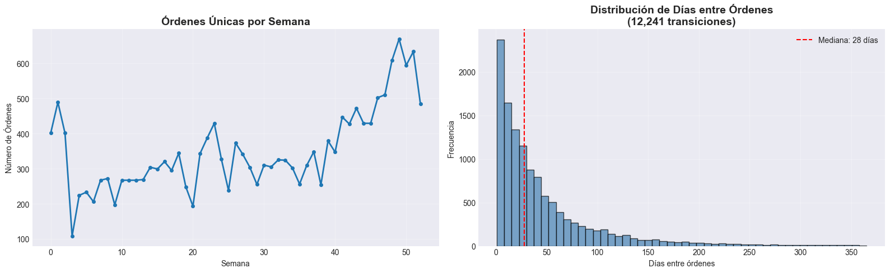
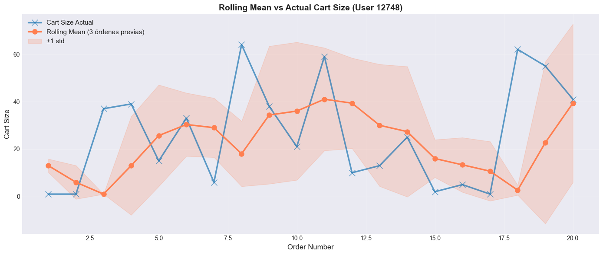

## Parte 0: Setup y Carga de Datos
```python
import pandas as pd
import numpy as np
import matplotlib.pyplot as plt
import seaborn as sns
from datetime import timedelta, datetime
from sklearn.model_selection import TimeSeriesSplit
from sklearn.ensemble import RandomForestClassifier
from sklearn.metrics import roc_auc_score, classification_report
import warnings
import platform
warnings.filterwarnings('ignore')

# Configurar pandas y visualización
pd.set_option('display.max_columns', None)
pd.set_option('display.max_rows', 100)
plt.style.use('seaborn-v0_8-darkgrid')

print("✅ Librerías importadas correctamente")
print(f"Pandas version: {pd.__version__}")
print(f"Sistema operativo: {platform.system()}")
print(f"Python version: {platform.python_version()}")

print("\n" + "="*70)
print("🚀 TEMPORAL FEATURE ENGINEERING CON PANDAS")
print("="*70)
print("✅ Pandas con .groupby() + .shift() previene data leakage")
print("✅ Sintaxis clara y estudiantes ya conocen pandas")
print("✅ Compatible con cualquier entorno Python")
print("="*70 + "\n")
```
```output
✅ Librerías importadas correctamente
Pandas version: 2.3.1
Sistema operativo: Windows
Python version: 3.12.10

======================================================================
🚀 TEMPORAL FEATURE ENGINEERING CON PANDAS
======================================================================
✅ Pandas con .groupby() + .shift() previene data leakage
✅ Sintaxis clara y estudiantes ya conocen pandas
✅ Compatible con cualquier entorno Python
======================================================================
```

## Parte 1: Carga del Dataset
### 1.1 Cargar Online Retail Dataset desde Kaggle
```python
print("\n=== DESCARGANDO ONLINE RETAIL DATASET DESDE KAGGLE ===\n")

# Instalar kaggle si no está instalado
from kaggle.api.kaggle_api_extended import KaggleApi

# Autenticar con API
api = KaggleApi()
api.authenticate()
print("✅ Autenticación exitosa con Kaggle API\n")

# Dataset reference para Online Retail
dataset_ref = "vijayuv/onlineretail"
download_path = "./data"

# Crear directorio si no existe
os.makedirs(download_path, exist_ok=True)

# Descargar archivos
print(f"📥 Descargando dataset: {dataset_ref}")
print(f"📂 Destino: {download_path}")
print("⏳ Esto puede tomar 1-2 minutos (~20MB)...\n")

api.dataset_download_files(
    dataset_ref,
    path=download_path,
    unzip=True  # Descomprime automáticamente
)

print("✅ Descarga completada\n")

# Listar archivos descargados
print(f"📋 Archivos disponibles en {download_path}:")
for file in sorted(os.listdir(download_path)):
    file_path = os.path.join(download_path, file)
    if os.path.isfile(file_path):
        size_mb = os.path.getsize(file_path) / (1024 * 1024)
        print(f"   ✅ {file:40s} ({size_mb:7.2f} MB)")
```
```output
=== DESCARGANDO ONLINE RETAIL DATASET DESDE KAGGLE ===

✅ Autenticación exitosa con Kaggle API

📥 Descargando dataset: vijayuv/onlineretail
📂 Destino: ./data
⏳ Esto puede tomar 1-2 minutos (~20MB)...

Dataset URL: https://www.kaggle.com/datasets/vijayuv/onlineretail
✅ Descarga completada

📋 Archivos disponibles en ./data:
   ✅ OnlineRetail.csv                         (  43.47 MB)
```
```python
print("\n=== CARGANDO ONLINE RETAIL EN PANDAS ===\n")

# Cargar el dataset principal
df_raw = pd.read_csv(f'{download_path}/OnlineRetail.csv', encoding='ISO-8859-1')

print("✅ Dataset cargado exitosamente\n")
print(f"📊 Shape inicial: {df_raw.shape}")

print("\n" + "=" * 70)
print("PREVIEW: Online Retail Dataset")
print("=" * 70)
print(df_raw.info())
print("\n", df_raw.head(10))

print("\n" + "=" * 70)
print("COLUMNAS DEL DATASET")
print("=" * 70)
print("\n".join([f"  - {col}: {df_raw[col].dtype}" for col in df_raw.columns]))
print("\n" + "=" * 70)
```
```output
=== CARGANDO ONLINE RETAIL EN PANDAS ===

✅ Dataset cargado exitosamente

📊 Shape inicial: (541909, 8)

======================================================================
PREVIEW: Online Retail Dataset
======================================================================
<class 'pandas.core.frame.DataFrame'>
RangeIndex: 541909 entries, 0 to 541908
Data columns (total 8 columns):
 #   Column       Non-Null Count   Dtype  
---  ------       --------------   -----  
 0   InvoiceNo    541909 non-null  object 
 1   StockCode    541909 non-null  object 
 2   Description  540455 non-null  object 
 3   Quantity     541909 non-null  int64  
 4   InvoiceDate  541909 non-null  object 
 5   UnitPrice    541909 non-null  float64
 6   CustomerID   406829 non-null  float64
 7   Country      541909 non-null  object 
dtypes: float64(2), int64(1), object(5)
memory usage: 33.1+ MB
None

   InvoiceNo StockCode                          Description  Quantity  \
0    536365    85123A   WHITE HANGING HEART T-LIGHT HOLDER         6   
1    536365     71053                  WHITE METAL LANTERN         6   
2    536365    84406B       CREAM CUPID HEARTS COAT HANGER         8   
3    536365    84029G  KNITTED UNION FLAG HOT WATER BOTTLE         6   
4    536365    84029E       RED WOOLLY HOTTIE WHITE HEART.         6   
5    536365     22752         SET 7 BABUSHKA NESTING BOXES         2   
6    536365     21730    GLASS STAR FROSTED T-LIGHT HOLDER         6   
7    536366     22633               HAND WARMER UNION JACK         6   
8    536366     22632            HAND WARMER RED POLKA DOT         6   
9    536367     84879        ASSORTED COLOUR BIRD ORNAMENT        32   

      InvoiceDate  UnitPrice  CustomerID         Country  
0  12/1/2010 8:26       2.55     17850.0  United Kingdom  
1  12/1/2010 8:26       3.39     17850.0  United Kingdom  
2  12/1/2010 8:26       2.75     17850.0  United Kingdom  
3  12/1/2010 8:26       3.39     17850.0  United Kingdom  
4  12/1/2010 8:26       3.39     17850.0  United Kingdom  
5  12/1/2010 8:26       7.65     17850.0  United Kingdom  
6  12/1/2010 8:26       4.25     17850.0  United Kingdom  
7  12/1/2010 8:28       1.85     17850.0  United Kingdom  
8  12/1/2010 8:28       1.85     17850.0  United Kingdom  
9  12/1/2010 8:34       1.69     13047.0  United Kingdom  

======================================================================
COLUMNAS DEL DATASET
======================================================================
  - InvoiceNo: object
  - StockCode: object
  - Description: object
  - Quantity: int64
  - InvoiceDate: object
  - UnitPrice: float64
  - CustomerID: float64
  - Country: object

======================================================================
```

## 1.2 Preparar y Explorar Estructura Temporal
```python
print("\n=== PREPARANDO DATOS PARA ANÁLISIS TEMPORAL ===\n")

# 1. Limpiar datos
print("📋 Paso 1: Limpieza de datos")

# Eliminar filas con CustomerID nulo (no podemos hacer análisis temporal sin ID)
df = df_raw.dropna(subset=['CustomerID'])

# Eliminar transacciones canceladas (InvoiceNo que empieza con 'C')
df = df[~df['InvoiceNo'].astype(str).str.startswith('C')]

# Eliminar cantidades negativas o cero
df = df[df['Quantity'] > 0]

# Eliminar precios negativos o cero
df = df[df['UnitPrice'] > 0]

print(f"   ✅ Filas después de limpieza: {len(df):,} (de {len(df_raw):,})")

# 2. Crear columnas derivadas
print("\n📋 Paso 2: Creando columnas derivadas")

# Renombrar columnas para consistencia
df = df.rename(columns={
    'CustomerID': 'user_id',
    'InvoiceDate': 'order_date',
    'InvoiceNo': 'order_id',
    'StockCode': 'product_id',
    'UnitPrice': 'price'
})

# Convertir order_date a datetime
df['order_date'] = pd.to_datetime(df['order_date'])

# Calcular total_amount (cantidad × precio)
df['total_amount'] = df['Quantity'] * df['price']

# Ordenar por temporal (CRÍTICO para operaciones temporales)
df = df.sort_values(['user_id', 'order_date']).reset_index(drop=True)

print("   ✅ Columnas renombradas y total_amount calculado")

# 3. Exploración temporal
print("\n" + "=" * 70)
print("EXPLORACIÓN TEMPORAL")
print("=" * 70)

print(f"\n📊 Shape del dataset: {df.shape}")
print(f"📅 Rango de fechas: {df['order_date'].min().date()} a {df['order_date'].max().date()}")
print(f"⏱️  Rango de días: {(df['order_date'].max() - df['order_date'].min()).days} días")

print(f"\n👥 Unique usuarios: {df['user_id'].nunique():,}")
print(f"📦 Unique productos: {df['product_id'].nunique():,}")
print(f"🛒 Total órdenes (facturas): {df['order_id'].nunique():,}")
print(f"📝 Total items/líneas: {len(df):,}")

print(f"\n💰 Promedio items por orden: {df.groupby('order_id').size().mean():.2f}")
print(f"🔁 Promedio órdenes por usuario: {df.groupby('user_id')['order_id'].nunique().mean():.2f}")
print(f"💵 Promedio precio por item: ${df['price'].mean():.2f}")
print(f"💸 Total ventas: ${df['total_amount'].sum():,.2f}")

# Identificar tipo de datos temporales
print("\n" + "=" * 70)
print("TIPO DE DATOS TEMPORALES")
print("=" * 70)
print("✅ Dataset de TRANSACCIONES (eventos irregulares con timestamps)")
print("   - No hay intervalos fijos entre eventos")
print("   - Cada usuario tiene su propio timeline de compras")
print("   - Alta frecuencia de compras repetidas (ideal para temporal features)")
print("   - Perfecto para temporal feature engineering con Pandas")

# 4. Análisis de usuarios con múltiples órdenes
multi_order_users = df.groupby('user_id')['order_id'].nunique()
users_with_multiple = (multi_order_users > 1).sum()
print(f"\n🎯 Usuarios con múltiples órdenes: {users_with_multiple:,} ({users_with_multiple/len(multi_order_users)*100:.1f}%)")
print(f"📈 Promedio órdenes (usuarios recurrentes): {multi_order_users[multi_order_users > 1].mean():.2f}")

# 5. Visualizar distribución temporal
print("\n📊 Generando visualizaciones temporales...")

fig, axes = plt.subplots(1, 2, figsize=(16, 5))

# Órdenes por semana
weekly_orders = df.groupby(df['order_date'].dt.to_period('W'))['order_id'].nunique()
axes[0].plot(range(len(weekly_orders)), weekly_orders.values, marker='o', linewidth=2, markersize=4)
axes[0].set_title('Órdenes Únicas por Semana', fontsize=14, fontweight='bold')
axes[0].set_xlabel('Semana')
axes[0].set_ylabel('Número de Órdenes')
axes[0].grid(alpha=0.3)

# Distribución de tiempo entre órdenes por usuario
time_between_list = []
for user_id, group in df.groupby('user_id')['order_date']:
    if len(group) > 1:
        diffs = group.diff().dt.days.dropna()
        time_between_list.extend([val for val in diffs if val > 0])

if len(time_between_list) > 0:
    axes[1].hist(time_between_list, bins=50, edgecolor='black', alpha=0.7, color='steelblue')
    axes[1].set_title(f'Distribución de Días entre Órdenes\n({len(time_between_list):,} transiciones)', 
                     fontsize=14, fontweight='bold')
    axes[1].set_xlabel('Días entre órdenes')
    axes[1].set_ylabel('Frecuencia')
    axes[1].axvline(np.median(time_between_list), color='red', linestyle='--', 
                   label=f'Mediana: {np.median(time_between_list):.0f} días')
    axes[1].legend()
else:
    axes[1].text(0.5, 0.5, 'No hay suficientes usuarios\ncon múltiples órdenes',
                ha='center', va='center', fontsize=12, transform=axes[1].transAxes)

axes[1].grid(alpha=0.3)
plt.tight_layout()
plt.show()

# 6. Primeras filas del dataset preparado
print("\n" + "=" * 70)
print("PRIMERAS FILAS DEL DATASET PREPARADO")
print("=" * 70)
print(df[['user_id', 'order_id', 'order_date', 'product_id', 
         'Quantity', 'price', 'total_amount', 'Country']].head(20))

print("\n✅ Dataset limpio y listo para análisis temporal con Pandas\n")
```
```output
=== PREPARANDO DATOS PARA ANÁLISIS TEMPORAL ===

📋 Paso 1: Limpieza de datos
   ✅ Filas después de limpieza: 397,884 (de 541,909)

📋 Paso 2: Creando columnas derivadas
   ✅ Columnas renombradas y total_amount calculado

======================================================================
EXPLORACIÓN TEMPORAL
======================================================================

📊 Shape del dataset: (397884, 9)
📅 Rango de fechas: 2010-12-01 a 2011-12-09
⏱️  Rango de días: 373 días

👥 Unique usuarios: 4,338
📦 Unique productos: 3,665
🛒 Total órdenes (facturas): 18,532
📝 Total items/líneas: 397,884

💰 Promedio items por orden: 21.47
🔁 Promedio órdenes por usuario: 4.27
💵 Promedio precio por item: $3.12
💸 Total ventas: $8,911,407.90

======================================================================
TIPO DE DATOS TEMPORALES
======================================================================
✅ Dataset de TRANSACCIONES (eventos irregulares con timestamps)
   - No hay intervalos fijos entre eventos
   - Cada usuario tiene su propio timeline de compras
   - Alta frecuencia de compras repetidas (ideal para temporal features)
   - Perfecto para temporal feature engineering con Pandas

🎯 Usuarios con múltiples órdenes: 2,845 (65.6%)
📈 Promedio órdenes (usuarios recurrentes): 5.99

📊 Generando visualizaciones temporales...
```

```output
======================================================================
PRIMERAS FILAS DEL DATASET PREPARADO
======================================================================
    user_id order_id          order_date product_id  Quantity  price  \
0   12346.0   541431 2011-01-18 10:01:00      23166     74215   1.04   
1   12347.0   537626 2010-12-07 14:57:00      85116        12   2.10   
2   12347.0   537626 2010-12-07 14:57:00      22375         4   4.25   
3   12347.0   537626 2010-12-07 14:57:00      71477        12   3.25   
4   12347.0   537626 2010-12-07 14:57:00      22492        36   0.65   
5   12347.0   537626 2010-12-07 14:57:00      22771        12   1.25   
6   12347.0   537626 2010-12-07 14:57:00      22772        12   1.25   
7   12347.0   537626 2010-12-07 14:57:00      22773        12   1.25   
8   12347.0   537626 2010-12-07 14:57:00      22774        12   1.25   
9   12347.0   537626 2010-12-07 14:57:00      22775        12   1.25   
10  12347.0   537626 2010-12-07 14:57:00      22805        12   1.25   
11  12347.0   537626 2010-12-07 14:57:00      22725         4   3.75   
12  12347.0   537626 2010-12-07 14:57:00      22726         4   3.75   
13  12347.0   537626 2010-12-07 14:57:00      22727         4   3.75   
14  12347.0   537626 2010-12-07 14:57:00      22728         4   3.75   
15  12347.0   537626 2010-12-07 14:57:00      22729         4   3.75   
16  12347.0   537626 2010-12-07 14:57:00      22212         6   2.10   
17  12347.0   537626 2010-12-07 14:57:00     85167B        30   1.25   
18  12347.0   537626 2010-12-07 14:57:00      21171        12   1.45   
19  12347.0   537626 2010-12-07 14:57:00      22195        12   1.65   

    total_amount         Country  
0        77183.6  United Kingdom  
1           25.2         Iceland  
2           17.0         Iceland  
3           39.0         Iceland  
4           23.4         Iceland  
5           15.0         Iceland  
6           15.0         Iceland  
7           15.0         Iceland  
8           15.0         Iceland  
9           15.0         Iceland  
10          15.0         Iceland  
11          15.0         Iceland  
12          15.0         Iceland  
13          15.0         Iceland  
14          15.0         Iceland  
15          15.0         Iceland  
16          12.6         Iceland  
17          37.5         Iceland  
18          17.4         Iceland  
19          19.8         Iceland  

✅ Dataset limpio y listo para análisis temporal con Pandas
```

### Parte 1.3: Crear Features Derivadas a Nivel de Orden
```python
print("\n=== CREANDO FEATURES DERIVADAS ===\n")

# 1. Extraer features temporales de order_date (a nivel de transacción)
df['order_dow'] = df['order_date'].dt.dayofweek  # Día de semana (0=Lunes, 6=Domingo)
df['order_hour_of_day'] = df['order_date'].dt.hour  # Hora del día (0-23)

print("✅ Features temporales extraídas:")
print("   - order_dow: Día de semana (0=Lunes, 6=Domingo)")
print("   - order_hour_of_day: Hora del día (0-23)")

# Ver primeras transacciones con features temporales
print("\n📋 Primeras transacciones con features temporales:")
print(df[['user_id', 'order_id', 'order_date', 'order_dow', 
         'order_hour_of_day', 'Quantity', 'total_amount']].head(10))

# 2. Agregar a nivel de ORDEN (una fila por factura/orden)
print("\n" + "=" * 70)
print("AGREGANDO A NIVEL DE ORDEN")
print("=" * 70)
print(f"\n📊 Filas antes de agregar (nivel transacción): {len(df):,}")

# ⚠️ IMPORTANTE: Convertir user_id a int para consistencia
df['user_id'] = df['user_id'].astype(int)

# Agregar transacciones por orden para obtener una fila por factura
orders_df = df.groupby(['order_id', 'user_id', 'order_date',
                        'order_dow', 'order_hour_of_day']).agg({
    'product_id': 'count',      # Número de productos en la orden
    'total_amount': 'sum'       # Total gastado en la orden
}).reset_index()

# Renombrar columnas agregadas
orders_df.columns = ['order_id', 'user_id', 'order_date',
                     'order_dow', 'order_hour_of_day',
                     'cart_size', 'order_total']

# CRÍTICO: Ordenar por user_id y order_date (necesario para features temporales)
orders_df = orders_df.sort_values(['user_id', 'order_date']).reset_index(drop=True)

# 3. Calcular features temporales a nivel de usuario
print("\n📋 Calculando features temporales por usuario...")

# order_number: número secuencial de orden para cada usuario (1, 2, 3, ...)
orders_df['order_number'] = orders_df.groupby('user_id').cumcount() + 1

# days_since_prior_order: días transcurridos desde la última orden del usuario
orders_df['days_since_prior_order'] = orders_df.groupby('user_id')['order_date'].diff().dt.days

print(f"\n✅ Filas después de agregar (nivel orden): {len(orders_df):,}")

# 4. Validación
if len(orders_df) == 0:
    raise ValueError("❌ ERROR CRÍTICO: orders_df está vacío!")

# 5. Estadísticas del dataset agregado
print("\n" + "=" * 70)
print("ORDERS DATASET (una fila por orden/factura)")
print("=" * 70)
print(f"\n📊 Shape: {orders_df.shape}")
print(f"👥 Usuarios únicos: {orders_df['user_id'].nunique():,}")
print(f"🛒 Órdenes totales: {len(orders_df):,}")

print("\n💰 Estadísticas de órdenes:")
print(f"   - Cart size promedio: {orders_df['cart_size'].mean():.2f} items")
print(f"   - Total promedio por orden: ${orders_df['order_total'].mean():.2f}")
print(f"   - Días promedio entre órdenes: {orders_df['days_since_prior_order'].mean():.1f} días")

print("\n📋 Primeras 10 órdenes:")
print(orders_df[['user_id', 'order_id', 'order_date', 'order_number', 
                 'cart_size', 'order_total', 'days_since_prior_order']].head(10))

print("\n" + "=" * 70)
print(f"✅ Dataset preparado: {len(orders_df):,} órdenes de {orders_df['user_id'].nunique():,} usuarios")
print(f"✅ Período: {(orders_df['order_date'].max() - orders_df['order_date'].min()).days} días")
print("=" * 70)
```
```output
=== CREANDO FEATURES DERIVADAS ===

✅ Features temporales extraídas:
   - order_dow: Día de semana (0=Lunes, 6=Domingo)
   - order_hour_of_day: Hora del día (0-23)

📋 Primeras transacciones con features temporales:
   user_id order_id          order_date  order_dow  order_hour_of_day  \
0  12346.0   541431 2011-01-18 10:01:00          1                 10   
1  12347.0   537626 2010-12-07 14:57:00          1                 14   
2  12347.0   537626 2010-12-07 14:57:00          1                 14   
3  12347.0   537626 2010-12-07 14:57:00          1                 14   
4  12347.0   537626 2010-12-07 14:57:00          1                 14   
5  12347.0   537626 2010-12-07 14:57:00          1                 14   
6  12347.0   537626 2010-12-07 14:57:00          1                 14   
7  12347.0   537626 2010-12-07 14:57:00          1                 14   
8  12347.0   537626 2010-12-07 14:57:00          1                 14   
9  12347.0   537626 2010-12-07 14:57:00          1                 14   

   Quantity  total_amount  
0     74215       77183.6  
1        12          25.2  
2         4          17.0  
3        12          39.0  
4        36          23.4  
5        12          15.0  
6        12          15.0  
7        12          15.0  
8        12          15.0  
9        12          15.0  

======================================================================
AGREGANDO A NIVEL DE ORDEN
======================================================================

📊 Filas antes de agregar (nivel transacción): 397,884

📋 Calculando features temporales por usuario...

✅ Filas después de agregar (nivel orden): 18,562

======================================================================
ORDERS DATASET (una fila por orden/factura)
======================================================================

📊 Shape: (18562, 9)
👥 Usuarios únicos: 4,338
🛒 Órdenes totales: 18,562

💰 Estadísticas de órdenes:
   - Cart size promedio: 21.44 items
   - Total promedio por orden: $480.09
   - Días promedio entre órdenes: 39.4 días

📋 Primeras 10 órdenes:
   user_id order_id          order_date  order_number  cart_size  order_total  \
0    12346   541431 2011-01-18 10:01:00             1          1     77183.60   
1    12347   537626 2010-12-07 14:57:00             1         31       711.79   
2    12347   542237 2011-01-26 14:30:00             2         29       475.39   
3    12347   549222 2011-04-07 10:43:00             3         24       636.25   
4    12347   556201 2011-06-09 13:01:00             4         18       382.52   
5    12347   562032 2011-08-02 08:48:00             5         22       584.91   
6    12347   573511 2011-10-31 12:25:00             6         47      1294.32   
7    12347   581180 2011-12-07 15:52:00             7         11       224.82   
8    12348   539318 2010-12-16 19:09:00             1         17       892.80   
9    12348   541998 2011-01-25 10:42:00             2          6       227.44   

   days_since_prior_order  
0                     NaN  
1                     NaN  
2                    49.0  
3                    70.0  
4                    63.0  
5                    53.0  
6                    90.0  
7                    37.0  
8                     NaN  
9                    39.0  

======================================================================
✅ Dataset preparado: 18,562 órdenes de 4,338 usuarios
✅ Período: 373 días
======================================================================
```

## Parte 2: Lag Features con Pandas
### 2.1 Crear Lag Features con .shift()
```python
print("\n=== CREANDO LAG FEATURES CON PANDAS ===\n")

# CRÍTICO: Asegurar que los datos estén ordenados por user_id y order_date
orders_df = orders_df.sort_values(['user_id', 'order_date']).reset_index(drop=True)

# ⚠️ COMPLETA: Crear lags de days_since_prior_order (últimas 1, 2, 3 órdenes)
# .shift(n) toma el valor de la fila anterior DENTRO de cada grupo
orders_df['days_since_prior_lag_1'] = orders_df.groupby('user_id')['days_since_prior_order'].shift(1)
orders_df['days_since_prior_lag_2'] = orders_df.groupby('user_id')['days_since_prior_order'].shift(2)
orders_df['days_since_prior_lag_3'] = orders_df.groupby('user_id')['days_since_prior_order'].shift(3)

print("✅ Lag Features creadas con Pandas")

# IMPORTANTE: Seleccionar un usuario con MÚLTIPLES órdenes para visualizaciones
print("\n🔍 Seleccionando usuario con múltiples órdenes para ejemplos...")
user_order_counts = orders_df.groupby('user_id').size().sort_values(ascending=False)
users_with_many_orders = user_order_counts[user_order_counts >= 8].index.tolist()

if len(users_with_many_orders) > 0:
    sample_user_id = users_with_many_orders[0]  # Usuario con más órdenes
else:
    sample_user_id = user_order_counts.index[0]  # Mejor disponible

print(f"✅ Usuario seleccionado: {sample_user_id} ({user_order_counts[sample_user_id]} órdenes)\n")

# Mostrar ejemplo
print(f"Ejemplo de Lag Features para usuario {sample_user_id}:")
sample = orders_df[orders_df['user_id'] == sample_user_id][
    ['user_id', 'order_number', 'days_since_prior_order',
     'days_since_prior_lag_1', 'days_since_prior_lag_2', 'days_since_prior_lag_3']
].head(12)
print(sample)

print(f"\n✅ NaNs en lag_1: {orders_df['days_since_prior_lag_1'].isna().sum():,}")
print(f"✅ NaNs en lag_2: {orders_df['days_since_prior_lag_2'].isna().sum():,}")
print(f"✅ NaNs en lag_3: {orders_df['days_since_prior_lag_3'].isna().sum():,}")

print("\n💡 Los NaN son normales: aparecen en las primeras órdenes donde no hay historia previa")
print("💡 .groupby() + .shift() previene data leakage: cada usuario tiene sus propios lags independientes")
```
```output
=== CREANDO LAG FEATURES CON PANDAS ===

✅ Lag Features creadas con Pandas

🔍 Seleccionando usuario con múltiples órdenes para ejemplos...
✅ Usuario seleccionado: 12748 (210 órdenes)

Ejemplo de Lag Features para usuario 12748:
      user_id  order_number  days_since_prior_order  days_since_prior_lag_1  \
1318    12748             1                     NaN                     NaN   
1319    12748             2                     0.0                     NaN   
1320    12748             3                     3.0                     0.0   
1321    12748             4                     0.0                     3.0   
1322    12748             5                     0.0                     0.0   
1323    12748             6                     0.0                     0.0   
1324    12748             7                     0.0                     0.0   
1325    12748             8                     0.0                     0.0   
1326    12748             9                     0.0                     0.0   
1327    12748            10                     0.0                     0.0   
1328    12748            11                     0.0                     0.0   
1329    12748            12                     0.0                     0.0   

      days_since_prior_lag_2  days_since_prior_lag_3  
1318                     NaN                     NaN  
1319                     NaN                     NaN  
1320                     NaN                     NaN  
1321                     0.0                     NaN  
1322                     3.0                     0.0  
1323                     0.0                     3.0  
1324                     0.0                     0.0  
1325                     0.0                     0.0  
1326                     0.0                     0.0  
1327                     0.0                     0.0  
1328                     0.0                     0.0  
1329                     0.0                     0.0  

✅ NaNs en lag_1: 7,185
✅ NaNs en lag_2: 9,196
✅ NaNs en lag_3: 10,701

💡 Los NaN son normales: aparecen en las primeras órdenes donde no hay historia previa
💡 .groupby() + .shift() previene data leakage: cada usuario tiene sus propios lags independientes
```

### 2.2 Rolling Window Features con Pandas
```python
print("\n=== CREANDO ROLLING FEATURES CON PANDAS ===\n")

# ⚠️ COMPLETA: Rolling mean de cart_size (últimas 3 órdenes, EXCLUYENDO la actual)
orders_df['rolling_cart_mean_3'] = (
    orders_df.groupby('user_id')['cart_size']
    .shift(1)
    .rolling(window=3, min_periods=1)
    .mean()
    .reset_index(level=0, drop=True)
)

# ⚠️ COMPLETA: Rolling std de cart_size
orders_df['rolling_cart_std_3'] = (
    orders_df.groupby('user_id')['cart_size']
    .shift(1)
    .rolling(window=3, min_periods=1)
    .std()
    .reset_index(level=0, drop=True)
)

print("✅ Rolling Features creadas con Pandas")

# Mostrar ejemplo
print(f"\nEjemplo para un usuario:")
sample = orders_df[orders_df['user_id'] == sample_user_id][
    ['order_number', 'cart_size', 'rolling_cart_mean_3', 'rolling_cart_std_3']
].head(10)
print(sample)

# Visualización
fig, ax = plt.subplots(figsize=(14, 6))
user_sample = orders_df[orders_df['user_id'] == sample_user_id].head(20)

# Graficar valores reales
ax.plot(user_sample['order_number'], user_sample['cart_size'], 
        marker='x', alpha=0.7, label='Cart Size Actual', linewidth=2.5, markersize=10)

# Graficar rolling mean (solo si hay valores no-NaN)
if user_sample['rolling_cart_mean_3'].notna().any():
    ax.plot(user_sample['order_number'], user_sample['rolling_cart_mean_3'], 
            marker='o', label='Rolling Mean (3 órdenes previas)', linewidth=2.5, 
            color='coral', markersize=8)

    # Fill between con std (solo si hay valores)
    if user_sample['rolling_cart_std_3'].notna().any():
        ax.fill_between(user_sample['order_number'],
                        user_sample['rolling_cart_mean_3'] - user_sample['rolling_cart_std_3'],
                        user_sample['rolling_cart_mean_3'] + user_sample['rolling_cart_std_3'],
                        alpha=0.2, label='±1 std', color='coral')

ax.set_xlabel('Order Number', fontsize=12)
ax.set_ylabel('Cart Size', fontsize=12)
ax.set_title(f'Rolling Mean vs Actual Cart Size (User {sample_user_id})', 
             fontweight='bold', fontsize=14)
ax.legend(fontsize=11)
ax.grid(alpha=0.3)
plt.tight_layout()
plt.show()

print("\n✅ Ventaja clave: .shift(1) antes de .rolling() previene data leakage automáticamente")
```
```output
=== CREANDO ROLLING FEATURES CON PANDAS ===

✅ Rolling Features creadas con Pandas

Ejemplo para un usuario:
      order_number  cart_size  rolling_cart_mean_3  rolling_cart_std_3
1318             1          1            13.000000            2.828427
1319             2          1             6.000000            7.071068
1320             3         37             1.000000            0.000000
1321             4         39            13.000000           20.784610
1322             5         15            25.666667           21.385353
1323             6         33            30.333333           13.316656
1324             7          6            29.000000           12.489996
1325             8         64            18.000000           13.747727
1326             9         38            34.333333           29.022979
1327            10         21            36.000000           29.051678
```

```output
✅ Ventaja clave: .shift(1) antes de .rolling() previene data leakage automáticamente
```